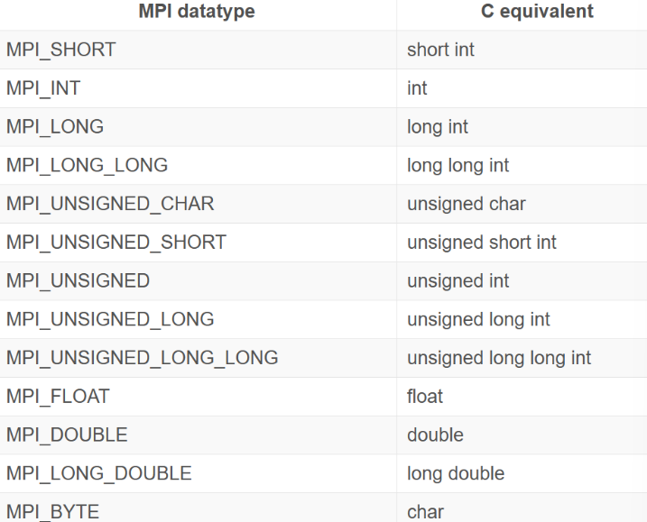
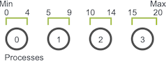
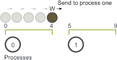
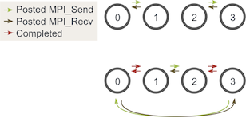
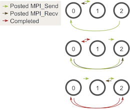

本文写于`2024-2-23`至`2024-3-4`。

# 参考资料

我学习MPI时主要参考MPI Tutorial，部分参考《An Introduction to Parallel Programming》。MPI Tutorial的内容由浅入深，配套了简单但实用的程序案例，支持中文，非常适合入门；《An Introduction to Parallel Programming》只适合补充，中文的翻译挺一般的。

[MPI Tutorial](https://mpitutorial.com/tutorials/)

[《An Introduction to Parallel Programming》](https://ghproxy.com/github.com/apachecn/huazhang-cs-books/blob/master/%E5%B9%B6%E8%A1%8C%E7%A8%8B%E5%BA%8F%E8%AE%BE%E8%AE%A1%E5%AF%BC%E8%AE%BA.pdf)

## MPI基础

### 编译

`mpicc -o output input`：使用mpich自带的脚本进行编译和链接，mpicc、mpicxx、mpifort分别对应C、C++、Fortran

### 运行

+ 在本地机器上运行`number`个进程的程序：`mpiexec -n <number> ./output`
+ 在多个节点上运行`number`个进程的程序：`mpiexec -f machinefile -n <number> ./output`

> `mpirun`是MPI的实现用来启动任务的一个程序，进程会在host文件里指定的所有机器上面生成，MPI程序就会在所有进程上面运行。`-n`参数告诉MPI程序要运行`<number>`个进程。

### 编程

#### 引入头文件和初始化

MPI环境必须以`MPI_Init(int* argc, char*** argv)`来初始化。
在`MPI_Init`的过程中，所有MPI的**全局变量**或者**内部变量**都会被创建。举例：一个communicator会根据所有可用的进程被创建出来（进程是通过mpi运行时的参数指定的），每个进程会被分配独一无二的rank。

#### 函数调用

```c
MPI_Comm_size(
	MPI_Comm communicator,
	int* size)
```
+ `MPI_Comm_size`会返回**communicator的可用进程数量**，`MPI_COMM_WORLD`（这个communicator是MPI帮忙生成的）这个变量包含了当前MPI任务中所有的进程，因此这个调用会返回所有的可用进程数目。
+ `MPI_COMM_WORLD`是预定义的、所有进程的默认通信器，当MPI程序启动时，每个进程都会加入这个通信器，可通过`MPI_Comm_rank`得到每个进程的唯一标识符。

```c
MPI_Comm_rank(
	MPI_Comm name,
	int* name_length)
```
+ `MPI_Comm_rank`会返回**communicator中当前进程的rank**，communicator中每个进程会以此得到一个从0开始递增的数字作为rank值（主要用来指定发送或接受信息时对应的进程）。

```c
MPI_Get_processor_name(
	char* name,
	int* name_Length)
```
+ `MPI_Get_processor_name`会得到当前进程实际跑的时候所在的处理器名。
+ `MPI_Get_Processor_name(processor_name, &name_len)`将处理器名存储在`processor_name`中，并更新`name_len`（存储处理器名称的实际长度）。
```c
MPI_Finalize(void)
```
+ `MPI_Finalize`是用来清理MPI环境的，被调用后就没有MPI函数可以被调用了。

#### Hello World

```c
#include <mpi.h>
#include <stdio.h>

int main(int argc, char** argv){
        MPI_Init(NULL, NULL);
        int world_size;
        MPI_Comm_size(MPI_COMM_WORLD, &world_size);
        int world_rank;
        MPI_Comm_rank(MPI_COMM_WORLD, &world_rank);
        char processor_name[MPI_MAX_PROCESSOR_NAME];
        int name_len;
        MPI_Get_processor_name(processor_name, &name_len);
        printf("Hello world from processor %s, rank %d out of %d processors\n",
                processor_name, world_rank, world_size);
        MPI_Finalize();
}
```

## MPI的发送和接收

### MPI Send and Receive

+ A进程决定发送一些消息给B进程，将需要发送的数据打包放入缓存，根据特定的rank确定发送的进程
+ B需要确认接收A的数据，A会接收到数据传递成功的信息
+ 有时A需要传递很多不同消息，为了让B更方便地区别不同消息，MPI运行发送者和接受者额外地指定一些信息ID（标签，tags），当B只要求接收某种特定标签地信息时，其他非该标签地信息会先被缓存直到B需要

### `MPI_Send`和`MPI_Recv`方法定义

```c
MPI_Send(
	void* data, //数据缓存
	int count, //数据数量（发送）
	MPI_Datatype datatype, //数据类型
	int destination, //发送方进程rank
	int tag, //信息标签
	MPI_Comm communicator)
```

```c
MPI_Recv(
	void* data,
	int count, //数据数量（**最多**接收）
	MPI_Datatype datatype,
	int source, //接收方进程rank
	int tag,
	MPI_Comm communicator,
	MPI_Status* status) //可以是MPI_STATUS_IGNORE
```

### 代码

#### 简单的P2P通信

```c
#include <mpi.h>
#include <stdio.h>
#include <stdlib.h>

int world_rank;
MPI_Comm_rank(MPI_COMM_WORLD, &world_rank);
int world_size;
MPI_Comm_size(MPI_COMM_WORLD, &world_size);

int number;
if (world_rank == 0) {
    number = -1;
    MPI_Send(&number, 1, MPI_INT, 1, 0, MPI_COMM_WORLD);
} else if (world_rank == 1) {
    MPI_Recv(&number, 1, MPI_INT, 0, 0, MPI_COMM_WORLD,
             MPI_STATUS_IGNORE);
    //tag=MPI_ANY_TAG
    printf("Process 1 received number %d from process 0\n",
           number);
}
```
+ 若当前进程是0进程，那么初始化一个数字-1通过`MPI_Send`以`MPI_INT`数据类型发送给1进程
+ 在`else if`中，进程1会调用`MPI_Recv`接收这个数字并打印
+ 每个进程使用了0作为消息标签来指定消息（由于这里只有一种类型地消息被传递，因此进程也可以使用预先定义好的常量`MPI_ANY_TAG`来作为tag）

#### 乒乓程序-循环P2P通信

```c
int ping_pong_count = 0;
int partner_rank = (world_rank + 1) % 2;
while (ping_pong_count < PING_PONG_LIMIT) {
    if (world_rank == ping_pong_count % 2) {
        // Increment the ping pong count before you send it
        ping_pong_count++;
        MPI_Send(&ping_pong_count, 1, MPI_INT, partner_rank, 0, MPI_COMM_WORLD);
        printf("%d sent and incremented ping_pong_count %d to %d\n",
               world_rank, ping_pong_count,
               partner_rank);
    } else {
        MPI_Recv(&ping_pong_count, 1, MPI_INT, partner_rank, 0,
                 MPI_COMM_WORLD, MPI_STATUS_IGNORE);
        printf("%d received ping_pong_count %d from %d\n",
               world_rank, ping_pong_count, partner_rank);
    }
}
```
+ 在两个进程中，`ping_pong_count`在每次发送消息后递增，随着`ping_pong_count`的递增，两个进程会轮流成为发送者和接收者直到limit被触发

#### 环通信（重要）

```c
int token;
if (world_rank != 0) {
    MPI_Recv(&token, 1, MPI_INT, world_rank - 1, 0,
             MPI_COMM_WORLD, MPI_STATUS_IGNORE);
    printf("Process %d received token %d from process %d\n",
           world_rank, token, world_rank - 1);
} else {
    // Set the token's value if you are process 0
    token = -1;
}
MPI_Send(&token, 1, MPI_INT, (world_rank + 1) % world_size,
         0, MPI_COMM_WORLD);

// Now process 0 can receive from the last process.
if (world_rank == 0) {
    MPI_Recv(&token, 1, MPI_INT, world_size - 1, 0,
             MPI_COMM_WORLD, MPI_STATUS_IGNORE);
    printf("Process %d received token %d from process %d\n",
           world_rank, token, world_size - 1);
}
```
+ 在进程0上初始化了`token = -1`，然后这个值会一次传递给每个进程，程序会在最后一个进程接收到值后结束
+ 对于进程0：保证了**在想要接收数据之前发送了token**
+ 其他进程：仅仅调用`MPI_Recv`并调用`MPI_Send`
+ `MPI_Send`和`MPI_Recv`会阻塞直到数据传递完成，避免了死锁

> 

## 动态接收消息

### `MPI_Status`结构体

`MPI_Recv`将`MPI_Status`结构体地地址作为参数（可以使用`MPI_STATUS_IGNORE`忽略）。如果将`MPI_Status`结构体传递给`MPI_Recv`函数，则操作完成后将在该结构体中填充有关接收操作地其他信息，包括：
+ 发送端rank：存储在结构体的`MPI_SOURCE`元素中，如声明一个`MPI_Status stat`变量，则可以通过`stat.MPI_SOURCE`访问rank
+ 消息的tag：通过`MPI_TAG`元素访问
+ 消息的长度：没有预定义的元素，必须使用`MPI_Get_count`找出消息的长度
```c
MPI_Get_count(
	MPI_Sratus* status,
	MPI_Datatype datatype,
	int* count)
```
WHY？`MPI_Recv`可以将`MPI_ANY_SOURCE`用作发送端的rank，将`MPI_ANY_TAG`用作消息的tag。此时，`MPI_Status`就是找出消息的实际发送端和tag的唯一方法。此外，并不能保证`MPI_Recv`能够接收函数调用参数的全部元素；相反，它只接收已发送给它的元素数量（如发送的元素多于所需的接收数量则返回错误），而`MPI_Get_count`函数用于确定实际的接收量。

### `MPI_Status`结构体查询的示例

```c
const int MAX_NUMBERS = 100;
int numbers[MAX_NUMBERS];
int number_amount;
if (world_rank == 0) {
    // Pick a random amount of integers to send to process one
    srand(time(NULL));
    number_amount = (rand() / (float)RAND_MAX) * MAX_NUMBERS;

    // Send the amount of integers to process one
    MPI_Send(numbers, number_amount, MPI_INT, 1, 0, MPI_COMM_WORLD);
    printf("0 sent %d numbers to 1\n", number_amount);
} else if (world_rank == 1) {
    MPI_Status status;
    // Receive at most MAX_NUMBERS from process zero
    MPI_Recv(numbers, MAX_NUMBERS, MPI_INT, 0, 0, MPI_COMM_WORLD,&status);//！

    // After receiving the message, check the status to determine
    // how many numbers were actually received
    MPI_Get_count(&status, MPI_INT, &number_amount);//！

    // Print off the amount of numbers, and also print additional
    // information in the status object
    printf("1 received %d numbers from 0. Message source = %d, "
           "tag = %d\n",
           number_amount, status.MPI_SOURCE, status.MPI_TAG);
}
```
注：`srand(time(NULL))`用于生成随机数种子，`(rand()/(float)RAND_MAX)`用于随机生成0~1的数（需包含`<time.h>`头文件

### 使用`MPI_Probe`找出消息大小

```c
MPI_Probe(
	int source,
	int tag,
	MPI_Comm comm,
	MPI_Status* status)
```
可以将`MPI_Probe`视为`MPI_Recv`（除了不接收消息外执行相同的功能）。与`MPI_Recv`类似，`MPI_Probe`将阻塞具有匹配标签和发送端的消息，当消息可用时将填充status结构体，然后用户可以使用`MPI_Recv`接收实际的消息。
在上面的示例中调用`MPI_Probe`：
```c
else if (world_rank == 1) {
    MPI_Status status;
    // Probe for an incoming message from process zero
    MPI_Probe(0, 0, MPI_COMM_WORLD, &status);

    // When probe returns, the status object has the size and other
    // attributes of the incoming message. Get the message size
    MPI_Get_count(&status, MPI_INT, &number_amount);

    // Allocate a buffer to hold the incoming numbers
    int* number_buf = (int*)malloc(sizeof(int) * number_amount);

    // Now receive the message with the allocated buffer
    MPI_Recv(number_buf, number_amount, MPI_INT, 0, 0,
             MPI_COMM_WORLD, MPI_STATUS_IGNORE);
    printf("1 dynamically received %d numbers from 0.\n",
           number_amount);
    free(number_buf);
}
```
+ 通过`MPI_Probe`阻塞消息并填充status，再调用`MPI_Get_count`得到消息个数，然后进程1分配适当大小的缓冲区并接收数字

## P2P通信应用——随机游走

### 随机游走

给定*Min*，*Max*和随机游走器*W*，让游走器*W*向右以任意长度的*S*随机移动。如果该过程越过边界，它就会绕回。*W*一次只能左右移动一个单位。


### 随机游走问题的并行化

在许多并行程序的应用中，首要任务是在各个进程之间划分域。随机游走问题的一维域大小为$Max-Min+1$（因为游走器包含*Max*和*Min*）。假设游走器只能采取整数大小的步长，我们可以轻松地将域在每个进程中划分为大小近乎相等的块。例如，如果*Min*为0，*Max*为20，并且我们有四个进程，则将像这样拆分域。



前三个进程拥有域的五个单元，而最后一个进程则拥有最后五个单元并且再加上一个剩余的单元。一旦队域进行了分区，应用程序将初始化游走器，游走器将以步长*S*进行总步数随机的游走。
例如，如果游走器在进程0上进行了移动总数为6的游走，执行如下：
+ 游走器的步行长度开始增加。但是值达到4时，已达到进程0的边界，因此进程0必须域进程1交流游走器信息。
+ 进程1接收游走器并继续移动直到达到移动总数6，然后进行新的随机移动



### 使用`MPI_Send`和`MPI_Recv`组织代码

初步特征和功能：
+ 明确每个进程在域中的部分
+ 每个进程初始化N个walker，所有这些walker都从其局部域的第一个值开始
+ 每个walker都有两个相关的整数值：**当前位置**和**剩余步数**
+ walkers开始遍历该域，并传递到其他进程直到完成所有移动
+ 当所有walker完成时，该进程终止
> `MPI_Abort(MPI_COMM_WORLD, 错误代码)`可以终止指定通讯器中的所有进程并退出MPI环境，将错误代码返回给操作系统

#### 分解域

该函数将考虑域的总大小，并为MPI进程找到合适的子域并将域的其余部分交给最终的进程：
```c
void decompose_domain(int domain_size, int world_rank,
                      int world_size, int* subdomain_start,
                      int* subdomain_size) {
    if (world_size > domain_size) {
        // 通常总进程数小于域的规模
        MPI_Abort(MPI_COMM_WORLD, 1);
    }
    *subdomain_start = domain_size / world_size * world_rank;
    *subdomain_size = domain_size / world_size;
    if (world_rank == world_size - 1) {
        // 最后一个进程特殊处理domain_size
        *subdomain_size += domain_size % world_size;
    }
  }
```
该函数将域分成偶数个块，并考虑了存在余数的情况。该函数返回一个子域开始和一个子域大小。

#### 定义并初始化walkers

```c
typedef struct {
	int location,
	int num_steps_left_in_walker;
} Walker;
```
初始化函数如下：（用于填充传入的walker列表）
```c
void initialize_walkers(int num_walkers_per_proc, int max_walk_size,
                        int subdomain_start, int subdomain_size,
                        vector<Walker>* incoming_walkers) {
    Walker walker;
    for (int i = 0; i < num_walkers_per_proc; i++) {
        // Initialize walkers in the middle of the subdomain
        walker.location = subdomain_start;
        walker.num_steps_left_in_walk =
            (rand() / (float)RAND_MAX) * max_walk_size;
        incoming_walkers->push_back(walker);
    }
}
```

#### walker移动功能

此功能负责使walkers前进，直到完成移动为止；如果超出局部域范围，则将其添加到`outgoing_wallers(vector)`中：
```c
void walk(Walker* walker, int subdomain_start, int subdomain_size,
          int domain_size, vector<Walker>* outgoing_walkers) {
    while (walker->num_steps_left_in_walk > 0) {
        if (walker->location == subdomain_start + subdomain_size) {
            // 抵达边界
            if (walker->location == domain_size) {
                walker->location = 0;
            }
            outgoing_walkers->push_back(*walker);
            break;
        } else {
            walker->num_steps_left_in_walk--;
            walker->location++;
            // 向前移动一步（剩余步数--；当前位置++）直到走完
        }
    }
}
```

#### 发送函数

```c
void send_outgoing_walkers(vector<Walker>* outgoing_walkers, 
                           int world_rank, int world_size) {
    // 向下一个进程发送消息（如果是最后一个进程则向0进程发送）
    MPI_Send((void*)outgoing_walkers->data(), 
             outgoing_walkers->size() * sizeof(Walker), MPI_BYTE,
             (world_rank + 1) % world_size, 0, MPI_COMM_WORLD);

    // 清除待传出walker列表
    outgoing_walkers->clear();
}
```

#### 接收函数

```c
void receive_incoming_walkers(vector<Walker>* incoming_walkers,int world_rank, int world_size) {
    MPI_Status status;
    // Receive from the process before you. If you are process zero,
    // receive from the last process
    int incoming_rank =
        (world_rank == 0) ? world_size - 1 : world_rank - 1;
    MPI_Probe(incoming_rank, 0, MPI_COMM_WORLD, &status);
    // Resize your incoming walker buffer based on how much data is
    // being received
    int incoming_walkers_size;
    MPI_Get_count(&status, MPI_BYTE, &incoming_walkers_size);
    incoming_walkers->resize(
        incoming_walkers_size / sizeof(Walker));
    MPI_Recv((void*)incoming_walkers->data(), incoming_walkers_size,
             MPI_BYTE, incoming_rank, 0, MPI_COMM_WORLD,
             MPI_STATUS_IGNORE); 
}
```
由于事先不知道将接收多少walkers，因此需要调用`MPI_Probe`。

#### main函数

```c
// Find your part of the domain
decompose_domain(domain_size, world_rank, world_size,
                 &subdomain_start, &subdomain_size);

// Initialize walkers in your subdomain
initialize_walkers(num_walkers_per_proc, max_walk_size,
                   subdomain_start, subdomain_size,
                   &incoming_walkers);

while (!all_walkers_finished) { // Determine walker completion later
    // Process all incoming walkers
    for (int i = 0; i < incoming_walkers.size(); i++) {
        walk(&incoming_walkers[i], subdomain_start, subdomain_size,
             domain_size, &outgoing_walkers); 
    }

    // Send all outgoing walkers to the next process.
    send_outgoing_walkers(&outgoing_walkers, world_rank,
                          world_size);

    // Receive all the new incoming walkers
    receive_incoming_walkers(&incoming_walkers, world_rank,
                             world_size);
}
```

#### 死锁及预防

**死锁**是指两个或多个进程各自在等待另一个进程释放资源，或者两个或多个进程在循环链中等待资源的特定条件。
MPI规范表面`MPI_Send`会一直阻塞，直到可以回收发送缓冲区为止。者意味着当网络可以缓冲消息时，`MPI_Send`将返回。如果发送最终无法被网络缓冲，它们将一直阻塞直到发布匹配的接收。
避免可能发生的发送和接收死锁的最佳方法是对消息进行排序，以使发送将具有匹配的接收。一种简单的方法是更改循环，使偶数编号的进程在接收walkers之前发送传出的walkers，而奇数编号的进程相反。




#### 确认完成

最后一步——确定每个walker何时结束。由于walkers可以随机行走，因此它们可以在任何一个进程中结束。因此，如果没有某种额外的通信，所有进程都很难知道walkers何时全部结束。一种可能的解决方案是让进程-跟踪所有已完成的walker，然后告诉其他所有进程何时终止。但是每个进程都必须向进程0报告所有瓦纳城的walker，然后还要处理不同类型的传入信息。
由于我们直到任意一个walker可以行进的最大距离和每对发送和接收对它可以行进的最小总大小（子域大小），因此可以计算出终止之前每个进程应该执行的发送和接收量。

```c
// Find your part of the domain
decompose_domain(domain_size, world_rank, world_size,
                 &subdomain_start, &subdomain_size);

// Initialize walkers in your subdomain
initialize_walkers(num_walkers_per_proc, max_walk_size,
                  subdomain_start, subdomain_size,
                  &incoming_walkers);

// Determine the maximum amount of sends and receives needed to 
// complete all walkers
int maximum_sends_recvs =
    max_walk_size / (domain_size / world_size) + 1;
for (int m = 0; m < maximum_sends_recvs; m++) {
    // Process all incoming walkers
    for (int i = 0; i < incoming_walkers.size(); i++) {
        walk(&incoming_walkers[i], subdomain_start, subdomain_size,
             domain_size, &outgoing_walkers); 
    }

    // Send and receive if you are even and vice versa for odd
    if (world_rank % 2 == 0) {
        send_outgoing_walkers(&outgoing_walkers, world_rank,
                              world_size);
        receive_incoming_walkers(&incoming_walkers, world_rank,
                                 world_size);
    } else {
        receive_incoming_walkers(&incoming_walkers, world_rank,
                                 world_size);
        send_outgoing_walkers(&outgoing_walkers, world_rank,
                              world_size);
    }
}
```