本文写于`2024-3-19`至`2024-3-24`。

## MPI广播及collective communication

### 集合通信及其同步点

`MPI_Barrier(MPI_Comm communicator)`用于同步进程，所有进程在执行代码时必须首先都到达一个同步点才能继续执行后面的代码。

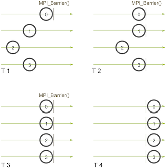

### 使用`MPI_Bcast`进行广播

一个广播发生时，一个进程会把同样一份数据传递给一个communicator里的所有其他进程。广播的主要用途之一是把用户输入传递给一个分布式程序，或把一些**配置参数**传递给所有进程。

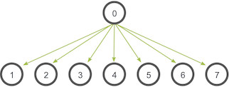

```c
MPI_Bcast(
	void* data,
	int count,
	MPI_Datatype datatype,
	int root,
	MPI_Comm communicator)
```
当根进程调用`MPI_Bcast`函数时，`data`变量会被发送到其他进程，其他进程调用`MPI_Bcast`时，`data`变量会被复制成从根进程接受到的数据。

### 使用`MPI_Send`和`MPI_Recv`广播

类似的这层封装：
```c
void bcast(void* data, int count, MPI_Datatype datatype, int root, MPI_Comm communicator){
	int world_rank;
	MPI_Comm_rank(communicator, &world_rank);
	int world_size;
	MPI_Comm_size(communicator, &world_size);

	if(world_rank == root) {
	int i;
	for(i = 0; i < world_size; i++){
		if(i != world_rank){
			MPI_Send(data, count, datatype, i, 0, communicator);
		}
	}else{
		MPI_Recv(data, count, datatype, root, 0, communicator, MPI_STATUS_IGNORE);
		}
	}
}
```
但是效率特别低！因为每个进程都只有一个I/O网络连接，只使用进程0的一个输出连接来传递数据->优化为树的通信算法：

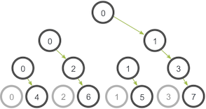

而`MPI_Bcast`的实现使用了一个类似的树形广播算法来获得比较好的网络利用率。

### 时间比较

`MPI_Wtime`不接收参数，仅仅返回以浮点数形式展示的从1970-01-01到现在为止进过的秒数，与C的`time`函数类似，使用结构如下：
```c
for(int i = 0; i < num_trails; i++){
	MPI_Barrier(MPI_COMM_WORLD);//在开始之前同步
	total_trial_A_time -= MPI_Wtime();
	/* trial_A */
	MPI_Barrier(MPI_COMM_WORLD);//在获得最终时间前再次同步
	total_trial_A_time += MPI_Wtime();

	MPI_Barrier(MPI_COMM_WORLD);
	total_trial_B_time -= MPI_Wtime();
	/* trial_B */
	MPI_Barrier(MPI_COMM_WORLD);
	total_trial_B_time += MPI_Wtime();
}
```
当然需要接收实验次数，并在最终时间上除以这个数，同时做多个进程的比较（Processors=2时二者相同）。

## MPI Scatter,Gather,and Allgather

### `MPI_Scatter`

`MPI_Bcast`给每个进程发送的是同样的数据，然而`MPI_Scatter`给每个进程发送的是一个数组的一部分数据。

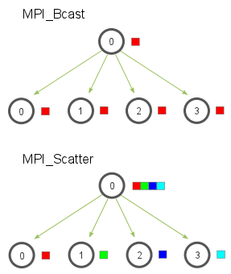

`MPI_Scatter`接收一个数组，并把元素按进程的rank分发。
```c
MPI_Scatter{
	void* send_data,
	int send_count,
	MPI_Datatype send_datatype,
	void* recv_count,
	int recv_count,
	MPI_Datatype recv_datatype,
	int root,//规定了根进程
	MPI_Comm communicator}
```
+ `send_data`实在跟进程上的一个数据数组，`send_count`和`send_datatype`描述了发送给每个进程的**数据数量**和**数据类型**
+ `recv_data`参数是一个缓存，里面存了`recv_count`个`recv_datatype`数据类型的元素
+ `root`和`communicator`指定开始分发数组的跟进程以及对应的communicator

### `MPI_Gather`

`MPI_Gather`与`MPI_Scatter`相反，从多进程里面收集数据到一个进程，这个机制对很多平行算法很有用，如并行的排序和搜索。

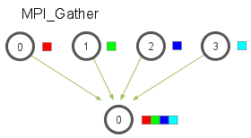

元素根据接收到的进程的rank排序。
```c
MPI_Gather{
	void* send_data,
	int send_count,
	MPI_Datatype send_datatype,
	void* recv_data,
	int recv_count,
	MPI_Datatype recv_datatype,
	int root,
	MPI_Comm communicator}
```
在`MPI_Gather`中，只有跟进程需要一个有效的接收缓存，其他所有的调用进程可以传递`NULL`给`recv_data`，需要注意`recv_count`参数是从**每个进程接收到的数据量**。

### 使用`MPI_Scatter`和`MPI_Gather`来计算平均数

+ 在根进程上生成一个充满随机数字的数组
+ 把所有数字用`MPI_Scatter`分发同样多给每个进程
+ 每个进程计算它们各自的搭配的数字的平均数
+ 根进程收集所有平均数并计算平均数

#### 生成随机浮点数

```c
float *create_rand_nums(int num_elements) {
    float *rand_nums = (float *)malloc(sizeof(float) * num_elements);
    assert(rand_nums != NULL);
    int i;
    for(i = 0; i < num_elements; ++i) {
        rand_nums[i] = (rand() / (float)RAND_MAX);
    }
    return rand_nums;
}
```

#### 完整代码

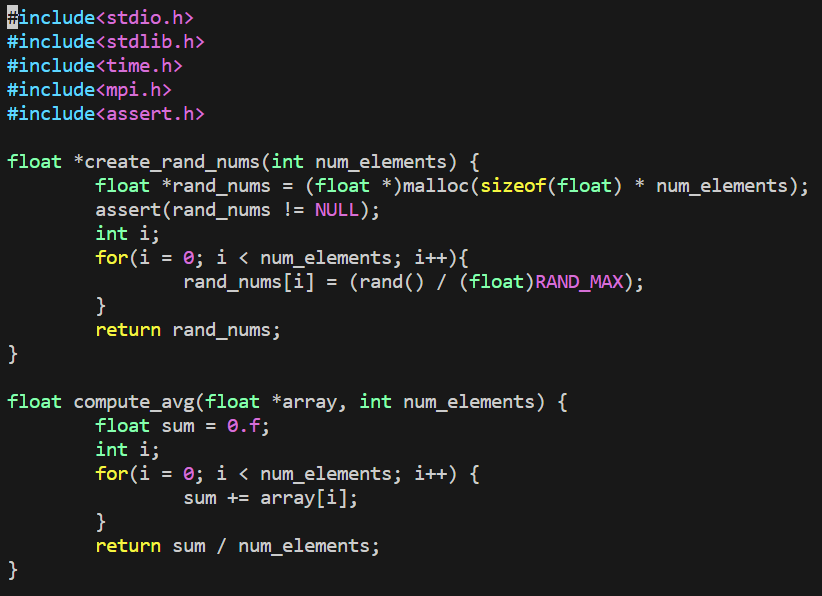
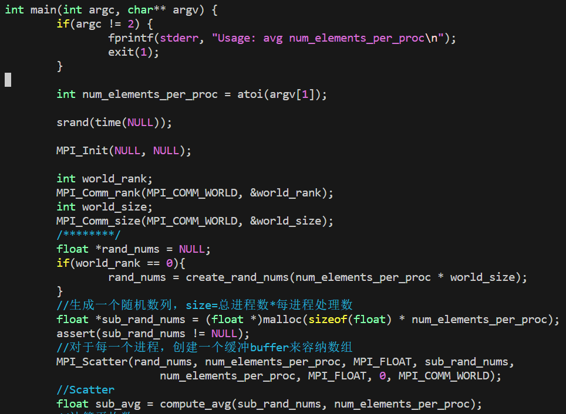
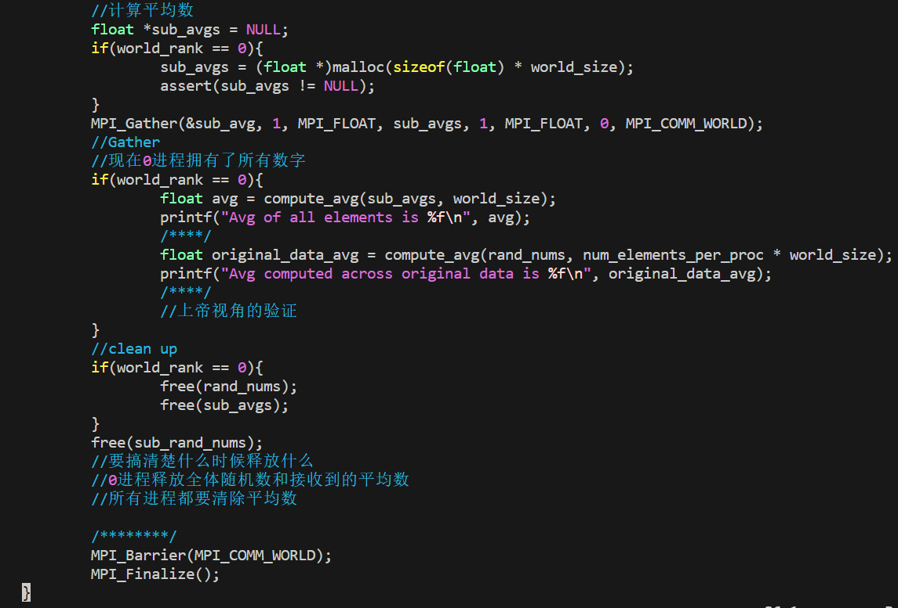

### `MPI_Allgather`

到目前为止都是操作多对一或一对多通信模式的MPI方法，即要么多个进程向一个进程发送数据，要么从一个进程接收数据。很多时候发送多个元素到多个进程也很有用（多对多通信）->`MPI_Allgather`
对于分发在所有进程上的一组数据来说，`MPI_Allgather`会收集所有数据到所有进程上。从最基础的角度来看，`MPI_Allgather`相当于一个`MPI_Gather`操作之后跟着一个`MPI_Bcast`操作。


与`MPI_Gather`类似，每个进程上的元素是根据rank顺序被收集的。`MPI_Allgather`的方法定义跟`MPI_Gather`几乎一样，不过不需要root参数来指定根进程。

```c
MPI_Allgather(
	void* send_data,
	int send_count,
	MPI_Datatype send_datatype,
	void* recv_data,
	int recv_count,
	MPI_Datatype recv_datatype,
	MPI_Comm communicator
)
```

## `MPI_Reduce` and `MPI_Allreduce`

*归约*是函数式编程中的经典概念。数据归约包括通过函数将一组数字归约为较小的一组数字。`MPI_Reduce`将处理在并行程序中需要执行的几乎所有常见的归约操作。

### `MPI_Reduce`

与`MPI_Gather`类似，`MPI_Reduce`在每个进程上获取一个输入元素数组，并将输出元素数组返回给根进程。
```c
MPI_Reduce(
	void* send_data,
	void* recv_data,
	int count,
	MPI_Datatype datatype,
	MPI_Op op,
	int root,
	MPI_Comm communicator)
```
`send_data`参数是每个进程都希望归约的`datatype`类型元素的数组，`recv_data`仅与具有`root`rank的进程有关。`recv_data`数组包含归约的结果，大小为`sizeof(datatype) * count`。`op`参数是希望应用于数据的操作。
+ `MPI_MAX`返回最大元素
+ `MPI_MIN`返回最小元素
+ `MPI_SUM`元素求和
+ `MPI_PROD`元素相乘
+ `MPI_LAND`与
+ `MPI_LOR`或
+ `MPI_BAND`按位与
+ `MPI_BOR`按位或
+ `MPI_MAXLOC`返回最大值和所在进程的rank
+ `MPI_MINLOC`返回最小值和所在进程的rank
下面是`MPI_Reduce`通信模式的说明：

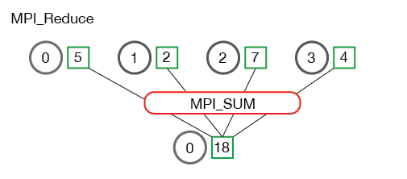
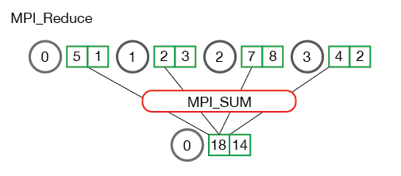

#### `MPI_Reduce`计算均值

```c
float local_sum = 0;
int i;
for(i = 0; i < num_elements_per_proc; ++i) {
	local_sum += rand_nums[i];
}

float global_sum;
MPI_Reduce(&local_sum, &global_sum, 1, MPI_FLOAT, MPI_SUM, 0, MPI_COMM_WORLD);
```

### `MPI_Allreduce`

在许多并行程序中，需要在所有进程而不是仅仅在根进程中访问归约的结果。与`MPI_Gather`相似的补充方式，`MPI_Allreduce`将归约值并将结果分配给所有进程。
```c
MPI_Allreduce(
	void* send_data,
	void* recv_data,
	int count,
	MPI_Datatype datatype,
	MPI_Op op,
	MPI_Comm communicator)
```

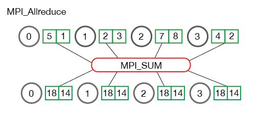

`MPI_Allreduce`等效于执行`MPI_Reduce`+`MPI_Bcast`。

#### `MPI_Allreduce`计算标准差

标准差：数字与均值之间的离散程度的度量。
要计算标准差，必须先计算所有数字的平均值。总和均值的平方根是最终结果。
思路：将整体功能分为“计算avg”和“计算$(x_i-avg)^2$的sum"，其中第二个功能需要第一个功能的值。

## 通信子和MPI组

### 通讯子

#### 概述

对于简单的应用程序，使用`MPI_COMM_WORLD`进行所有操作并不罕见，但是对于更复杂的用例，拥有更多的通讯器可能会有所帮助。如，想对网格中进程的子集执行计算。
```c
MPI_Comm_split(
	MPI_Comm comm,
	int color,
	int key,
	MPI_Comm* newcomm)
```
`MPI_Comm_split`通过输入参数`color`和`key`将通讯器拆分为一组子通讯器来创建新的通讯器。原始的通讯器并没有消失，但是在每个进程中都会创建一个新的通讯器。`color`确定每个进程将属于哪个新的通讯器，为`color`传递相同值的所有进程都分配给同一通讯器。如果`color`为`MPI_UNDEFINED`，泽该进程将不包含在任何新的通讯器中。`key`确定每个新通讯器中的顺序（rank）。`key`最小值的进程为0，下一个为1，以此类推。如果存在相等，则在原始通讯器中rank较低的进程是第一位。`newcomm`是MPI如何将新的通讯器返回给用户。

#### 使用多个通信子的示例

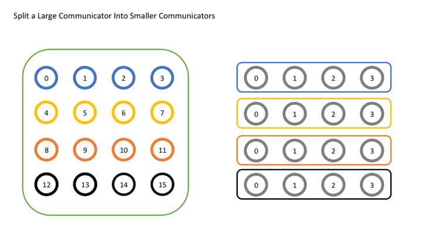
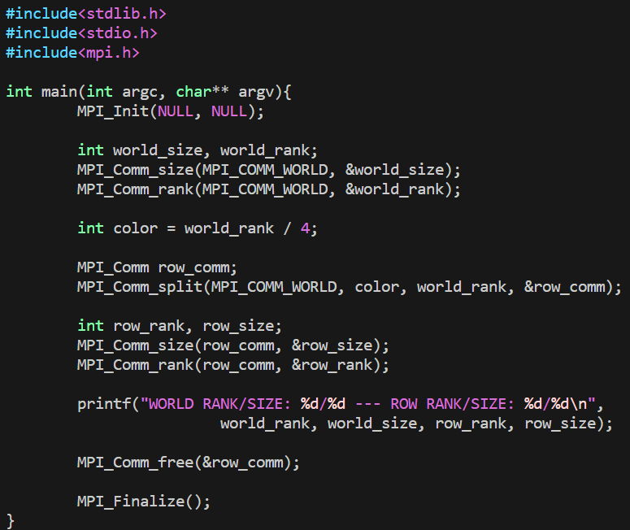

`color = world_rank / 4`将通讯器矩阵分为了四层
我们使用原始rank作为拆分操作的`key`，新通讯器中的所有进程与原始通讯器中的所有进程处于相同的顺序，保证了正确的排序。
最后通过`MPI_Comm_free`释放通讯器。MPI一次可以创建的对象数量有限，如果MPI用完了可分配对象，则不释放对象可能会导致运行时错误。

#### 其他通信子创建函数

`MPI_Comm_dup`是最基本的通讯器创建函数，创建一个通讯器的副本。对于使用库执行特殊函数的应用（例如数学库）非常有用。在这类应用中，重要的是用户代码和库代码不要互相干扰。为了避免这种情况，每个应用程序应该做的第一件事是创建`MPI_COMM_WORLD`副本，浙江避免其他使用`MPI_COMM_WORLD`的库的问题。
另一个功能是`MPI_Comm_create`。
```c
MPI_Comm_create(
	MPI_Comm comm,
	MPI_Group group,
	MPI_Comm* newcom)
```
与`MPI_Comm_create_group`的区别：缺少`tag`参数；`MPI_Comm_create_group`仅是`group`中包含的一组进程的集合，而`MPI_Comm_create`是`comm`中每个进程的集合。如果尝试在运行很多很多个进程时创建`MPI_COMM_WORLD`的子集，则重要的是使用尽可能少的进程来执行此操作，因为大型集的开销会变得非常昂贵。

## 组

### 概述

创建通讯器有更灵活的方法，使用一种新的MPI对象`MPI_Group`。
> 通讯器的实际含义
> 在内部，MPI必须保持通讯器的两个主要部分，即区分一个通讯器与另一个通讯器的上下文以及该通讯器包含的一组进程。
> The context is what prevents an operation on one communicator from matching with a similar operation on another communicator.

上下文阻止了与一个通讯器上的操作匹配的另一通讯器上的类似操作。MPI在内部为每个通讯器保留一个ID以防混淆。

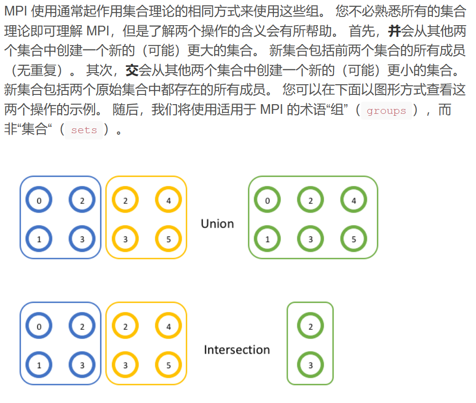

### 使用MPI组

在MPI中，很容易通过API调用`MPI_Comm_group`来获取通讯器中的进程组。
```c
MPI_Comm_group(
	MPI_Comm comm,
	MPI_Group* group)
```
通讯器包含一个上下文或ID，以及一个组。调用`MPI_Comm_group`会得到对该组对象的引用。组对象的工作方式与通讯器对象相同，不同之处在于您不能使用它与其他rank进行通信（因为它没有附加上下文）。但仍然可以获取组的rank和size（`MPI_Group_rank`和`MPI_Group_size`）。但是，组特有的功能而通讯器无法完成的工作是可以使用组在本地构建新的组。 在此记住本地操作和远程操作之间的区别很重要。 远程操作涉及与其他秩的通信，而本地操作则没有。 创建新的通讯器是一项远程操作，因为所有进程都需要决定相同的上下文和组，而在本地创建组是因为它不用于通信，因此每个进程不需要具有相同的上下文。 您可以随意操作一个组，而无需执行任何通信。

> 并

```c
MPI_Group_union(
	MPI_Group group1,
	MPI_Group group2,
	MPI_Group* newgroup)
```

> 交

```c
MPI_Group_intersection(
	MPI_Group group1,
	MPI_Group group2,
	MPI_Group* newgroup)
```
