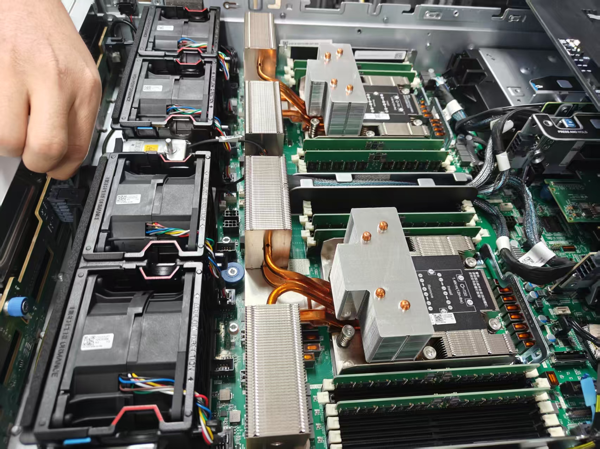
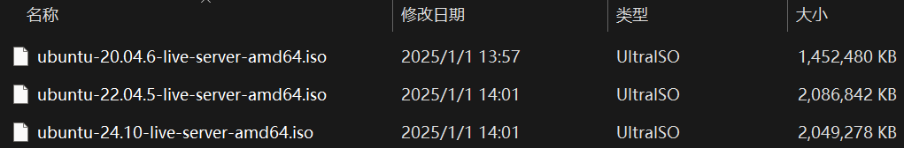
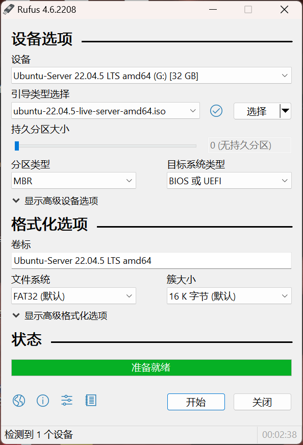
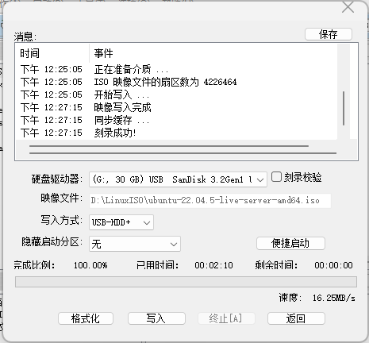
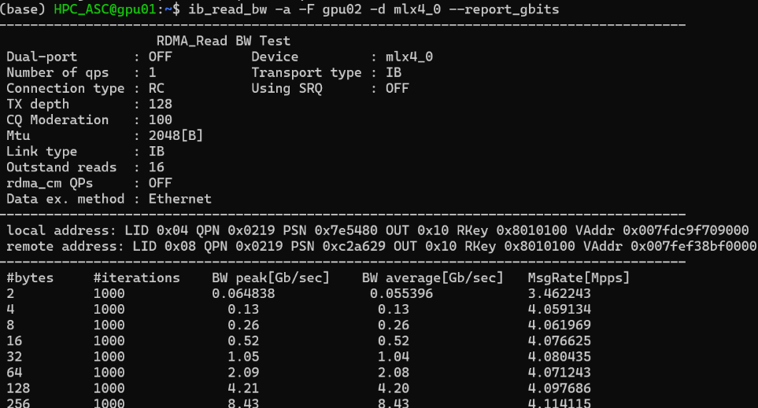
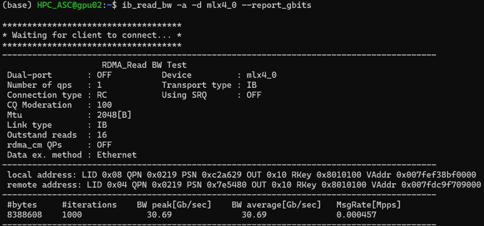

这段时间和机房打交道比较多，所以来总结一下这段时间的运维经验，也方便学弟学妹未来参与搭建集群。

## 硬件

### 组装

新采购的整机服务器，硬盘、内存条、网卡都是在的，因此只需要把计算卡插入PCIE插槽即可。务必保证启动时，主电源和备用电源都是亮灯状态。在ASC Final中，硬盘、内存条、网卡都是得自己插的。



### 制作启动盘

需要准备可引导ISO、烧录软件([Rufus](https://rufus.ie/en/)或[UltraISO](https://ultraiso.net/))和一个U盘(最好是USB3.0)。这里选择服务器端`Ubuntu Server 22.04.5 LTS`(上一个Ubuntu Server长期支持版，支持到2027年4月)，在[Ubuntu官网](https://cn.ubuntu.com/download)获取可引导ISO文件。



接下来用烧录软件写入硬盘镜像，UltraISO注意选择写入方式为`USB-HDD+`，Rufus注意选择目标系统类型为`BIOS或UEFI`，文件系统和其他设置根据需求配置。格式化U盘后即可写入系统镜像（约2-3分钟）。

 

## 软件

### 网络配置

一般在系统安装时先不配置，安装完成后通过`ip link show`查看网口名。通过`vim /etc/netplan/50-cloud-init.yaml`，配置如下：

```bash
# ...
network:
    ethernets:
        ens16f0:
            addresses:
            - <A.B.C.D>/24
            nameservers:
                addresses: []
                search: []
            routes:
            -   to: default
                via: <A.B.C.D>
    version: 2
```

### 设置root密码

```bash
su root
passwd root
```

### 禁用Linux kernel自动更新

如果不禁用的话,每次`apt update`后都会提示你是否需要重启服务并更新。修改`/etc/apt/apt.conf.d/`下的`10periodic`和`20auto-upgrades`内的参数为`0`即可。

`sudo vim /etc/apt/apt.conf.d/10periodic`

更新为:

```bash
APT::Periodic::Update-Package-Lists "0";
APT::Periodic::Download-Upgradeable-Packages "0";
APT::Periodic::AutocleanInterval "0";
```

`sudo vim /etc/apt/apt.conf.d/20auto-upgrades`

更新为:

```bash
APT::Periodic::Update-Package-Lists "0";
APT::Periodic::Unattended-Upgrade "0";
```

### 反向代理

由于计算节点不联网，因此把本地作为跳板机进行反向代理。

修改本地`Users/username/.ssh/config`:

```bash
Host <IP>
  HostName <IP>
  User <username>
  RemoteForward <Port1> 127.0.0.1:<Port2>
```

### 值得被做的准备

```bash
# 禁用Linux自动休眠
echo "\$nrconf{kernelhints} = 0;" >> /etc/needrestart/needrestart.conf
echo "\$nrconf{restart} = 'l';" >> /etc/needrestart/needrestart.conf
systemctl mask sleep.target suspend.target hibernate.target hybrid-sleep.target
# 更新apt和apt-get
apt update
apt upgrade
apt-get update
apt-get upgrade
# 安装一些必要组件
apt install git wget vim curl htop net-tools pciutils build-essential 
```

### 分盘

如果不识别硬盘，可能在系统安装阶段就报错`block probing did not discover any disks`，检查硬盘、RIAD卡是否亮灯。

```bash
lsblk # 确认新硬盘设备名称(如/dev/sdX)
sudo pvcreate /dev/sdb /dev/sdc /dev/sdd # 创建物理卷PV
sudo vgcreate vg_home /dev/sdb /dev/sdc /dev/sdd # 创建卷组VG
vgdisplay # 检查卷组信息
sudo lvcreate -l 100%FREE -n lv_home vg_home # 创建一个逻辑卷，占用卷组的全部空间
sudo mkfs.ext4 /dev/vg_home/lv_home # 格式化逻辑卷为ext4文件系统
sudo mount /dev/vg_home/lv_home /home # 挂载逻辑卷到/home
# 自动挂载
sudo blkid /dev/vg_home/lv_home # 获取逻辑卷的UUID
sudo vim /etc/fstab
>>> UUID=<UUID> /home ext4 defaults 0 2
sudo mount -a
df -a # 验证
```

### NFS共享文件系统

```bash
sudo apt install nfs-kernel-server nfs-common rdma-core # 所有节点都执行
```

#### NFS服务器节点

```bash
sudo mkdir -p /home
sudo chmod 777 /home
sudo vim /etc/exports
>>> /home *(rw,sync,no_root_squash) 
sudo vim /etc/nfs.conf # 启用RMDA
>>> [nfsd]
>>> rdma=y
sudo systemctl restart nfs-kernel-server
sudo systemctl enable nfs-kernel-server
```

#### 客户端节点

```bash
sudo mount -o rdma,vers=4.2 <server_ip>:/home /home
df -h | grep /home # 检查挂载是否成功
sudo vim /etc/fstab # 设置开机自动挂载
>>> <server_ip>:/home /home nfs4 rdma,vers=4.2 0 0
```

验证RMDA传输:

```bash
mount | grep /home
cat /proc/fs/nfsfs/servers # 看transport列是否为rdma
```

### InfiniBand Driver

驱动下载：[NVIDIA InfiniBand Software | NVIDIA | NVIDIA Developer](https://developer.nvidia.com/networking/infiniband-software)

MLNX_OFED：[Linux InfiniBand Drivers](https://network.nvidia.com/products/infiniband-drivers/linux/mlnx_ofed/)

对于旧版本的IB，请务必查看Release Note确认是否支持。

查看IB设备：

```bash
lspci | grep -i mell
```

打开IB的opensm服务：

```bash
# 如果没有安装
sudo apt update && sudo apt upgrad -y
sudo apt install opensm infiniband-diags ibutils perftest -y
sudo systemctl start opensm
systemctl status opensm
sudo systemctl enable opensm # 开机自启
```

验证能否正常识别IB设备：

```bash
ibv_devinfo
ibstat
```

测试服务器和客户端的ib带宽：

```nash
ibv_devices # 查询设备名称, 如mlx5_0
ib_read_bw -a -d <device_name> --report_gbits # 服务器
ib_read_bw -a -F <ip_addr> -d <device_name> --report_gbits # 客户端 (-a测试所有消息大小, -F强制使用服务端连接(需要服务端先启动), --report_gbits以Gbps显示带宽结果)
```

 

设置IB的MTU（最大传输单元）：

```bash
ifconfig | grep ib # 查询
ifconfig ib0 mtu 65520 # 保证两台机器的IB接口配置相同的MTU
```

> 简单测试：`ibping`和`ibping <ip_addr>`即可

### CUDA

#### 禁用/卸载Nouveau驱动(非必要)

```bash
sudo vim /etc/modprobe.d/blacklist.conf
```

在最后两行加入：

```bash
blacklist nouveau
options nouveau modeset=0
```

重建initramfs并重启服务器使其生效：

```
sudo update-initramfs -u
sudo reboot
```

通过`lsmod | grep nouveau`验证，若没有输出则禁用成功。

#### 安装驱动

查看GPU型号：`lspci | grep -i nvidia`

驱动下载：[NVIDIA Driver](https://www.nvidia.com/en-us/drivers/)

> A800/V100 for CUDA12.6：
> [Data Center Driver for Linux x64 560.35.03 | Linux 64-bit | NVIDIA](https://www.nvidia.com/en-us/drivers/details/231430/)

#### 卸载驱动

`sudo /usr/bin/nvidia-uninstall`

#### 安装CUDA

CUDA Toolkit：[CUDA Toolkit Archive | NVIDIA Developer](https://developer.nvidia.com/cuda-toolkit-archive)

CUDA：[CUDA Toolkit 12.6 Update 3 Downloads | NVIDIA Developer](https://developer.nvidia.com/cuda-downloads)