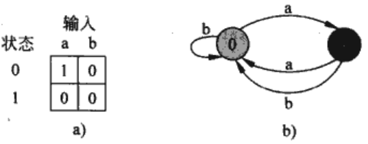
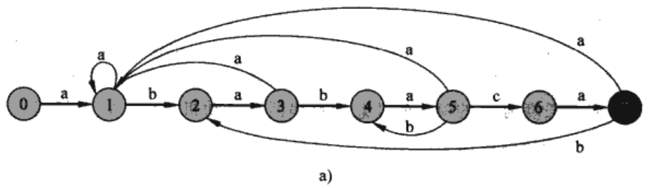
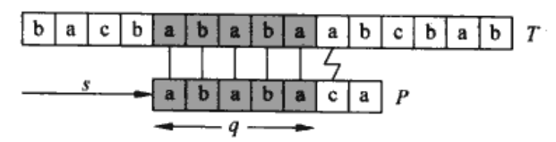
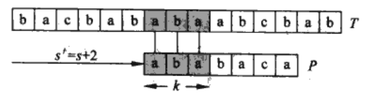
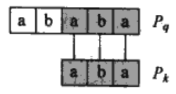
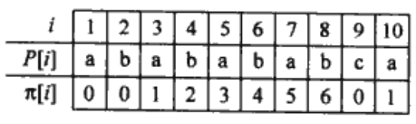

## 前言

此篇博客系补档，写于`2023/11/04`至`2023/11/14`，最后更新于`2023/11/14 16:23`，曾发布于[知乎](https://zhuanlan.zhihu.com/p/665965430)。

## 朴素字符串匹配

朴素字符串匹配算法(Naive-String-Matcher)是通过一个循环找到所有有效偏移，该循环对n-m+1个可能的s值进行检测，看是否满足条件$P[1..m]=T[s+1..s+m]$。
```cpp
//伪代码NAIVE-STRING-MATCHER(T,P)
n = T.length
m = P.length
for s = 0 to n-m
	if P[1..n] == T[s+1..s+m]
		print "Pattern occurs with shift"s
```
由于不需要预处理，在最坏情况下的时间复杂度为O((n-m+1)m)（对偏移s的n-m+1个可能值比较，或者说对前n-m+1的每个字符做一次长度为m的匹配）。
KMP算法在最坏情况下比朴素算法好得多，这种匹配算法效率不高，因为当其他无效的s值存在时，它也只关心一个有效的s值，而完全忽略了检测无效s值时获得的文本信息（这种信息可能非常有用）。

## 利用有限自动机进行字符串匹配

很多字符串匹配算法都要建立一个有限自动机，它时一个处理信息的简单机器，通过对文本字符串T进行扫描，找出模式P的所有出现位置。

### 有限自动机

一个有限自动机$M$是一个五元组( $Q$ , $q$<sub>0</sub> , $A$ , $\sum$ , $\delta$ )，其中：
- $Q$是**状态**的有限集合
- $q$<sub>0</sub>$\in$Q是**初始状态**
- $A$$\subseteq$Q是一个特殊的**接受状态**集合
-  $\sum$是有限**输入字母表**
-  $\delta$是一个从Q$\times$$\sum$到Q的函数，称为$M$的**转移函数**
有限自动机开始于状态$q$<sub>0</sub>，每次读入输入字符串的一个字符。如果有限自动机在状态q时读入了字符a，则它从状态q变为状态$\delta( q , a )$（进行了一次转移）。每当其当前状态$q$属于$A$时，就表明自动机M**接受**了迄今为止所读入的字符串，没有被接受的输入称为被拒绝的输入。

> 用一个简单的两状态自动机说明
> <br>
> 该自动机拥有状态集$Q=${0,1}，开始状态$q$<sub>0</sub>=0，输入字母表$\sum$={a,b}。
>(a)用表格表示状态函数$\delta$，(b)是一个等价的状态转换图。
>状态1是唯一的被接受状态，有向边代表着转换（例如从状态1到状态0的b边表示$\delta(1,b)=0$。显然，这个自动机接受以奇数个a结尾的字符串。或者说，一个 字符串$x$被接受当且仅当$x=yz$，其中$y=\varepsilon$或$y$以b结尾，并且$z=a$<sup>k</sup>（k为奇数）。
>例如，对于输入abaaa，包括初始状态，这个自动机输入状态序列为$<0,1,0,1,0,1>$，因而它接受这个输入；对于输入abbaa，自动机输入状态序列为$<0,1,0,0,1,0>$，因而它拒绝这个输入。

有限自动机$M$引入一个函数$\phi$，称为**终态函数**，它是从$\sum*$到$Q$的函数，满足$\phi(\omega)$是$M$在扫描字符串$\omega$后终止时的状态。因此，当且仅当$\phi(\omega)\in A$时，$M$接受字符串$\omega$。我们可以用转移函数递归定义$\phi$：
	$\phi(\varepsilon)=q$<sub>0</sub>
	$\phi(\omega a)=\delta(\phi(\omega),a),    \omega\in\sum*,a\in\sum$

### 字符串匹配自动机

对于一个给定的模式P，我们可以在预处理阶段构造出一个字符串匹配自动机，根据模式构造出相应的自动机后，再利用它来搜寻文本字符串。
>定义一个辅助函数$\sigma$，称为对应模式串的后缀函数。
>满足$\sigma(x)$是$x$的后缀与对应模式串P的前缀的最大公共长度：
>$\sigma(x)=$max{k:P<sub>k</sub>$\sqsupset$ $x$}
>如对于模式串P=ab，有$\sigma$($\varepsilon$)=0，$\sigma$(ccaca)=1，$\sigma$(ccab)=2

给定模式$P[1..m]$，其相应的字符串匹配自动机定义如下：
- 状态集合$Q$为{0,1,...,m}。开始状态$q$<sub>0</sub>是0状态，并且只有状态m是唯一被接受的状态
- 对任意的状态$q$和字符$a$，转移函数$\delta$定义为$\delta(q,a)$=$\sigma$$($P<sub>q</sub>$a$$)$
我们定义$\delta(q,a)$=$\sigma$$($P<sub>q</sub>$a$$)$，目的是记录已得到的与模式P匹配的文本呢字符串T的最长前缀。考虑最近一次扫描T的字符，为了使T的一个子串能够和P的某些前缀P<sub>j</sub>匹配，前缀P<sub>j</sub>必须是T<sub>i</sub>的一个后缀。如果自动机处于状态$q$并且读入下一个字符$T[i+1]=a$，那么我们希望这个转换能够指向T<sub>i</sub>a的后缀状态，它对应着P的最长前缀，即$\sigma$(T<sub>i</sub>a)。由于P<sub>q</sub>是P的最长前缀，也就是T<sub>i</sub>的一个后缀，那么P的最长前缀也就是T<sub>i</sub>a的一个后缀，即$\sigma$$($T<sub>i</sub>a$)$=$\sigma$$($P<sub>q</sub>a$)$（由后缀函数递归引理证明，此处省略）。因此，当自动机处在状态$q$时，我们希望这个在字符a上的转移函数能使自动机转移到状态$\sigma$$($P<sub>q</sub>a$)$。

考虑两种情况：
- $a=P[q+1]$，使得字符a继续匹配模式，那么状态前进，即$\delta(q,a)=q+1$
- $a\ne P[q+1]$，使得字符a不能继续匹配模式，那么回溯到一个更小的字串，它是**P的前缀同时也是T<sub>i</sub>的后缀。

> <br>
>在这个例子中，状态0是初始状态，状态7是仅有的接受状态。
>图中的自动机有$\delta(5,c)=6$，说明其是第一种情况，匹配继续进行。
>但是，如果自动机在$q=5$状态时读到b，那么P<sub>q</sub>b=ababab，并且P的最长前缀也是ababab的后缀P<sub>4</sub>=abab，因此转移到状态$q=5$。

```cpp
//伪代码有限自动机(T,δ,m)
n = T.length
q = 0
for i = 1 to n
	q = δ(q,T[i])
	if q == m
		print "Pattern occurs with shift"i-m
```
从有限自动机的简单循环结构可以看出，对于一个长度为n的文本字符串，它的匹配时间为$O(n)$。但是，这一匹配时间没有包括计算转移函数$\delta$所需要的预处理时间。

>定理：如果$\phi$是字符串匹配自动机关于给定模式P的终态函数，T[1..n]是自动机的输入文本，则对i=0,1,...,n，有$\phi($T<sub>i</sub>$)$=$\sigma($T<sub>i</sub>$)$
```cpp
//伪代码计算转移函数
m = P.length
for q = 0 to m
	for each charater a ∈ Σ
		k = min(m+1, q+2)
		repeat
			k = k - 1
		until Pk是Pqa的后缀
		δ(q,a) = k
return δ
```
这个过程根据定理直接计算$\delta(q,a)$，在嵌套循环中考察所有的状态$q$和字符a。第4~8行把$\delta(q,a)$置为满足P<sub>k</sub>$\sqsupset$P<sub>q</sub>a的最大的k。代码从k的最大可能值$min(m, q+1)$开始，随着过程的执行，k递减至P<sub>k</sub>$\sqsupset$P<sub>q</sub>a，这种情况必然会发生，因为P<sub>0</sub>=$\varepsilon$是每个字符串的一个后缀。

## KMP算法（Knuth-Morris-Pratt A.）

这个算法无需计算转移函数$\delta$，匹配时间为$O(n)$，只用到辅助函数$\pi$，它在O(m)时间内根据模式预先计算出来，并且存储在数组$\pi$$[1..m]$中。数组$\pi$使得我们可以按需要有效地计算转移函数$\delta$。粗略地说，对任意状态q=0,1,...,m和任意字符$a\in\sum$，$\pi[q]$的值包含了与a无关但在计算$\delta(q,a)$时需要的信息。由于数组$\pi$只有m个元素，而$\delta$有$O(m\sum)$个值，所以通过预先计算$\pi$而不是$\delta$，可以使计算时间减少一个$\sum$因子。

### 关于模式的前缀函数

模式的前缀函数$\pi$包含模式与其自身的偏移进行匹配的信息，这些信息可用在朴素字符串匹配算法中避免对无用偏移的检测，也可以避免在字符串匹配自动机中对整个转移函数$\delta$的预先计算。


>在这个用模式串P=ababaca匹配文本字符串T的例子中，q=5个字符已经匹配成功，但模式的第6个字符不能匹配。已知的这q个文本字符使我们能够立即确定某些偏移是无效的，如s+1必然是无效的，因为文本字符已知不能与模式的第一个字符a匹配，但能与模式的第二个字符b匹配。因此，如下图所示的$s'=s+2$的偏移显然比s+1的偏移更有效率。
><br><br>
>在这里，我们发现P<sub>3</sub>是能构成P<sub>5</sub>真后缀的P的最长前缀（如下图所示），这些信息被预先计算出来，并用数组$\pi$表示，即$\pi[5]=3$。我们可以归纳得到，在偏移s有q个字符成功匹配时，则下一个**可能有效**的偏移为$s'=s+(q-\pi[q])$。
><br><br>

接下来我们来讨论$\pi[q]$从何而来。假设模式字符$P[1..q]$与文本字符$T[s+1..s+q]$匹配，$s'$是最小的偏移量，$s'>s$，那么对某些k<q，满足$P[q..k]=T[s'+1..s'+k]$的最小偏移$s'$是多少（其中$s'+k=s+q$）？
换句话说，已知P<sub>q</sub>$\sqsupset$T<sub>s+q</sub>，我们希望P<sub>q</sub>的最长真前缀P<sub>k</sub>也是T<sub>s+q</sub>的后缀。由于$s'+k=s+q$，那么找到的最小偏移$s'$等价于找到最长前缀的长度k。我们把P前缀长度范围内的差值$q-k$加入到偏移s中，用于找到新的偏移$s'$，使得$s'=s+(q-k)$。在最好情况下$k=0$，因此$s'=s+q$。总之，在任何情况下，对于新的偏移$s'$，**无需把P的前k个字符与T中相应的字符进行比较**，因为$P[q..k]=T[s'+1..s'+k]$已经保证它们肯定匹配。
>我们可以用模式与其自身进行比较来预先计算出这些必要的信息，如图所示：
><br>
>$\pi$存储的是模式串P的最长公共前后缀。例如，$\pi[5]=3,\pi[3]=1,\pi[1]=0$，通过迭代可以得到$\pi[\pi[\pi[5]]]=0,\pi[\pi[5]]=1$，可以用$\pi*[5]={3,1,0}$表示。那么，当k为3或1或0时，都会出现偏移$s'$满足P的某前缀与P<sub>q</sub>的后缀匹配，实现更有效率的偏移。

```cpp
//伪代码KMP算法
n = T.length
m = P.length
π = COMPUTE-PREFIX-FUNCTION(p)
q = 0  //number of characters matched
for i = 1 to n //scan the text T
	while q > 0 and P[q+1] != T[i]
		q = π[q]
	if P[q+1] == T[i]
		q = q + 1
	if q == m
		print "Pattern occurs with shift"i-m
		q = π[q]

//COMPUTE-PREFIX-FUNCTION
m = P.length
let π[1..m] be a new array
π[1] = 0
k = 0
for q = 2 to m
	while k > 0 and P[k+1] != P[q]
		k = π[k]
	if P[k+1] == P[q]
		k = k + 1
	π[q] = k
return π
```

KMP算法通过运用$\pi$而不是$\delta$，可将对模式进行预处理的时间由$O(m \sum)$减为$O(m)$，同时保持实际的匹配时间为$O(n)$（暂时省略证明，以后来补罢）。
