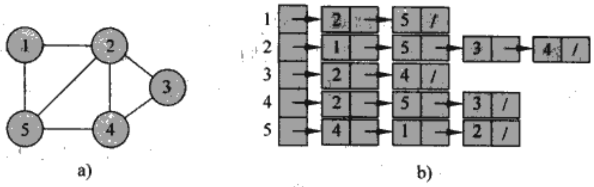
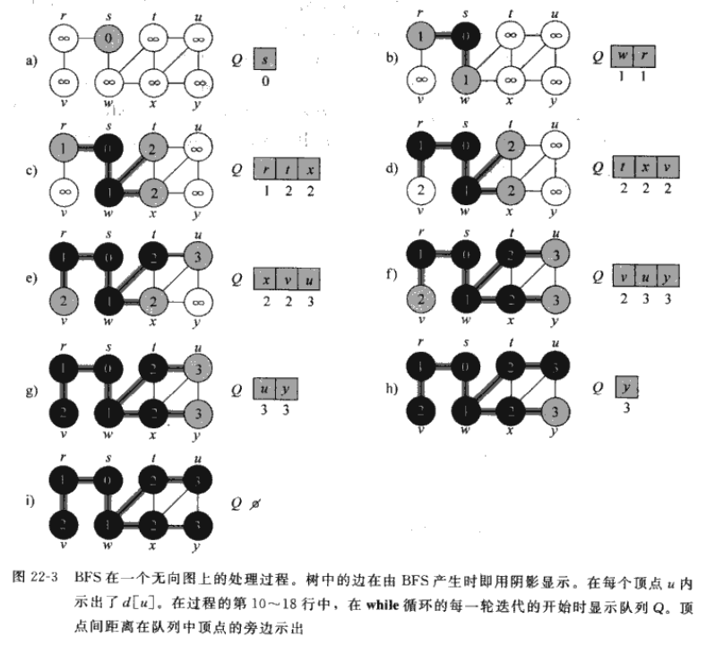
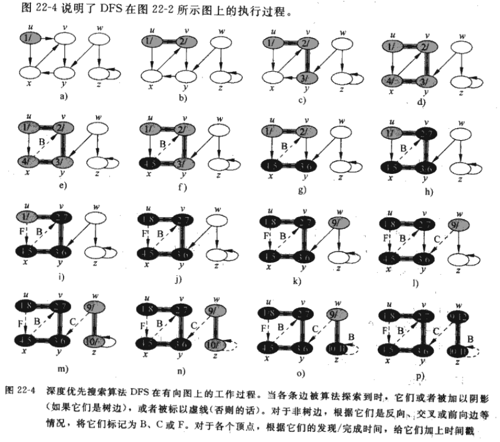
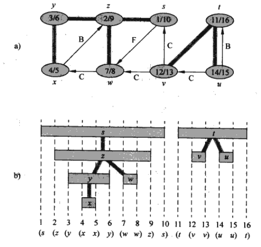

## 前言

此篇博客系补档，写于`2023/11/10`至`2023/12/07`，最后更新于`2023/12/07 21:53`，曾发布于[知乎](https://zhuanlan.zhihu.com/p/670992012)。

## 图论（Graph Theory）的基本知识

我们通常用$G=(V,E)$表示图（Graph，图；Vertices，顶点；Edge，边），一般用邻接矩阵或邻接（链）表来表示，二者都可以存储无向图和有向图。通常我们在稀疏图（$|E|<<|V|^2$）选择邻接表，在稠密图（$|E|$接近$|V|^2$）或需要快速判断任意两个结点之间是否有边相连时选择邻接矩阵。

### 邻接表

对于图$G=(V,E)$的邻接表是一个长度为$|V|$的数组$Adj$，其中数组的每个元素都是一条链表，$Adj[u]$中存储有所有与结点$u$**邻接**的结点。



接下来分别在有向图和无向图中讨论邻接表：
- 若$G$是有向图，则对于边$(u,v)$，结点$v$将出现在链表$Adj[u]$里，因此所有邻接链表的长度之和为$|E|$
- 若$G$是无向图，则对于边$(u,v)$，结点$v$将出现在链表$Adj[u]$中，结点$u$将出现在链表$Adj[v]$中，因此所有邻接链表的长度之和为$2|E|$
不论有向图还是无向图，邻接表的存储空间需求均为$\Theta(V+E)$。
**优点**：邻接表的robust很好，可以对其简单修改来支持许多其他的图变种。如权重图，将边$(u,v)\in E$的权重值$\omega(u,v)$存放在结点$u$的邻接链表中即可。
**缺点**：无法快速判断一条边$(u,v)$是否是图中的一条边，唯一的办法是在$Adj[u]$中搜索结点$v$，邻接矩阵克服了这一缺陷但付出的代价是更大的空间消耗。

### 邻接矩阵

对于图$G$的邻接矩阵表示一个$|V|\times |V|$的矩阵$A=(a_{ij})$，该矩阵满足以下条件：
$$a_{ij}=\begin{cases} 1 ,若(i,j)\in E\\ 0,其他 \end{cases}$$
不管一个图有多少边，邻接矩阵的空间需求皆为$\Theta(V^2)$。在无向图中，邻接链表是一个堆成矩阵，即$A=A^T$，在某些应用中可以只存对角线及其以上部分而减少一半空间占用。同时，当$a_{ij}=\omega(u,v)$也可以用于表示权重图。

## 广度优先搜索（BFS）

### 算法分析

BFS是最简单的图搜索算法之一，Prim的最小生成树算法和Dijkstra的单源最短路径算法都使用了类似BFS的思想。
> 在这里先抽象地描述一下广度优先搜索（BFS）和深度优先搜索（DFS）的区别。想象你身处迷宫之中，你的面前有n条路。
> 在BFS中，你会使用影分身之术，操纵分身走向每一条路，当其中一个分身抵达终点时，你就找到了抵达终点的最短路。
> 在DFS中，你选择其中一条路，一直走到尽头，如果是一条死路，那么你会回到之前的某一个分岔路口，选择另一条路，知道你走完所有能走的路，于是便找到了抵达终点的路。

BFS能够计算从源节点$s$到每个可到达的结点的举例（最少的边数），同时生成一棵“广度优先搜索树”，该树以源结点$s$为根结点，包含所有可以从$s$到达的结点。该算法既可用于有向图，也可用于无向图。
广度优先搜索得名是因为该算法始终是将已发现结点和未发现结点之间的边界沿其广度方向向外扩展。也就是说，算法需要在发现所有距离源结点$s$为$k$的所有结点后才会发现距离源节点距离为$k+1$的结点。
在执行广度优先搜索的过程中将构造出一棵广度优先树，一开始，该树仅含有根结点（源结点$s$）作为已发现的结点。在扫描已发现结点$u$的邻接表时，每当发现一个未知结点$v$时，就将结点$u$和边$(u,v)$加入树中。由于每个结点最多被发现一次，因此最多只有一个父结点。
> 在《算法导论》中，作者给图$G$中的每个结点定义了三种状态：$WHITE$（未发现结点），$BLACK$（已发现结点），$GRAY$（待发现结点，位于$white$结点与$black$结点之间）。
> 假定输入图$G=(V,E)$是以邻接表表示的：
> 1.将每个结点$u$的颜色存放在属性$u.color$中；
> 2.将$u$的前驱节点（父节点）存放在属性$u.\pi$中（若$u=s$或$u$尚未被发现，则$u.\pi=NULL$）；
> 3.将源结点到$u$的距离存放在属性$u.d$中。
> 下面给出BFS的伪代码
> ```
> //$BFS(G,s)$
> for each vertex $u\in G.V-{s}$
> 	$u.color=WHITE$
> 	$u.d=\infty$
> 	$u.\pi=NULL$
> $s.color=GRAY$
> $s.d=0$
> $s.\pi=NULL$
> //初始化，源节点$s$为待发现结点，距离为0，无前驱结点
> //源节点外的结点都是未发现结点
> $Q=\varnothing$
> $ENQUEUE(Q,s)$
> while $Q \ne \varnothing$
> 	$u=DEQUEUE(Q)$
> 	//出队，并对当前结点的邻接结点遍历，进入待发现状态并入队
> 	for each $v \in G.Adj[u]$
> 		if $v.color == WHITE$
> 			$v.color=GRAY$
> 			$v.d=u.d+1$
> 			$v.\pi=u$
> 			$ENQUEUE(Q,v)$
> 	$u.color=BLACK$
> 	//遍历结束后，当前结点从待发现结点变为已发现结点
> ```
>

### 时间复杂度分析

在初始化操作后，BFS不会再给任何点涂上白色，因此`if(v.color==WHITE)`保证了每个结点最多入队/出队一次，入队和出队的时间均为$\Theta(1)$，因此对队列进行操作的总时间为$\Theta(V)$。因为BFS只在一个结点出队时才对结点的邻接表进行扫描，因此每个邻接表最多只扫描一次，由于邻接表长度之和为$\Theta(E)$，用于扫描邻接表的总时间为$\Theta(E)$。综上，BFS的总运行时间为$\Theta(V+E)$，是图$G$的邻接表大小的一个线性函数。

## 深度优先搜索（DFS）

### 算法分析

深度优先搜索总是对最近才发现的结点$v$的出发边进行探索，直到该结点的所有出发边都被发现为止。一旦搜索过程发现的$v$的所有出发边都被发现，则搜索回溯到$v$的前驱结点，该过程一直持续到从源结点可以达到的所有结点都被发现为止。如果还存在尚未发现的结点，则深度优先搜索将从这些未被发现的结点中任选一个作为新的源结点，并重复同样的搜索过程，直到所有结点都被发现为止。
在DFS中，每当扫描已发现顶点$u$的邻接表，发现新的结点$v$时，令$v$的先辈域$\pi[v]$为$u$（出于回溯的目的，可以通过递归的返回地址巧妙地完成）。与BFS不同的是，DFS生成的先辈子图可以由几棵树组成，因为搜索可能由多个源顶点开始重复进行。
> 在《算法导论》中，类似于BFS，DFS也通过对结点着色表示结点的状态。开始时，每个结点都是$WHITE$，在搜索中被发现时置于$GRAY$，在当前搜索结束时（其邻接表被完全搜索后）置于$BALCK$，这可以保证每一顶点在搜索结束时只存在于一棵深度优先树中，因此这些树是不相交的。
> 除了创建深度优先森林，DFS同时为每个结点加盖时间戳。每个结点$v$由两个时间戳：当$v$第一次被发现（置于$GRAY$）时记录第一个时间戳$d[v]$，当结束检查$v$的邻接表（置于$BLACK$）时记录的第二个时间戳$f[v]$。显然，$d[v]<f[v]$。我们可以通过时间戳判断某一结点在DFS中的状态：$times<d[v]$时为$WHITE$，$d[v]<times<f[v]$时为$GRAY$，$times>f[v]$时为$BLACK$。
> 下面给出DFS的伪代码：
> ```
> //$DFS(G)$
> for each vertex $u\in V[G]$
> 	do $color[u]=WHITE$
> 		$\pi[u]=NULL$
> $times=0$
> 	//初始化
> 	for each vertex $u\in V[G]$
> 		do if $color[v]=WHITE$
> 			then $DFS-VISIT(u)$//如果当前结点为被搜索过，那么开搜！
> 				
>//$DFS-VISIT(u)$
> $color[u]=GRAY$
> $d[u]=time$
> for each $v \in Adj[u]$
> 	do if $color[v]=WHITE$
> 		then $\pi[v]=u$
> 			$DFS-VISIT(v)$
> $color[u]=BLACK$
> $f[u]=++time$
> ```
> 

DFS的结果可能依赖于DFS的`for each`各个结点的访问顺序和DFS-VISIT的`for each`对邻接点的访问顺序，但在实践中这些不同的访问顺序往往不会引起什么问题，因为任何DFS结果通常都可以被有效利用，最终结果基本上等价。

### 时间复杂度分析

初始化和遍历每个结点进行DFS-VISIT（不包括调用DFS-VISIT）的循环占用时间为$\Theta(V)$。对于每个结点$v\in V$，过程DFS-VISIT仅被调用一次，因为只有对$WHITE$顶点才会调用DFS-VISIT，且DFS-VISIT的第一件事就是将结点置为$GRAY$。在DFS-VISIT($v$)的一次执行过程中，循环被执行了$|Adj[v]|$次，由于$\Sigma |Adj[v]| = \Theta(E)$，故DFS0VUSUT的循环代价为$\Theta(E)$。因此，DFS的运行时间为$\Theta(V+E)$。

### DFS的性质

如果把发现结点$u$用左括号"$(u$"表示，完成用右括号"$u)$"表示，那么在各级括号正确嵌套的前提下，发现于完成时间的记载就是一个完善的表达式。
> 

**推论（后裔区间的嵌套）** 在一个（有向/无向）图$G$中的深度优先森林中，结点$v$是结点$u$的后裔，当且仅当$d[u]<d[v]<f[v]<f[u]$（由**括号定理**证明）。

### 边的分类

树边（tree edge）深度优先森林中的边，如果结点$v$是在探寻边$(u,v)$时被首次发现，那么$(u,v)$就是一条树边。
反向边（$B$,back edge）深度优先树中结点$u$到某一祖先$v$的边（可能产生自环的边）。
正向边（$F$,forward edge）深度优先树中连接$u$到某后裔$v$的**非树边**$(u,v)$。
交叉边（$C$,cross edge）其他类型的边，存在于同一深度优先树种的两个结点（其中一个结点不是另一个结点的祖先）之间或不同深度优先树的结点之间。

## 拓扑排序

### 算法分析

对一个有向无环图（$DAG$）$G=(V,E)$进行拓扑排序后，结果为该图所有结点的一个**线性序列**，满足若$G$包含边$(u,v)$，则在该序列种$u$出现在$v$的前面（若图有环路则不可能存在这样的线性序列）。简单来看，图的拓扑排序可以看成所有结点沿水平线排列而成的一个序列，其中所有有向边均从左指向右。
> ```下面给出拓扑排序的伪代码
> //$TOPOLOGICAL-SORT(G)$
> call $DPS(G)$ to compute finishing times $f[v]$ for rach vertex $v$
> as each vertex is finished, insert it onto the front of a linked list
> **return** the linked list of vertices
> ```

因为DFS的运行时间为$\Theta(V+E)$，而将$|V|$个结点中的每一结点插入链表所需的时间为$\Theta(1)$，因此拓扑排序的运行时间为$\Theta(V+E)$。

### 应用

给任务排序（Ordering Tasks，UVa 10305)
> 假设有$n$个变量，还有$m$个二元组$(u,v)$，分别表示变量$u$小于$v$。那么，所有变量从小到大排列起来应该是什么样子？例如，有4个变量$a,b,c,d$，若已知$a<b$，$c<b$，$d<c$，则这4个变量的排序可能是$a<d<c<b$，找出其中一个可能的答案即可。

**Solution**：把每个变量看成一个点，“小于”关系看成有向边，则得到了一个有向图，任务转化为对这张图进行拓扑排序。
这里给出紫书（《算法竞赛入门经典-第二版》-刘汝佳）的代码：
其中，$c[u]=0$表示从未访问过，$c[u]=1$表示已经访问过且递归访问所有子孙（DFS已返回），$c[u]=-1$表示正在访问（递归调用dfs(u)或正在栈帧中，尚未返回）。
```cpp
int c[maxn], topo[maxn], t;
bool dfs(int u){
	c[u] = -1;//访问标志
	for(int v = 0; v < n; v++)if(G[u][v]){
		if(c[v] == -1) return false;//存在环路，退出
		else if(c[v] == 1 && !dfs(v)) return false;//访问完所有子孙，退出
	}
	c[u] = 1; topo[--t] = u;
	return true;
}
bool toposort(){
	t = n;
	memset(c, 0, sizeof(c));
	for(int u = 0; u < n; u++)if(!c[u])
		if(!dfs(u)) return false;
	return true;
}
```
