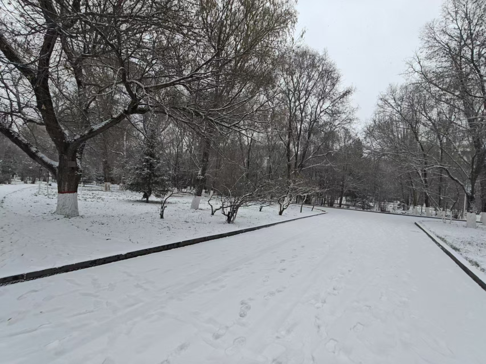
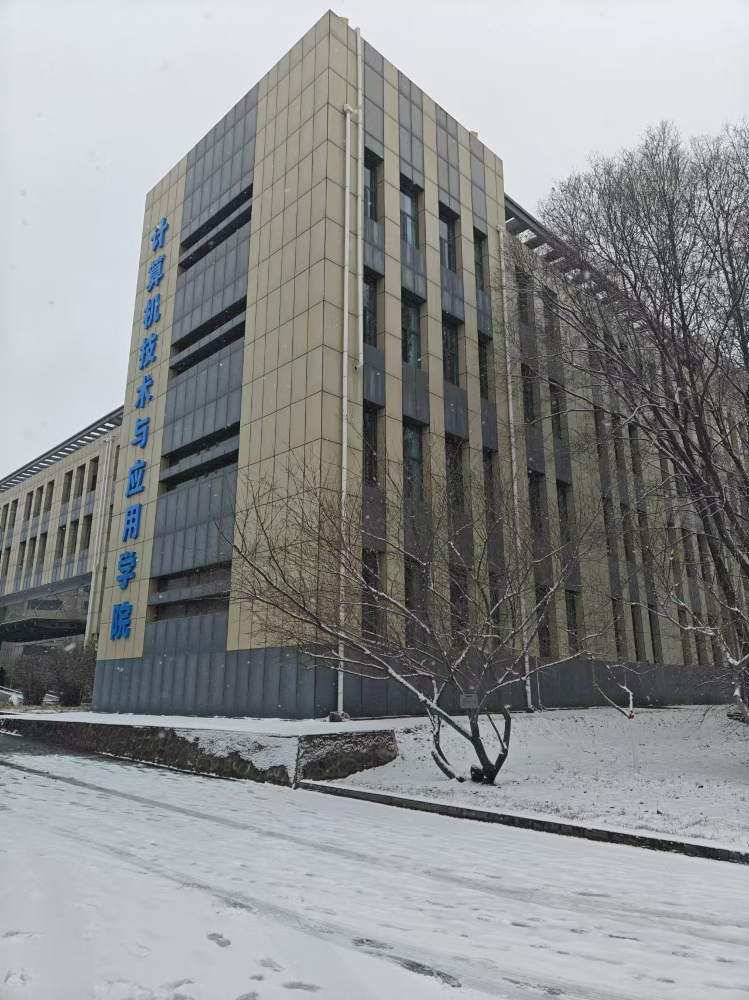

# Welcome——

欢迎来到我的技术&生活博客！本站点建于`2024/11/23`，本篇文章写于`2024/11/24`的晚上。想写的东西有很多，但到真正要落笔时却有些踌躇不前。

# 关于*Kambri*

我是一名国内CS专业大三本科生，研究方向是高性能计算（HPC），未来希望在这个领域深造。希望能在ASC25取得佳绩，明年的推研和实习有个好去处。

爱好旅行（想记录旅行过程也是建站的目的之一），希望能在学生时代结束前环游中国；音乐，喜欢梶浦由记（和她的乐队，Kalafina和Fiction Junction）kokia、aimer的歌曲。

# 关于站点

该站点由[Hugo](https://github.com/gohugoio/hugo)构建，使用[Stack主题](https://github.com/CaiJimmy/hugo-theme-stack)并进行修改，并托管于[GitHub Pages](https://pages.github.com/)。

建设站点计划TODOLIST：

- [ ] 配置CDN并绑定域名

- [x] ~~_~~添加评论系统，可能是[utterances](https://github.com/utterance)~~_~~（Finished，确实是`utterances`）

- [ ] Last but not least，更多文章

博文更新计划TODOLIST：

- [ ] MPI、算法导论等学习笔记（迁移）

- [ ] 运维记录（迁移）

- [ ] 旅行回忆录，以往的旅行经历就靠零星的回忆和些许照片还原罢，这或许也不错

- [ ] LIVE回忆录

如果你喜欢我的博客，欢迎来到[站点仓库](https://github.com/KaigeZheng/KaigeZheng.github.io)点一个star，谢谢！

# 寄语

从我上踏入计算机科学与技术这个专业开始，便一直想拥有一个技术博客。但由于种种原因，比较流行的博客平台如CSDN、博客园、知乎都没有让我特别感兴趣，我也够懒，时至今日才动手搭建属于自己的博客站点。所幸大多精彩的技术知识没有因此错过，它们大多被我记录于OneNote或是Obsidian中，在未来我也会视情况将这些留存的技术文章或是学习笔记迁移到这个站点。

随着大学生活的推移，我有了很多足够精彩的经历，但很少在社交媒体发文，因此也愈发希望能够在某个地方记录这些转瞬即逝的想法。在起初的构想中，技术博文和生活随笔放在不同的站点或许会更有利于读者，但想来还是过于折腾，就索性放在一起罢。

总之，在这个大雪纷飞的夜晚，Kambri's Blog正式诞生了！

 