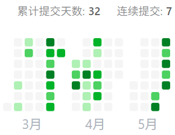

## 前言

前言写于`2025/05/22 23:58`，在一刻钟前我刚完成hot 100题单。突然感慨于身为计算机科班学生与算法（这里仅指传统算法，非AI/ML算法）的孽缘，从高考后向往ACM学习C/C++和[紫书](https://book.douban.com/subject/25902102/)~~（被紫书摧残）~~，大一开始为成为ACMer而日刷洛谷夜刷codeforces，到大二认清现实放弃ACM，却因离不开算法而浅读《算法导论》，到大三为找回感觉和准备机试而速通leetcode hot 100...不知未来如何，起码本科的每个阶段都离不开算法（可惜咱算法水平一般）。本篇博文用于记录我从3月6日开始到今天写hot 100的过程。



---

[leetcode hop 100](https://leetcode.cn/studyplan/top-100-liked/)

## 哈希

### 两数之和

难度：Easy

[1. 两数之和](https://leetcode.cn/problems/two-sum/description/?envType=study-plan-v2&envId=top-100-liked)

给定数组，求$x + y = target$的任意解。

暴力枚举很容易实现，$\Theta(n^2)$的时间复杂度和$\Theta(1)$的空间复杂度。使用哈希表可以实现空间换时间，让时间和空间复杂度都为$\Theta(n)$。

遍历元素时判断`target - x`是否存在哈希表，若不存在则将`(x, index)`存入哈希表中，只用遍历一遍数组。

```cpp
class Solution {
public:
    vector<int> twoSum(vector<int>& nums, int target) {
        unordered_map<int, int> hash;
        for(int i = 0; i < nums.size(); ++i) {
            auto it = hash.find(target - nums[i]);
            if(it != hash.end()) return {it->second, i};
            hash[nums[i]] = i;
        }
        return {};
    }
};
```

### 字母异位词分组

难度：Medium

[49. 字母异位词分组](https://leetcode.cn/problems/group-anagrams/description/?envType=study-plan-v2&envId=top-100-liked)

给定字符串数组，将*字母相同顺序不同的单词*组合再一起按任意顺序返回列表。

第一个思路是字符串哈希，应该是可以过掉大部分样例的（但也有被卡单哈希模数和溢出的风险）。这里将每个单词排序后插入哈希表，实现方法也很简单。拷贝结果的方法值得参考。

```cpp
class Solution {
public:
    vector<vector<string>> groupAnagrams(vector<string>& strs) {
        unordered_map<string, vector<string>> hash;
        for(string s : strs) {
            string data = s;
            sort(s.begin(), s.end());
            hash[s].emplace_back(data);
        }
        vector<vector<string>> ans;
        for(auto x : hash) ans.emplace_back(x.second);
        return ans;
    }
};
```

### 最长连续序列

难度：Medium

[128. 最长连续序列](https://leetcode.cn/problems/longest-consecutive-sequence/description/?envType=study-plan-v2&envId=top-100-liked)

给定未排序的数组，找出数字连续的最长序列长度（不要求在原数组中连续）。

使用`std::set`的自动排序可以轻松实现，虽然能过题，但是速度非常慢，只是样例没那么严格才能过的题，时间复杂度是$\Theta(nlogn)$。

```cpp
class Solution {
public:
    int longestConsecutive(vector<int>& nums) {
        if(!nums.size()) return 0;
        set<int> s;
        for(int x : nums) {
            s.insert(x);
        }
        int cnt = 0;
        int max_cnt = 1;
        int last = -1;
        for(int x : s) {
            if(last + 1 == x) {
                max_cnt = max(++cnt, max_cnt);
            }else{
                cnt = 1;
            }
            last = x;
        }
        return max_cnt;
    }
};
```

正解（哈希表）的构思很巧妙，首先遍历一遍数组去重，然后再遍历一遍哈希表。遍历时（假设当前元素为`x`），若`x - 1`在表中则跳过（因为这表示这个元素是最长序列的中间点或尾部，而非起点）；若`x - 1`不在表中，表明`x`只可能是起点，开始不断寻找`x + 1`是否在表内。

```cpp
class Solution {
public:
    int longestConsecutive(vector<int>& nums) {
        unordered_set<int> hash;
        for(int num : nums) hash.insert(num);
        int max_cnt = 0;
        for(int num : hash) {
            if(!hash.count(num - 1)) {
                int cur = num;
                int cnt = 1;
                while(hash.count(cur + 1)) {
                    ++cur; ++cnt;
                }
                max_cnt =max(cnt, max_cnt);
            }
        }
        return max_cnt;
    }
};
```

## 双指针

### 移动零

难度：Easy

[283. 移动零](https://leetcode.cn/problems/move-zeroes/description/?envType=study-plan-v2&envId=top-100-liked)

给定数字，将所有0移到末尾（要求原地操作）。

使用双指针，左指针指向已处理好的序列尾部，右指针指向待处理序列头部。右指针不断移动，当指向非零元素时左右指针元素交换，且左指针右移。这样保证了左指针左边均非零，右指针到左指针之间均为0。

### 盛最多水的容器

难度：Medium

[11. 盛最多水的容器](https://leetcode.cn/problems/container-with-most-water/?envType=study-plan-v2&envId=top-100-liked)

给定数组height，求$(j - i) * min(height[i], height[j])$的最大值。

$\Theta(n^2)$的暴力解法显然会TLE，这题的双指针有些难想到。

首先设置分别从头开始遍历和从尾开始遍历的双指针，考虑以下结论：

+ 若向内移动短板，$min(height[i], height[j])$可能增大，因此$S$**可能**增大

+ 若向内移动长板，$min(height[i], height[j])$可能不变或变小，又$j-i$一定变小，因此$S$**一定**变小

```cpp
class Solution {
public:
    int maxArea(vector<int>& height) {
        int ans = 0, i = 0, j = height.size() - 1;
        while(i < j) {
            int result = (j - i) * min(height[i], height[j]);
            ans = max(ans, result);
            if(height[i] > height[j]) --j;
            else ++i;
        }
        return ans;
    }
};
```

### 三数之和

难度：Medium

[15. 三数之和](https://leetcode.cn/problems/3sum/description/?envType=study-plan-v2&envId=top-100-liked)

与[两数之和（哈希）](https://leetcode.cn/problems/two-sum/)类似。题目主要分为两个部分，寻找满足条件的解和去重。找到解再通过哈希表去重有些麻烦，在遍历前排序，直接保证解$(a, b, c)$满足$a \leq b \leq c$即可方便地去重。

暴力的时间复杂度为$\Theta(n^3)$（三重循环），可以改为一重循环+双指针，时间复杂度为$\Theta(n * n)=\ThetaO(n^3)$，在左指针元素递增时右指针元素递减。

```cpp
class Solution {
public:
    vector<vector<int>> threeSum(vector<int>& nums) {
        vector<vector<int>> ans;
        sort(nums.begin(), nums.end());
        for(int i = 0; i < nums.size(); ++i) {
            if(i && nums[i] == nums[i - 1]) continue;
            int l = i + 1; 
            int r = nums.size() - 1;
            while(l < r) {
                while(l > i + 1 && l < nums.size() && nums[l] == nums[l - 1]) ++l;
                while(r < nums.size() - 1 && nums[r] == nums[r + 1]) --r;
                if(l >= r) break;
                if(nums[i] + nums[l] + nums[r] > 0) --r;
                else if (nums[i] + nums[l] + nums[r] < 0) ++l;
                else{
                    ans.push_back({nums[i], nums[l], nums[r]});
                    ++l; --r;
                }
            }
        }
        return ans;
    }
};
```

### 接雨水

难度：Hard

[42. 接雨水](https://leetcode.cn/problems/trapping-rain-water/?envType=study-plan-v2&envId=top-100-liked)

给定数组表示每个宽度为1的柱子的高度图，计算按此排列的柱子下雨后能接多少雨水。

对于下标$i$，能接的水等于下表$i$两边的最大高度的最小值减去$height[i]$。暴力法就是对于每个$i$都分别向左和向右遍历最大高度，时间复杂度是$\Theta(n^3)$。

#### 构造动态规划

使用动态规划，可以在$\Theta(n)$的时间内预处理得到每个位置两边的最大高度。维护两个长度为$n$的数组$leftMax$和$rightMax$，分别表示$i$及左边的最大值和$i$及右边的最大值。

+ $leftMax[i] = max(leftMax[i - 1], height[i])$(正向遍历)

+ $rightMax[i] = max(rightMax[i + 1], height[i])$(逆向遍历)

于是下标$i$处能接的雨水量等于$min(leftMax[i], rightMax[i]) - height[i]$。

```cpp
class Solution {
public:
    int trap(vector<int>& height) {
        int n = height.size();
        vector<int> leftMax, rightMax;
        leftMax.resize(n);
        rightMax.resize(n);
        /* 预处理:维护leftMax和rightMax */
        leftMax[0] = height[0];
        for(int i = 1; i < n; ++i) {
            leftMax[i] = max(leftMax[i - 1], height[i]);
        }
        rightMax[n - 1] = height[n - 1];
        for(int i = n - 2; i >= 0; --i) {
            rightMax[i] = max(rightMax[i + 1], height[i]);
        }
        /* DP */
        int ans = 0;
        for(int i = 0; i < n; ++i) {
            ans += min(leftMax[i], rightMax[i]) - height[i];
        }
        return ans;
    }
};
```

#### 双指针优化

使用双指针就不需要维护数组$leftMax$和$rightMax$了，可以将空间复杂度从$\Theta(n)$降低到$\Theta(1)$，但是很难想。

维护两个指针$left$和$right$，以及两个变量$leftMax$和$rightMax$，$left$向右移动，$right$向左移动。

+ 使用$height[left]$和$height[right]$的值更新$leftMax$和$rightMax$

+ 如果$height[left] \lt height[right]$，则必有$leftMax \lt rightMax$，此时$left$处能接的雨水量等于$leftMax - height[left]$，$left$右移

+ $right$的遍历基本同上，直到双指针相遇结束

## 滑动窗口

涉及到**子串**（连续非空字符序列，并非子序列），就可以考虑一下滑动窗口了。

### 无重复字符的最长子串

难度：Medium

[3. 无重复字符的最长子串](https://leetcode.cn/problems/longest-substring-without-repeating-characters/description/?envType=study-plan-v2&envId=top-100-liked)

给定一个字符串，找出不含重复字符的额最长**子串**长度。

有点类似双指针，滑动窗口也需要$left$和$right$控制滑动窗口左右边界

+ 当$right + 1$元素存在且不重复时，向右扩大窗口

+ 不满足扩大窗口条件时，向右缩小窗口并将窗口外元素排除出哈希集合

```cpp
class Solution {
public:
    int lengthOfLongestSubstring(string s) {
        unordered_set<char> hash;
        int ans = 0, right = -1;
        for(int left = 0; left < s.size(); ++left) {
            /* 移动左边界直到子串不重复 */
            if(left != 0) hash.erase(s[left - 1]);
            /* 右边界存在且不重复时扩大窗口 */
            while(right + 1 < s.size() && !hash.count(s[right + 1])) {
                hash.insert(s[right + 1]);
                ++right;
            }
            ans = max(ans, right - left + 1);
        }
        return ans;
    }
};
```

### 找到字符串中所有字母异位词

难度：Medium

[438. 找到字符串中所有字母异位词](https://leetcode.cn/problems/find-all-anagrams-in-a-string/description/?envType=study-plan-v2&envId=top-100-liked)

给定两个字符串`s`和`p`，找到`s`中所有`p`的异位词的**子串**，返回这些**子串**的起始索引。

写了段又臭又长的代码，但反正思路是对的。这个滑动窗口比上一个简单，因为只要开始滑动，$right$和$left$是同时递增的。

```cpp
class Solution {
public:
    vector<int> findAnagrams(string s, string p) {
        vector<int> ans;
        if(s.size() < p.size()) return ans;
        vector<int> hash;
        vector<int> hash_table(26, 0);
        vector<int> hash_table2(26, 0);
        for(int i = 0; i < p.size(); ++i) {
            ++hash_table[p[i] - 'a'];
        }
        int right = 0;
        for(int left = 0; left < s.size() - p.size() + 1; ++left) {
            if(left != 0) {
                --hash_table2[hash[0]];
                hash.erase(hash.begin());
            }
            while(right - left < p.size() && right < s.size()) {
                hash.emplace_back(s[right] - 'a');
                ++hash_table2[s[right++] - 'a'];
            }
            bool ok = true;
            for(int i = 0; i < 26; ++i) {
                if(hash_table2[i] != hash_table[i]) {
                    ok = false;
                    break;
                }
            }
            if(ok) ans.emplace_back(left);  
        }
        return ans;
    }
};
```

## 子串

### 和为K的子数组

难度：Medium

[560. 和为K的子数组](https://leetcode.cn/problems/subarray-sum-equals-k/description/?envType=study-plan-v2&envId=top-100-liked)

给定数组和一个整数$k$，返回该数组中和为$k$的子数组的个数。

写了一个非常之蠢的$\Theta(n^2)$的前缀和（这和暴力有什么区别啊喂），竟然能AC。正解需要前缀和+哈希表优化。

定义$s[i + 1]$为$[0..i]$里所有数的和，则$s[i]$可以由$s[i - 1]$递推而来，即$s[i] = s[i - 1] + nums[i - 1]$。

设$i \lt j$，如果$nums[i]$到$nums[j-1]$的元素和等于$k$，用前缀和表示就是$s[j] - s[i] == k$，移项得$s[i]==s[j]-k$。

即，我们需要计算有多少个$s[i]$满足$i \lt j$且$s[i] == s[j] - k$。既要求$s[i]$的个数又要求$s[j]$的个数，那么用哈希表优化。（已知$s[j]$和$k$，统计$s[0]$到$s[j-1]$长有多少个数等于$s[j] - k$）

这个做法挺难理解的。

```cpp
class Solution {
public:
    int subarraySum(vector<int>& nums, int k) {
        int n = nums.size();
        vector<int> s(n + 1);
        /* 维护前缀和数组 */
        s[0] = 0;
        for(int i = 0; i < n; ++i) {
            s[i + 1] = s[i] + nums[i];
        }
        int ans = 0;
        unordered_map<int, int> hash;
        for(int x : s) {
            /* 对于每一个j(右端), 寻找s[?] - k的个数, O(1) */
            ans += hash.contains(x - k) ? hash[x - k] : 0;
            ++hash[x];
        }
        return ans;
    }
};
```

### 滑动窗口最大值

难度：Hard

[239. 滑动窗口最大值](https://leetcode.cn/problems/sliding-window-maximum/?envType=study-plan-v2&envId=top-100-liked)

给定数组和一个大小为k的滑动窗口（从左往右移动，每次移动一位），只能看到滑动窗口内的k个数字，返回滑动窗口中的最大值。

#### 优先队列（大根堆）

优先队列中的元素数量不一定等于滑动窗口大小（因为堆顶元素是最大值，但这个最大值不一定在滑动窗口中）。初始先将$k$个元素放入大根堆中。每次向右移动窗口就可以放一个心得元素到大根堆中，然后判断堆顶元素下标是否在滑动窗口范围内。

将一个元素放入优先队列的时间复杂度为$\Theta(log n)$，因此总体时间复杂度为$\Theta(nlogn)$。

```cpp
class Solution {
public:
    vector<int> maxSlidingWindow(vector<int>& nums, int k) {
        int n  = nums.size();
        priority_queue<pair<int, int>> q; // 大顶堆
        for(int i = 0; i < k; ++i) {
            q.emplace(nums[i], i);
        }
        vector<int> ans = {q.top().first};
        for(int i = k; i < n; ++i) {
            q.emplace(nums[i], i);
            while(q.top().second <= i - k) {
                q.pop();
            }
            ans.emplace_back(q.top().first);
        }
        return ans;
    }
};
```

#### 双向队列（大根堆）

使用`deque`模拟滑动窗口（当然`deque`内的元素数量不一定等于滑动窗口大小），满足队首存储当前窗口的最大值，依据滑动窗口下标决定是否要弹出。由于不需要自动排序，时间复杂度可以优化为$\Theta(n)$

```cpp
class Solution {
public:
    vector<int> maxSlidingWindow(vector<int>& nums, int k) {
        int n = nums.size();
        deque<int> dq;
        vector<int> ans(n - k + 1);
        for(int i = 0; i < k; ++i) {
            /* 如果插入的元素更大，就可以把前面的元素去掉了 -> 队首是最大值*/
            while(!dq.empty() && dq.back() < nums[i])
                dq.pop_back();
            dq.push_back(nums[i]);
        }
        ans[0] = dq.front();
        for(int i = k; i < n; ++i) {
            if(dq.front() == nums[i - k])
                dq.pop_front();
            while(!dq.empty() && dq.back() < nums[i])
                dq.pop_back();
            dq.push_back(nums[i]);
            ans[i - k + 1] = dq.front();
        }
        return ans;
    }
};
```

### 最小覆盖子串

难度：Hard

[76. 最小覆盖子串](https://leetcode.cn/problems/minimum-window-substring/description/?envType=study-plan-v2&envId=top-100-liked)

给定字符串`s`和`t`，返回`s`中涵盖`t`所有字符的最小子串或空。

官解写得太难看懂了，终于找到了一个可以看懂的代码。使用滑动窗口+哈希表，在滑动时维护哈希表和计数器`cnt`，代码值得学习。

```cpp
class Solution {
public:
    string minWindow(string s, string t) {
        int n = s.size(), m = t.size();
        if(n < m) return "";
        vector<int> cnt(128, 0);
        for(const char &x : t) cnt[x]++;
        int l = 0, cntC = m, ansL = 0, ansR = n + 1;
        for(int r = 0; r < n; r++) {
            // 如何出现过则计数器减一
            if(cnt[s[r]] > 0) cntC--;
            // 当前字符在计数器中减一
            cnt[s[r]]--;
            // 如果左指针元素可以不出现，则右移
            while(cnt[s[l]] < 0) {
                cnt[s[l]]++;
                l++;
            }
            // 如果计数器为0说明找到了一个包含t的子串
            if(cntC == 0) {
                if(r - l < ansR - ansL) ansL = l, ansR = r;
                // 左指针右移，继续滑动
                cnt[s[l]]++;
                l++;
                cntC++;
            }
        }
        return ansR == n + 1 ? "" : s.substr(ansL, ansR - ansL + 1);
    }
};
```

## 普通数组

### 最大子数组和

难度：Medium

[53. 最大子数组和](https://leetcode.cn/problems/maximum-subarray/?envType=study-plan-v2&envId=top-100-liked)

给定整数数组，求连续子数组的最大和。

靠肌肉记忆秒了，贪心算法可解。

```cpp
class Solution {
public:
    int maxSubArray(vector<int>& nums) {
        long long ans = -10005, cur = 0;
        for(const int& x: nums) {
            cur += x;
            ans = max(cur, ans);
            if(cur < 0) cur = 0;
        }
        return ans;
    }
};
```

### 合并区间

难度：Medium

[56. 合并区间](https://leetcode.cn/problems/merge-intervals/?envType=study-plan-v2&envId=top-100-liked)

给定数组`pair<int, int>[]`，合并所有重叠的区间并返回一个不重叠的区间数组。

写了半天错误的解法，发现不能简单地扫一遍数组并维护一个一维数组。这样会导致类似`[[1, 4], [5, 6]]`这样的区间输出`[1, 6]`，而实际上中间并不连续，一开始就走上了不归路...

正解是按区间的左端点排序，那么可以合并的区间一定是连续的。用结果的最后一个区间判断是否重叠，如果重叠就更新最后一个区间的右端点，否则加入新区间。代码值得学习。

```cpp
class Solution {
public:
    vector<vector<int>> merge(vector<vector<int>>& intervals) {
        sort(intervals.begin(), intervals.end(), [](auto& x, auto& y) {
            return x[0] < y[0];
        }); /* 虽然默认也是按第一个元素排的 */
    vector<vector<int>> result;
    result.push_back(intervals[0]);
    for(int i = 1; i < intervals.size(); ++i) {
        int start = intervals[i][0], end = intervals[i][1], n = result.size();
        if(start <= result[n - 1][1]) {
            result[n - 1][1] = max(result[n - 1][1], end);
        } else {
            result.push_back(intervals[i]);
        }
    }
    return result;
    }
};
```

### 轮转数组

难度：Medium

[189. 轮转数组](https://leetcode.cn/problems/rotate-array/?envType=study-plan-v2&envId=top-100-liked)

给定整数数组，将数组中的元素向右原地轮转`k`个位置。

用最直接的方法来模拟即可，记得防止溢出(`k %= nums.size()`)。

```cpp
class Solution {
public:
    void rotate(vector<int>& nums, int k) {
        vector<int> tmp;
        k %= nums.size(); // 记得防溢出!
        for(int i = nums.size() - k; i < nums.size(); ++i) {
            tmp.push_back(nums[i]);
        }
        for(int i = nums.size() - 1; i >= k; --i) {
            nums[i] = nums[i - k];
        }
        for(int i = 0; i < k; ++i) {
            nums[i] = tmp[i];
        }
    }
};
```

### 除自身以外数组的乘积

难度：Medium

[238. 除自身以外数组的乘积](https://leetcode.cn/problems/product-of-array-except-self/?envType=study-plan-v2&envId=top-100-liked)

给定整数数组`nums`，返回数组`answer`，其中`answer[i]`等于`nums`中除`nums[i]`外其余各元素乘积。（禁用除法，要求时间复杂度$\Theta(n)$）

初见无思路。题意等价于，只要知道`i`左边所有数的乘积和`i`右边所有数的乘积即可得到`answer[i]`->前缀和！

定义`pre[i]`表示从`nums[0]`到`nums[i-1]`的乘积；定义`suf[i]`表示从`nums[i+1]`到`nums[n-1]`的乘积。

```cpp
class Solution {
public:
    vector<int> productExceptSelf(vector<int>& nums) {
        int n = nums.size();
        vector<int> pre(n, 1);
        for(int i = 1; i < n; ++i)      pre[i] = pre[i - 1] * nums[i - 1];
        vector<int> suf(n, 1);
        for(int i = n - 2; i >= 0; --i) suf[i] = suf[i + 1] * nums[i + 1];
        vector<int> ans(n);
        for(int i = 0; i < n; ++i)      ans[i] = pre[i] * suf[i];
        return ans;
    }
};
```

### 缺失的第一个正数

难度：Hard

[41. 缺失的第一个正数](https://leetcode.cn/problems/first-missing-positive/description/?envType=study-plan-v2&envId=top-100-liked)

给定一个未排序的整数数组，找出其中没有出现的最小的正整数（要求时间复杂度$\Theta(n)$，空间复杂度$\Theta(1)$）。

初见无思路。很诡异的解法：1）将所有负数修改为$n+1$；2）遍历数组，如果绝对值在$[1, N]$中则将$|x| - 1$位置的数改为负数；3）遍历数组，如果每个数都是负数，则答案是$N + 1$，否则答案是第一个正数的位置加1（一种用位置index来映射真实数字的哈希表）。

```cpp
class Solution {
public:
    int firstMissingPositive(vector<int>& nums) {
        int n = nums.size();
        for(int& num: nums) {
            if(num <= 0) num = n + 1;
        }
        for(int i = 0; i < n; ++i) {
            int num = abs(nums[i]);
            if(num <= n) nums[num - 1] = -abs(nums[num - 1]);
        }
        for(int i = 0; i < n; ++i) {
            if(nums[i] > 0) return i + 1;
        }
        return n + 1;
    }
};
```

## 矩阵

### 矩阵置零

难度：Medium

[73. 矩阵置零](https://leetcode.cn/problems/set-matrix-zeroes/description/?envType=study-plan-v2&envId=top-100-liked)

给定mxn的矩阵，如果一个元素为0，使用原地算法将所在行列所有元素都设0。

Solution 1（时间复杂度$\Theta(2mn)$，空间复杂度$\Theta(m+n)$）：用两个数组，分别记录每一行每一列是否有零出现，最后更新原矩阵

Solution 2（时间复杂度$\Theta(2mn)$，空间复杂度$\Theta(2)$）：在Solution 1的基础上优化，用矩阵的第一行和第一列替代两个标记数组，并用两个标记变量分别记录第一行和第一列是否包含0。节省了空间，不过步骤麻烦了很多。

```cpp
# Solution 2
class Solution {
public:
    void setZeroes(vector<vector<int>>& matrix) {
        int m = matrix.size();
        int n = matrix[0].size();
        bool row_1 = false, col_1 = false;
        // 检查第一行和第一列
        for(int i = 0; i < m; ++i) if(!matrix[i][0]) row_1 = true;
        for(int i = 0; i < n; ++i) if(!matrix[0][i]) col_1 = true;
        // 检查其余矩阵
        for(int i = 1; i < m; ++i) {
            for(int j = 1; j < n; ++j) {
                if(!matrix[i][j]) matrix[i][0] = matrix[0][j] = 0;
            }
        }
        // 更新全局矩阵(注意是从index=1开始)
        for(int i = 1; i < m; ++i) if(!matrix[i][0]) for(int j = 0; j < n; ++j) matrix[i][j] = 0;
        for(int j = 1; j < n; ++j) if(!matrix[0][j]) for(int i = 0; i < m; ++i) matrix[i][j] = 0;
        // 更新第一行和第一列
        if(row_1) for(int i = 0; i < m; ++i) matrix[i][0] = 0;
        if(col_1) for(int i = 0; i < n; ++i) matrix[0][i] = 0;
    }
};
```

### 螺旋矩阵

难度：Medium

[54. 螺旋矩阵](https://leetcode.cn/problems/spiral-matrix/?envType=study-plan-v2&envId=top-100-liked)

给定mxn的矩阵，按照顺时针螺旋向里的顺序返回矩阵中的所有元素。

暴力模拟，非常不优雅的代码，就不贴了。

### 旋转图像

难度：Medium

[48. 旋转图像](https://leetcode.cn/problems/rotate-image/?envType=study-plan-v2&envId=top-100-liked)

给定nxn的矩阵，原地顺时针旋转90度。

Solution 1（时间复杂度$\Theta(n^2)$，空间复杂度$\Theta(n^2)$）：找规律可以发现$matrix[row][col]$在旋转后的位置为$matrix[col][n - row - 1]$。因此用一个二维辅助矩阵存储旋转后的矩阵，最后更新即可。

Solution 2（时间复杂度$\Theta(n^2)$，空间复杂度$\Theta(1)$）：很巧妙，顺时针旋转90°等价于**先水平翻转一次**（$matrix[row][col] \leftrightarrow matrix[n - row - 1][col]$），**再主对角线翻转一次**（$matrix[row][col] \leftrightarrow matrix[col][row]$）。

```cpp
# Solution 2
class Solution {
public:
    void rotate(vector<vector<int>>& matrix) {
        int n = matrix.size();
        // 水平翻转
        for(int i = 0; i < n / 2; ++i) {
            for(int j = 0; j < n; ++j) {
                swap(matrix[i][j], matrix[n - i - 1][j]);
            }
        }
        // 主对角线翻转
        for(int i = 0; i < n; ++i) {
            for(int j = 0; j < i; ++j) {
                swap(matrix[i][j], matrix[j][i]);
            }
        }
    }
};
```

### 搜索二维矩阵II

难度：Medium

[240. 搜索二维矩阵II](https://leetcode.cn/problems/search-a-2d-matrix-ii/description/?envType=study-plan-v2&envId=top-100-liked)

给定mxn的矩阵，每行的元素从左到右升序，每列的元素从上到下升序，搜索目标值target是否存在。

Solution 1：跟搜索二维矩阵I不同，不是顺序严格递增，因此不能先对列二分，锁定某一行后再二分，但是可以对每一行都二分，代码简洁值得学习。

```cpp
# Solution 1
class Solution {
public:
    bool searchMatrix(vector<vector<int>>& matrix, int target) {
        for(const auto& row: matrix) {
            auto it = lower_bound(row.begin(), row.end(), target);
            if(it != row.end() && *it == target) return true;
        }
        return false;
    }
};
```

Solution 2：很巧妙的方法，以右上角为二叉树的根节点，就得到了一个向左子树移动变小，向右子树移动变大的二叉搜索树！天才解法！

```cpp
class Solution {
public:
    bool searchMatrix(vector<vector<int>>& matrix, int target) {
        int i = matrix.size() - 1, j = 0;
        while(i >= 0 && j < matrix[0].size()) {
            if(matrix[i][j] > target) --i;
            else if(matrix[i][j] < target) ++j;
            else return true;
        }
        return false;
    }
};
```

## 链表

### 相交链表(哈希、双指针)

难度：Easy

[160. 相交链表](https://leetcode.cn/problems/intersection-of-two-linked-lists/?envType=study-plan-v2&envId=top-100-liked)(Easy):给两个单链表的头节点，找出并返回两个单链表相交的起始节点。（Note:不是值相等，而是内存空间相等）

#### 哈希集合

时间复杂度：$\Theta (m+n)$

空间复杂度：$\Theta (m)$

遍历单链表A并把每个元素（内存地址）存储到集合(`unordered_set`)中，遍历单链表B并判断A中是否已经存在(`unordered_set.count(..)`)。

```C++
class Solution {
public:
    ListNode *getIntersectionNode(ListNode *headA, ListNode *headB) {
        unordered_set<ListNode *> visited;
        ListNode *temp = headA;
        while(temp != nullptr) {
            visited.insert(temp);
            temp = temp->next;
        }
        temp = headB;
        while(temp != nullptr) {
            if(visited.count(temp)) {
                return temp;
            }
            temp = temp->next;
        }
        return nullptr;
    }
};
```

#### 双指针

时间复杂度：$\Theta (m+n)$

空间复杂度：$\Theta (1)$

使用两个指针分别同时遍历单链表A和单链表B，并在各自遍历完后切换到单链表B和单链表A，如果有相交节点，一定会同时遇到。

```cpp
class Solution {
public:
    ListNode *getIntersectionNode(ListNode *headA, ListNode *headB) {
        ListNode *A = headA, *B = headB;
        if(headA == nullptr || headB == nullptr) return nullptr;
        while(A != B) {
            A = (A == nullptr)? headB : A->next;
            B = (B == nullptr)? headA : B->next;
        }
        return A;
    }
};
```

### 反转链表（递归）

难度：Easy

[206. 反转链表](https://leetcode.cn/problems/reverse-linked-list/?envType=study-plan-v2&envId=top-100-liked)

给一个单链表的头节点`head`，反转链表并返回反转后的链表。

#### 递归

只有至少有两个元素时才有必要反转（因此递归出口是`head && head->next`时需要反转，递归出口是`!head || !head->next`）。由于需要在链表尾部开始递归至链表头，因此先进入递归。简单画个图就明白反转的目的就是把当前节点的下一节点的next指向当前节点（`head->next->next = head`），同时把当前节点的下一节点的next节点置空（`head->next = nullptr`）以避免环。最后返回这个节点。

```cpp
class Solution {
public:
    ListNode* reverseList(ListNode* head) {
        if(head == nullptr || head->next == nullptr) {
            return head;
        }
        ListNode* newHead = reverseList(head->next);
        head->next->next = head;
        head->next = nullptr;
        return newHead;
    }
};
```

#### 迭代

迭代的思路更好理解，用双指针不断修改当前节点的next即可，用两个指针的目的是为了保护上一个节点。

```cpp
class Solution {
public:
    ListNode* reverseList(ListNode* head) {
        ListNode* pre = nullptr;
        ListNode* cur = head;
        while(cur) {
            ListNode* next = cur->next;
            cur->next = pre;
            // 移动指针
            pre = cur;
            cur = next;
        }
        return pre;
    }
};
```

### 回文链表

难度：Easy

[234. 回文链表](https://leetcode.cn/problems/palindrome-linked-list?envType=study-plan-v2&envId=top-100-liked)

不难，跳过。

### 环形链表

难度：Easy

[141. 环形链表](https://leetcode.cn/problems/linked-list-cycle/description/?envType=study-plan-v2&envId=top-100-liked)

判断链表中是否存在环。

Solution 1：哈希表，遍历链表直到空，如果遇到曾访问过的节点表示有环

```cpp
# Solution 1
class Solution {
public:
    bool hasCycle(ListNode *head) {
        unordered_set<ListNode*> hash;
        while(head != nullptr) {
            if(hash.count(head)) {
                return true;
            }
            hash.insert(head);
            head = head->next;
        }
        return false;
    }
};
```

Solution 2：快慢指针，可以将空间优化到$\Theta(1)$。Floyd判圈法的两个要点：1）通过快慢指针是否相遇判断是否存在环；2）判断存在环后，将慢指针放回起点，快慢指针同步移动，相遇点就是环起点。

```cpp
# Solution 2
class Solution {
public:
    bool hasCycle(ListNode *head) {
        if(!head || !head->next) return false;
        ListNode* slow = head;
        ListNode* fast = head->next;
        while(slow != fast) {
            if(!fast || !fast->next) return false;
            slow = slow->next;
            fast = fast->next->next;
        }
        return true;
    }
};
```

### 环形链表II

难度：Medium

[142. 环形链表II](https://leetcode.cn/problems/linked-list-cycle-ii/description/?envType=study-plan-v2&envId=top-100-liked)

在判断是否有环的前提下，返回环起点或null。解法同上，哈希表或快慢指针，只是改成返回head。

快慢指针的解法略有一些细节变化。

```cpp
class Solution {
public:
    ListNode *detectCycle(ListNode *head) {
        if(!head || !head->next) return nullptr;
        /* 快慢指针务必初始化在同一起点 */
        ListNode* slow = head;
        ListNode* fast = head;
        /* 判断条件是fast和fast->next存在 */
        while(fast && fast->next) {
            slow = slow->next;
            fast = fast->next->next;
            if(slow == fast) break;
        }
        if(slow != fast) return nullptr;
        slow = head;
        while(slow != fast) {
            slow = slow->next;
            fast = fast->next;
        }
        return slow;
    }
};
```

### 合并两个有序链表

难度：Easy

[21. 合并两个有序链表](https://leetcode.cn/problems/merge-two-sorted-lists/description/?envType=study-plan-v2&envId=top-100-liked)

双指针可解，写的时候注意要记录一下头节点的位置，同时`ans`不能直接初始化为`list1`或`list2`。

```cpp
class Solution {
public:
    ListNode* mergeTwoLists(ListNode* list1, ListNode* list2) {
        ListNode* ans = new ListNode(-1);
        ListNode* prev = ans;
        ListNode* p1 = list1, *p2 = list2;
        while(p1 || p2) {
            if(p1 && p2) {
                if(p1->val > p2->val) {
                    ans->next = p2;
                    p2 = p2->next;
                }
                else {
                    ans->next = p1;
                    p1 = p1->next;
                }
            } else if(p1) {
                ans->next = p1;
                p1 = p1->next;
            } else if(p2) {
                ans->next = p2;
                p2 = p2->next;
            }
            ans = ans->next;
        }
        return prev->next;
    }
};
```

### 两数相加

难度：Medium

[2. 两数相加](https://leetcode.cn/problems/add-two-numbers/description/?envType=study-plan-v2&envId=top-100-liked)

给定两个链表表示两个非负整数（逆序存储各数字），将两数相加并返回逆序链表。

简单模拟一下加数和进位即可。

```cpp
class Solution {
public:
    ListNode* addTwoNumbers(ListNode* l1, ListNode* l2) {
        int first = (l1->val + l2->val) % 10, next = (l1->val + l2->val) / 10;
        l1 = l1->next, l2 = l2->next;
        ListNode* result = new ListNode(first);
        ListNode* ans = result;
        while(l1 || l2) {
            ListNode* current = new ListNode();
            if(l1 && l2) {
                current->val = (l1->val + l2->val + next) % 10;
                next = (l1->val + l2->val + next) / 10;
            }
            else if(l1) {
                current->val = (l1->val + next) % 10;
                next = (l1->val + next) / 10;
            }
            else if(l2) {
                current->val = (l2->val + next) % 10;
                next = (l2->val + next) / 10;
            }
            result->next = current;
            result = result->next;
            if(l1) l1 = l1->next;
            if(l2) l2 = l2->next;
        }
        if(next != 0) result->next = new ListNode(next);
        return ans;
    }
};
```

### 删除链表的倒数第N个结点

难度：Medium

[19. 删除链表的倒数第N个结点](https://leetcode.cn/problems/remove-nth-node-from-end-of-list/?envType=study-plan-v2&envId=top-100-liked)

给定链表，删除倒数第`n`个节点并返回头结点。

Solution 1:先跑一遍得到链表长度再删除，挣扎了半天加上`if(step == 0)`的情况就AC了。

```cpp
class Solution {
public:
    ListNode* removeNthFromEnd(ListNode* head, int n) {
        int N = 0;
        ListNode* start = head;
        while(head) {
            head = head->next;
            ++N;
        }
        int step = N - n;
        if(step == 0) {
            return start->next;
        }
        ListNode* remove = start;
        for(int i = 0; i < step - 1; ++i) remove = remove->next;
        remove->next = remove->next->next;
        return start;
    }
};
```

Solution 2：居然没有想到，栈可太适合这题了，出栈的第`n`个节点就是需要删除的节点。

```cpp
class Solution {
public:
    ListNode* removeNthFromEnd(ListNode* head, int n) {
        ListNode* dummy = new ListNode(0, head);
        stack<ListNode*> stk;
        ListNode* cur = dummy;
        while(cur) {
            stk.push(cur);
            cur = cur->next;
        }
        for(int i = 0; i < n; ++i) {
            stk.pop();
        }
        ListNode* prev = stk.top(); // 待删除节点的前一个节点
        prev->next = prev->next->next;
        return dummy->next;
    }
};
```

Solution 3：双指针，可以将时间复杂度优化到常数级。`first`指针比`second`指针快`n`个节点，那么当`first`遍历到链表尾时，`second`就恰好处于倒数第`n`个节点。

```cpp
class Solution {
public:
    ListNode* removeNthFromEnd(ListNode* head, int n) {
        ListNode* dummy = new ListNode(0, head);
        ListNode* first = head;
        ListNode* second = dummy;
        for(int i = 0; i < n; ++i) first = first->next;
        while(first) {
            first = first->next;
            second = second->next;
        }
        second->next = second->next->next;
        return dummy->next;
    }
};
```

### 两两交换链表中的节点

难度：Medium

[24. 两两交换链表中的节点](https://leetcode.cn/problems/swap-nodes-in-pairs/description/?envType=study-plan-v2&envId=top-100-liked)

给定链表，两两交换其中相邻的节点。

有点绕，画个图会清晰很多。同时记得用`prev`维护前驱节点的连接。

```cpp
class Solution {
public:
    ListNode* swapPairs(ListNode* head) {
        ListNode* dummy = new ListNode(0, head);
        ListNode* A;
        ListNode* B;
        ListNode* C;
        ListNode* prev = dummy;
        while(head && head->next) {
            A = head, B = head->next, C = head->next->next, head = C;
            prev->next = B;
            B->next = A;
            A->next = C;
            prev = A;
        }
        return dummy->next;
    }
};
```

### K个一组翻转链表

难度：Hard

[25. K个一组翻转链表](https://leetcode.cn/problems/reverse-nodes-in-k-group/description/?envType=study-plan-v2&envId=top-100-liked)

每`k`个节点一组进行翻转（将上一题的`k=2`扩展）。

比上一题更复杂一些的模拟，还得稍微看一看代码。

```cpp
class Solution {
    pair<ListNode*, ListNode*> Reverse(ListNode* head, ListNode* tail) {
            ListNode* prev = tail->next;
            ListNode* p = head;
            while(prev != tail) {
                ListNode* next = p->next;
                p->next = prev;
                prev = p;
                p = next;
            }
            return {tail, head};
        }
public:
    ListNode* reverseKGroup(ListNode* head, int k) {
        ListNode* dummy = new ListNode(0, head);
        ListNode *pre = dummy;
        while(head) {
            ListNode* tail = pre;
            /* 判断剩余部分长度是否>=k */
            for(int i = 0; i < k; ++i) {
                tail = tail->next;
                if(!tail) return dummy->next;
            }
            /* 寻找要翻转的链表尾 */
            ListNode* next = tail->next;
            pair<ListNode*, ListNode*> result = Reverse(head, tail);
            head = result.first;
            tail = result.second;
            pre->next = head;
            tail->next = next;
            pre = tail;             // 当前链表尾
            head = tail->next;      // 更新head
        }
        return dummy->next;
    }
};
```

### 随机链表的复制

难度：Medium

[138. 随机链表的复制](https://leetcode.cn/problems/copy-list-with-random-pointer/description/?envType=study-plan-v2&envId=top-100-liked)

实现链表（比正常链表多一个随机节点）的**深拷贝**。

毫无思路，正解是哈希表。由于`next`和`random`实际都是指向自己的（某个节点），因此深拷贝只需要申请一次链表空间。1）先建立`拷贝前节点->拷贝后节点`的映射，申请空间；2）参考拷贝前链表，还原拷贝后链表的`next`和`random`。值得学习。

```cpp
class Solution {
public:
    Node* copyRandomList(Node* head) {
        if(head == nullptr) return nullptr;
        Node* cur = head;
        unordered_map<Node*, Node*> map;
        /* 建立拷贝前节点->拷贝后节点的映射，申请空间 */
        while(cur != nullptr) {
            map[cur] = new Node(cur->val);
            cur = cur->next;
        }
        cur = head;
        /* 参考拷贝前链表，还原next和random */
        while(cur != nullptr) {
            map[cur]->next = map[cur->next];
            map[cur]->random = map[cur->random];
            cur = cur->next;
        }
        return map[head];
    }
};
```

### 排序链表

难度：Medium

[148. 排序链表](https://leetcode.cn/problems/sort-list/description/?envType=study-plan-v2&envId=top-100-liked)

给定链表，升序排序后并返回排序后的链表。

数组暂存一下然后快排，跳过。但是要$\Theta(1)$的空间复杂度还是有点难度的。

### 合并K个升序链表

难度：Hard

[23. 合并K个升序链表](https://leetcode.cn/problems/merge-k-sorted-lists/description/?envType=study-plan-v2&envId=top-100-liked)

给定一个链表数组，每个链表都按升序排序，将所有链表合并到一个升序链表。

别看到Hard就怕了，大问题拆小问题，用一个变量`ans`来维护已经合并的链表，第`i`次循环把第`i`个链表和`ans`合并并保存。那就只需要写一个合并两个链表的函数，时间复杂度$\Theta(k^2n)$，空间复杂度$\Theta(1)$。

```cpp
class Solution {
    ListNode* merge(ListNode* a, ListNode* b) {
        if(!a || !b) return a ? a : b;
        ListNode head, *tail = &head;
        ListNode *aPtr = a, *bPtr = b;
        while(aPtr && bPtr) {
            if(aPtr->val < bPtr->val) {
                tail->next = aPtr; aPtr = aPtr->next;
            } else {
                tail->next = bPtr; bPtr = bPtr->next;
            }
            tail = tail->next;
        }
        /* 最后接一次即可，后面的链表继续 */
        tail->next = (aPtr ? aPtr : bPtr);
        return head.next;
    }
public:
    ListNode* mergeKLists(vector<ListNode*>& lists) {
        ListNode *ans = nullptr;
        for(size_t i = 0; i < lists.size(); ++i) {
            ans = merge(ans, lists[i]);
        }
        return ans;
    }
};
```

### LRU缓存

难度：Medium

[146. LRU缓存](https://leetcode.cn/problems/lru-cache/description/?envType=study-plan-v2&envId=top-100-liked)

设计并实现一个满足**LRU（最近最少使用）缓存**

+ `LRUCache(int capacity)`以**正整数**作为容量`capacity`初始化LRU缓存

+ `int get(int key)`如果关键字`key`存在于缓存中，则返回关键字的值，否则返回`-1`

+ `void put(int key, int value)`如果关键字`key`已存在则变更其数据值`value`；如果不存在则向缓存中插入该组`key-value`。如果插入操作导致关键字数量超过`capacity`，则应该逐出最久未使用的关键字。

函数`get`和`pu`必须以`\Theta(1)`的平均时间复杂度运行。

```cpp
# template
class LRUCache {
public:
    LRUCache(int capacity) {
        
    }
    
    int get(int key) {
        
    }
    
    void put(int key, int value) {
        
    }
};

/**
 * Your LRUCache object will be instantiated and called as such:
 * LRUCache* obj = new LRUCache(capacity);
 * int param_1 = obj->get(key);
 * obj->put(key,value);
 */
```

如果只要简单的实现的话确实不难，但是要`\Theta(1)`的平均时间复杂度。使用

```cpp
class LRUCache {
    struct CacheLine{
        int key, value;
        CacheLine *prev, *next;
        CacheLine(): key(0), value(0), prev(nullptr), next(nullptr) {}
        CacheLine(int _key, int _value): key(_key), value(_value), prev(nullptr), next(nullptr) {}
    };

    unordered_map<int, CacheLine*> cache_hash;
    CacheLine *head, *tail;
    int size;
    int capacity;
public:
    LRUCache(int capacity) {
        /* 使用伪头节点和尾节点 */
        head = new CacheLine();
        tail = new CacheLine();
        head->next = tail;
        tail->prev = head;  
        size = 0;
        this->capacity = capacity;      
    }
    
    int get(int key) {
        if(!cache_hash.count(key)) {
            return -1;
        }
        CacheLine* line = cache_hash[key];
        moveToHead(line);
        return line->value;
    }
    
    void put(int key, int value) {
        if(!cache_hash.count(key)) { // 不在缓存中
            CacheLine* line = new CacheLine(key, value);
            cache_hash[key] = line;
            addToHead(line);
            ++size;
            if(size > capacity) {
                CacheLine* removed = removeTail();
                cache_hash.erase(removed->key);
                delete removed;
                --size;
            }
        } else { // 在缓存中
            CacheLine* line = cache_hash[key];
            line->value = value;
            moveToHead(line);
        }
    }

    void addToHead(CacheLine* line) {
        /* 将line添加到链表头 */
        line->prev = head;
        line->next = head->next;
        head->next->prev = line;
        head->next = line;
    }

    void removeLine(CacheLine *line) {
        /* 将line移除(暂时) */
        line->prev->next = line->next;
        line->next->prev = line->prev;
    }

    void moveToHead(CacheLine *line) {
        /* 将line移动到链表头 */
        removeLine(line);
        addToHead(line);
    }

    CacheLine* removeTail() {
        /* 将链表尾元素删除 */
        CacheLine* line = tail->prev;
        removeLine(line);
        return line;
    }
};
```

## 二叉树

### 二叉树的中序遍历

难度：Easy

[94. 二叉树的中序遍历](https://leetcode.cn/problems/binary-tree-inorder-traversal/description/?envType=study-plan-v2&envId=top-100-liked)

#### 递归

```cpp
class Solution {
public:
    void inorder(TreeNode* root, vector<int>& ans) {
        if(!root) {
            return;
        }
        inorder(root->left, ans);
        ans.emplace_back(root->val);
        inorder(root->right, ans);
    }

    vector<int> inorderTraversal(TreeNode* root) {
        vector<int> ans;
        inorder(root, ans);
        return ans;
    }
};
```

#### 迭代

和递归是等价的，用`stack`模拟函数栈

### 二叉树的最大深度

难度：Easy

[104. 二叉树的最大深度](https://leetcode.cn/problems/maximum-depth-of-binary-tree/description/?envType=study-plan-v2&envId=top-100-liked)

给定二叉树返回最大深度。

递归，非常简单，秒了。

```cpp
class Solution {
public:
    int maxDepth(TreeNode* root) {
        if(root == nullptr) return 0;
        else return max(maxDepth(root->left), maxDepth(root->right)) + 1;
    }
};
```

### 翻转二叉树（递归）

难度：Easy

[226. 翻转二叉树](https://leetcode.cn/problems/invert-binary-tree/?envType=study-plan-v2&envId=top-100-liked)

给一棵二叉树，翻转每一个左右节点，很简单的递归，秒了。

```cpp
class Solution {
public:
    void reverse(TreeNode* root) {
        if(root == nullptr) return;
        // 递归放上面or下面都无所谓，不影响结果
        reverse(root->left);
        reverse(root->right);
        TreeNode* newLeft = root->right;
        TreeNode* newRight = root->left;
        root->left = newLeft;
        root->right = newRight;
        return;
    }

    TreeNode* invertTree(TreeNode* root) {
        reverse(root);
        return root;
    }
};
```

### 对称二叉树

难度：Easy

[101. 对称二叉树](https://leetcode.cn/problems/symmetric-tree/description/?envType=study-plan-v2&envId=top-100-liked)

给定二叉树的根节点，检查是否轴对称。

#### 递归

想了一会没想出来，这个递归的构造有点巧妙。开局直接让左右子树进去递归没问题，如何在后续检查对称呢？答案是之后分别把`(leftTree->right, rightTree->left)`和`(leftTree->right, rightTree->left)`丢进去递归。

```cpp
class Solution {
    bool check(TreeNode* p, TreeNode* q) {
        if(p == nullptr || q == nullptr) {
            return p == q;
        }
        return p->val == q->val && check(p->left, q->right) && check(p->right, q->left);
    }
public:
    bool isSymmetric(TreeNode* root) {
        return check(root->left, root->right);
    }
};
```

#### 迭代

递归改迭代常引用队列，初始化时**将根节点入队两次**，每次提取两个节点比较是否相等，同时将左右子节点按相反顺序入队。

```cpp
class Solution {
    bool check(TreeNode *l, TreeNode *r) {
        queue<TreeNode*>q;
        q.push(l); q.push(r);
        while(!q.empty()) {
            l = q.front(); q.pop();
            r = q.front(); q.pop();
            if(!l && !r) continue;
            if((!l || !r) || (l->val != r->val)) return false;
            q.push(l->left);
            q.push(r->right);

            q.push(l->right);
            q.push(r->left);
        }
        return true;
    }
public:
    bool isSymmetric(TreeNode* root) {
        return check(root, root);
    }
};
```

### 二叉树的直径

难度：Easy

[543. 二叉树的直径](https://leetcode.cn/problems/diameter-of-binary-tree/description/?envType=study-plan-v2&envId=top-100-liked)

给定二叉树，求任意两节点之间最长路径的长度。递归注意返回`max(L, R) + 1`。

```cpp
class Solution {
    int ans;
    int check(TreeNode* root) {
        if(!root) return 0;
        int L = check(root->left);
        int R = check(root->right);
        ans = max(ans, L + R + 1);
        return max(L, R) + 1;
    }
public:
    int diameterOfBinaryTree(TreeNode* root) {
        ans = 0;
        check(root);
        return ans - 1;
    }
};
```

### 二叉树的层序遍历

难度：Medium

[102. 二叉树的层序遍历](https://leetcode.cn/problems/binary-tree-level-order-traversal/description/?envType=study-plan-v2&envId=top-100-liked)

遇到**层次遍历**和**最短路径**应该想到BFS。将根节点入队后，每次将队列**当前所有元素清空**，并将所有左节点和右节点入队。时间复杂度和空间复杂度都为$\Theta(n)$。

```cpp
class Solution {
public:
    vector<vector<int>> levelOrder(TreeNode* root) {
        vector<vector<int>> result;
        if(!root) return result;
        queue<TreeNode*> q;
        q.push(root);
        while(!q.empty()) {
            int n = q.size();
            result.push_back(vector<int>());
            for(int i = 0; i < n; ++i) {
                TreeNode* node = q.front(); q.pop();
                result.back().push_back(node->val);
                if(node->left) q.push(node->left);
                if(node->right) q.push(node->right);
            }
        }
        return result;
    }
};
```

### 将有序数组转换为二叉搜索树

难度：Easy

[108. 将有序数组转换为二叉搜索树](https://leetcode.cn/problems/convert-sorted-array-to-binary-search-tree/description/?envType=study-plan-v2&envId=top-100-liked)

给定升序数组，转换为一棵平衡（左右子树高度相差<=1）二叉搜索树。

递归解法如下。每次将中间节点作为根节点，然后将左升序区间和右升序区间再丢进去递归（直接写在申请`TreeNode`中，有点妙）。

```cpp
class Solution {
    TreeNode* dfs(vector<int>& nums, int left, int right) {
        if(left == right) return nullptr;
        int m = left + (right - left) / 2;
        return new TreeNode(nums[m], dfs(nums, left, m), dfs(nums, m + 1, right));
    }
public:
    TreeNode* sortedArrayToBST(vector<int>& nums) {
        return dfs(nums, 0, nums.size());
    }
};
```

### 验证二叉搜索树

难度：Medium

[98. 验证二叉搜索树](https://leetcode.cn/problems/validate-binary-search-tree/?envType=study-plan-v2&envId=top-100-liked)

给定二叉树，判断是否是合法的二叉搜索树（左子树只包含小于当前节点的数，右子树只包含大于当前节点的数）。

递归，初始范围区间是$(-inf, +inf)$，当前值在区间内时，将左子树和左区间$(-inf, root->val)$，右子树和右区间$(root->val, +inf)$丢进去递归。

（题目样例用`INT_MAX`恶心人...）

```cpp
class Solution {
    bool check(TreeNode* root, long long lower, long long upper) {
        if(root == nullptr) return true;
        if(root->val <= lower || root->val >= upper) {
            return false;
        }
        return check(root->left, lower, root->val) && check(root->right, root->val, upper);
    }
public:
    bool isValidBST(TreeNode* root) {
        return check(root, LONG_MIN, LONG_MAX);
    }
};
```

### 二叉搜索树中第K小的元素

难度：Medium

[230. 二叉搜索树中第K小的元素](https://leetcode.cn/problems/kth-smallest-element-in-a-bst/description/?envType=study-plan-v2&envId=top-100-liked)

给定二叉搜索树，返回第k小的元素。

在二叉搜索树中，任意子节点都满足$left < root < right$，因此有一个重要性质：**BST的中序遍历为递增序列**。问题转化为求中序遍历的第k个节点。

```cpp
class Solution {
    int ans, k;
    void dfs(TreeNode* root) {
        if(root == nullptr) return;
        /* 中序遍历 */
        dfs(root->left);
        if(--k == 0) ans = root->val;
        dfs(root->right);
    }
public:
    int kthSmallest(TreeNode* root, int k) {
        this->k = k;
        dfs(root);
        return ans;
    }
};
```

### 二叉树的右视图

难度：Medium

[199. 二叉树的右视图](https://leetcode.cn/problems/binary-tree-right-side-view/?envType=study-plan-v2&envId=top-100-liked)

给定二叉树，返回从右侧看到的节点值。

#### BFS

解法和二叉树的层序遍历差不多，由于不知道二叉树的形状，因此是需要遍历每个节点的。每次迭代将所有节点出队（队首就是需要的右视图），并将所有出队节点的子节点放入队列（优先放入右节点，保证下次迭代出队时，队首节点是需要的右视图）。

```cpp
class Solution {
public:
    vector<int> rightSideView(TreeNode* root) {
        vector<int> ans;
        queue<TreeNode*> q;
        if(root) q.push(root);
        while(!q.empty()) {
            int n = q.size();
            for(int i = 0; i < n; ++i) {
                TreeNode* node = q.front();
                if(i == 0) ans.emplace_back(node->val);
                if(node->right) q.push(node->right);
                if(node->left) q.push(node->left);
                q.pop();
            }
        }
        return ans;
    }
};
```

#### DFS

补充一个间接的DFS解法：

```cpp
class Solution {
    vector<int> ans;
    void dfs(TreeNode* node, int u) {
        if(u == ans.size()) ans.emplace_back(node->val);
        if(node->right) dfs(node->right, u + 1);
        if(node->left) dfs(node->left, u + 1);
    }
public:
    vector<int> rightSideView(TreeNode* root) {
        if(root) dfs(root, 0);
        return ans;
    }
};
```

### 二叉树展开为链表

难度：Medium

[114. 二叉树展开为链表](https://leetcode.cn/problems/flatten-binary-tree-to-linked-list/?envType=study-plan-v2&envId=top-100-liked)

给定二叉树，按前序遍历展平为链表。

前序遍历塞进队列，然后遍历一遍的队列。时间复杂度和空间复杂度都是$\Thata(n)$。

```cpp
class Solution {
    queue<TreeNode*>q;
    void preorder(TreeNode* node) {
        if(node == nullptr) {
            return;
        }
        q.push(node);
        preorder(node->left);
        preorder(node->right);
    }
public:
    void flatten(TreeNode* root) {
        if(root) preorder(root);
        else return;
        TreeNode* last = q.front();
        q.pop();
        while(!q.empty()) {
            last->left = nullptr;
            TreeNode* current = q.front();
            q.pop();
            last->right = current;
            last = current;
        }
    }
};
```

还有一种空间复杂度降为$\Theta(1)$的做法，对于当前节点，如果左节点非空，则在左子树找到最右的节点作为前驱节点，将右节点（右子树）赋这个节点的右节点（反正这个空间暂时用不到），并将当前节点的左节点赋给右节点，左节点置空。这个做法得思考一下。

```cpp
class Solution {
public:
    void flatten(TreeNode* root) {
        TreeNode *cur = root;
        while(cur != nullptr) {
            if(cur->left != nullptr) {
                TreeNode* next = cur->left;
                TreeNode* pre = next;
                while(pre->right != nullptr) {
                    pre = pre->right;
                }
                pre->right = cur->right;
                cur->left = nullptr;
                cur->right = next;
            }
            cur = cur->right;
        }
    }
};
```

### 从前序与中序遍历序列构造二叉树

难度：Medium

[105. 从前序与中序遍历序列构造二叉树](https://leetcode.cn/problems/construct-binary-tree-from-preorder-and-inorder-traversal/description/?envType=study-plan-v2&envId=top-100-liked)

给定二叉树的前序遍历和中序遍历，构造二叉树并返回根节点。

不会写，只能看题解了，给出一种递归解法：

前序遍历（$root, [left],[right]$）和中序遍历（$[left],root,[right]$）的长度是一致的。首先遍历一遍中序遍历，将$(inorder[i], i)$塞进哈希表，来快速找某个元素在中序遍历的位置（$\Theta(1)$），用来找根节点。

在递归中，前序遍历的第一个节点就是当前根节点，然后在中序遍历中寻找，就能分割左右子树了。当要递归构造左子树时，中序遍历的范围是清晰的（当前根节点左边的区间，即$[in_l, in_root - 1]$）；前序遍历的范围则是第一个节点（当前根节点）后的左子树个数的区间。

```cpp
class Solution {
    unordered_map<int, int> index;
public:
    TreeNode* build(const vector<int>& preorder, const vector<int>& inorder, int pre_l, int pre_r, int in_l, int in_r) {
        if(pre_l > pre_r) {
            return nullptr;
        }
        /* 前序遍历的第一个节点是根节点 */
        int pre_root = pre_l;
        /* 在中序遍历中定位根节点 */
        int in_root = index[preorder[pre_root]];

        TreeNode* root = new TreeNode(preorder[pre_root]);
        /* (通过中序遍历)左子树的子节点数目 */
        int size_l = in_root - in_l;
        /* 递归构造左子树 */
        root->left = build(preorder, inorder, pre_l + 1, pre_l + size_l, in_l, in_root - 1);
        /* 递归构造右子树 */
        root->right = build(preorder, inorder, pre_l + size_l + 1, pre_r, in_root + 1, in_r);
        return root;
    }

    TreeNode* buildTree(vector<int>& preorder, vector<int>& inorder) {
        int n = preorder.size();
        for(int i = 0; i < n; ++i) {
            index[inorder[i]] = i;
        }
        return build(preorder, inorder, 0, n - 1, 0, n - 1);
    }
};
```

### 路径总和III

难度：Medium

[437. 路径总和III](https://leetcode.cn/problems/path-sum-iii/description/?envType=study-plan-v2&envId=top-100-liked)

给定二叉树和整数$targetSum$，求该二叉树里节点值之和等于$targetSum$的路径的数目。

#### DFS

每次递归时都传$targetSum - node->val$，可以少传一个$sum$变量。要记得开`long long`，不然过不去阴间测例。这种解法遍历了每个节点出发到叶子节点，复杂度是$\Theta(n^2)$，有大量的重复遍历。

```cpp
class Solution {
    int dfs(TreeNode* node, long long targetSum) {
        if(!node) return 0;
        int result = 0;
        if(node->val == targetSum) ++result;
        result += dfs(node->left, targetSum - node->val);
        result += dfs(node->right, targetSum - node->val);
        return result;
    }
public:
    int pathSum(TreeNode* root, int targetSum) {
        if(!root) return 0;
        int ans = dfs(root, targetSum);
        ans += pathSum(root->left, targetSum);
        ans += pathSum(root->right, targetSum);
        return ans;
    }
};
```

#### 前缀和优化

求路径上的和是否等于目标值，很容易想到前缀和。问题转化为将二叉树构造为前缀和。

从根节点$root$开始遍历到$node$，此时的路径是$root->p_1->p_2->...->node$，而$sum$就是前缀和，在遍历的过程中，将前缀和记录到前缀和数组中($++prefix[sum]$)。**注意退出节点时还需要状态回溯($--prefix[sum]$)。

```cpp
class Solution {
    unordered_map<long long, int> prefix;

    int dfs(TreeNode *node, long long sum, int targetSum) {
        if(!node) return 0;
        int result = 0;
        sum += node->val;
        if(prefix.count(sum - targetSum)) result = prefix[sum - targetSum];
        ++prefix[sum];
        result += dfs(node->left, sum, targetSum);
        result += dfs(node->right, sum, targetSum);
        --prefix[sum];
        return result;
    }
public:
    int pathSum(TreeNode* root, int targetSum) {
        prefix[0] = 1;
        return dfs(root, 0, targetSum);
    }
};
```

### 二叉树的最近公共祖先（LCA）

难度：Medium

[236. 二叉树的最近公共祖先](https://leetcode.cn/problems/lowest-common-ancestor-of-a-binary-tree?envType=study-plan-v2&envId=top-100-liked)

给定一个二叉树，找到该树中两个指定节点`p`和`q`的最近公共祖先。

参考[题解](https://leetcode.cn/problems/lowest-common-ancestor-of-a-binary-tree/solutions/24970/236-er-cha-shu-de-zui-jin-gong-gong-zu-xian-jian-j/?envType=study-plan-v2&envId=top-100-liked)，`p`和`q`的情况分为两种：1）`p`和`q`在相同子树中；2）`p`和`q`在不同子树中。从根节点向左右节点递归（递归出口：空/`p`/`q`，返回当前节点）。

+ 递归遍历左右子树，如果都不为空，那么`p`和`q`分别在左右子树中，因此当前节点为LCA

+ 如果左右子树其中一个不为空，则返回非空节点

代码很简洁，得再思考思考。

```cpp
class Solution {
public:
    TreeNode* lowestCommonAncestor(TreeNode* root, TreeNode* p, TreeNode* q) {
        if(!root || root == p || root == q) return root;
        TreeNode *left = lowestCommonAncestor(root->left, p, q);
        TreeNode *right = lowestCommonAncestor(root->right, p, q);
        // 在不同子树时返回root
        if(left && right) return root;
        return left ? left : right;
    }
};
```

### 二叉树中的最大路径和

难度：Hard

[124. 二叉树中的最大路径和](https://leetcode.cn/problems/binary-tree-maximum-path-sum/?envType=study-plan-v2&envId=top-100-liked)

给定二叉树，返回最大路径和。

```cpp
class Solution {
    int ans = INT_MIN;
    int solve(TreeNode* node) {
        if(!node) return 0;
        /* 递归计算左右子节点的最大贡献值 */
        /* 贡献值>0时才选取 */
        int l = max(solve(node->left), 0);
        int r = max(solve(node->right), 0);
        /* 节点的最大路径和取决于该节点值与左右子节点的最大贡献值 */
        int sum = node->val + l + r;
        ans = max(ans, sum);
        /* 返回节点的最大贡献值 */
        return node->val + max(l, r);
    }
public:
    int maxPathSum(TreeNode* root) {
        solve(root);
        return ans;
    }
};
```

## 图论

### 岛屿数量

难度：Medium

[200. 岛屿数量](https://leetcode.cn/problems/number-of-islands/description/?envType=study-plan-v2&envId=top-100-liked)

给定'0'和'1'组成的二维网格，求成片的'1'的数量。

dfs过题代码如下，bfs、并查集也可以写。

```cpp
class Solution {
public:
    bool visited[305][305];
    bool dfs(vector<vector<char>>& grid, int x, int y) {
        if(grid[x][y] == '0' || visited[x][y]) return false;
        visited[x][y] = true;
        if(x - 1 >= 0)              dfs(grid, x - 1, y);
        if(x + 1 < grid.size())     dfs(grid, x + 1, y);
        if(y - 1 >= 0)              dfs(grid, x, y - 1);
        if(y + 1 < grid[0].size())  dfs(grid, x, y + 1);
        return true;
    }
    int numIslands(vector<vector<char>>& grid) {
        for(int i = 0; i < grid.size(); ++i) {
            for(int j = 0; j < grid[0].size(); ++j) {
                visited[i][j] = false;
            }
        }
        int ans = 0;
        for(int i = 0; i < grid.size(); ++i) {
            for(int j = 0; j < grid[0].size(); ++j) {
                if(dfs(grid, i, j)) ++ans;
            }
        }
        return ans;
    }
};
```

### 腐烂的橘子

难度：Medium

[994. 腐烂的橘子](https://leetcode.cn/problems/rotting-oranges/?envType=study-plan-v2&envId=top-100-liked)

给定含橘子、烂橘子和空的网格，求多少时间单位后全部腐烂。

因为烂橘子的腐烂是向外扩散的，因此必须用BFS（实际上是**多源**BFS）。由于题目的特殊性，可以不使用队列来BFS（因为下一次扩散的一定是上一次被扩散的，可以直接用新的队列存储，直接用`move`替换）。

题解代码写得太精致了，得学习一下。

```cpp
class Solution {
    int DIRECTIONS[4][2] = {{-1, 0}, {1, 0}, {0, -1}, {0, 1}};
public:
    int orangesRotting(vector<vector<int>>& grid) {
        int n = grid.size(), m = grid[0].size();
        int fresh = 0;
        vector<pair<int, int>> q;
        for(int i = 0; i < n; ++i) {
            for(int j = 0; j < m; ++j) {
                if(grid[i][j] == 1) {
                    ++fresh;
                } else if(grid[i][j] == 2) {
                    q.emplace_back(i, j);
                }
            }
        }
        int ans = 0;
        /* BFS */
        while(fresh && !q.empty()) {
            ++ans; // 经过一分钟
            vector<pair<int, int>> next;
            for(auto& [x, y] : q) {
                for(auto d : DIRECTIONS) {
                    int i = x + d[0], j = y + d[1];
                    if(0 <= i && i < n && 0 <= j && j < m && grid[i][j] == 1) {
                        --fresh;
                        grid[i][j] = 2;
                        next.emplace_back(i, j);
                    }
                }
            }
            q = move(next); // 优化: 下一次出发点一定是刚腐烂的
        }
        return fresh ? -1 : ans;
    }
};
```

### 课程表

难度：Medium

[207. 课程表](https://leetcode.cn/problems/course-schedule/description/?envType=study-plan-v2&envId=top-100-liked)

给出必修课程$0~n-1$和先修课程$pre[i] = [a_i, b_i]$（$a_i$的先决条件是$b_i$），判断是否可能完成所有课程的学习。

少见的**拓扑排序**（topo sort），很重要的题。给定$n$，一个先决条件表，判断是否能完成所有课程。

先用先决条件表构造入边表和有向图。使用BFS，将没有先决条件的课程加入队列。对于队列中的每个课程，可以在有向图中遍历，将先决条件消除，并将没有先决条件的课程继续加入队列直到空。

```cpp
class Solution {
public:
    bool canFinish(int numCourses, vector<vector<int>>& prerequisites) {
        vector<vector<int>> g(numCourses);
        vector<int> indegree(numCourses);
        /* 遍历先决条件表，构造“入边”表 */
        for(int i = 0; i < prerequisites.size(); ++i) {
            int x = prerequisites[i][0], y = prerequisites[i][1];
            ++indegree[x];  // x有?个先决条件
            g[y].push_back(x); 
        }
        queue<int> q;
        for(int i = 0; i < numCourses; ++i) {
            if(indegree[i] == 0) q.push(i); // 没有先决条件的课程(没有先修课程的课程)
        }
        /* BFS */
        while(!q.empty()) {
            int u = q.front();
            q.pop();
            for(int v : g[u]) {
                --indegree[v];
                if(indegree[v] == 0) {
                    q.push(v);
                }
            }
        }
        for(int x : indegree) {
            if(x != 0) return false;
        }
        return true;
    }
};
```

### 实现Trie（前缀树）（多叉树）

难度：Medium

[208. 实现Trie（前缀树）](https://leetcode.cn/problems/implement-trie-prefix-tree?envType=study-plan-v2&envId=top-100-liked)

思路就是多叉树，每个节点映射到26个字母（26叉）。

插入单词时，按照映射关系遍历，若为空则申请空间并将结尾标记为`isEnd=true`。

search和startwith的区别仅仅在于返回`isEnd`还是`true`。

```cpp
class Trie {
private:
    bool isEnd;
    Trie* next[26]; // 每个节点至多映射26个节点
public:
    Trie() {
        isEnd = false;
        memset(next, 0, sizeof(next));
    }
    
    void insert(string word) {
        Trie* node = this;
        for(char c : word) {
            if(node->next[c - 'a'] == NULL) {
                node->next[c - 'a'] = new Trie();
            }
            node = node->next[c - 'a'];
        }
        node->isEnd = true;
    }
    
    bool search(string word) {
        Trie* node = this;
        for(char c : word) {
            node = node->next[c - 'a'];
            if(node == NULL) {
                return false;
            }
        }
        return node->isEnd;
    }
    
    bool startsWith(string prefix) {
        Trie* node = this;
        for(char c : prefix) {
            node = node->next[c - 'a'];
            if(node == NULL) {
                return false;
            }
        }
        return true;
    }
};
```

## 回溯

### 全排列

难度：Medium

[46. 全排列](https://leetcode.cn/problems/permutations/description/?envType=study-plan-v2&envId=top-100-liked)

给定不含重复数字的数组，按任意顺序返回其所有可能的全排列。

邪门歪道之stl可秒，和[31. 下一个排列](https://leetcode.cn/problems/next-permutation/description/?envType=study-plan-v2&envId=top-100-liked)类似。

```cpp
class Solution {
public:
    vector<vector<int>> permute(vector<int>& nums) {
        sort(nums.begin(), nums.end());
        vector<vector<int>> ans;
        do{
            vector<int> tmp;
            for(int x : nums) {
                tmp.push_back(x);
            }
            ans.push_back(tmp);
        }while(next_permutation(nums.begin(), nums.end()));
        return ans;
    }
};
```

但还是认真写回溯解法吧。可以将问题视为在长度为$n$的数组中填充数字，每个数字仅能使用一次。题解是优化后的解法，去掉了$vis$标记数组。当已经填充到第$n$个位置，那么$[0, n - 1]$是已填的集合，$[n, len - 1]$是待填的集合，将$nums[n]$和$nums[x],x \in [n, len - 1]$区间的数字交换可以达到同样的效果。

```cpp
class Solution {
    void solve(vector<vector<int>>& ans, vector<int>& output, int n, int len) {
        if(n == len) {
            ans.emplace_back(output);
            return;
        }
        for(int i = n; i < len; ++i) {
            swap(output[i], output[n]);
            solve(ans, output, n + 1, len);
            swap(output[i], output[n]);
        }
    }
public:
    vector<vector<int>> permute(vector<int>& nums) {
        vector<vector<int>> ans;
        solve(ans, nums, 0, nums.size());
        return ans;
    }
};
```

### 子集

难度：Medium

[78. 子集](https://leetcode.cn/problems/subsets/?envType=study-plan-v2&envId=top-100-liked)

给定不含重复数字的数组，返回不重复的所有子集。

看到这题就想到大一时学习紫书的时候，被子集生成的增量构造法、二进制法、位向量法折磨地死去活来。Anyway，现在我都忘了。

#### 二进制法

二进制法是最快，最节省空间，最简单易懂的方法。可以将形如$XXX, X \in {0, 1}$的二进制串的每一位看作是否选取这个元素作为子集的一部分。从全0遍历到全1即可覆盖从空集到最长子集的所有情况。共`1 << n`种情况，实际从`0`遍历到`1 << n - 1`。

```cpp
class Solution {
    vector<vector<int>> ans;
    vector<int> tmp;
public:
    vector<vector<int>> subsets(vector<int>& nums) {
        int n = nums.size();
        for(int mask = 0; mask < (1 << n); ++mask) {
            tmp.clear();
            for(int i = 0; i < n; ++i) {
                if(mask & (1 << i)) tmp.push_back(nums[i]);
            }
            ans.push_back(tmp);
        }
        return ans;
    }
};
```

#### 回溯法

```cpp
class Solution {
    vector<vector<int>> ans;
    vector<int> tmp;

    void dfs(int cur, vector<int>& nums) {
        if(cur == nums.size()) {
            ans.push_back(tmp);
            return;
        }
        /* 将选择这个元素的情况进入递归栈 */
        tmp.push_back(nums[cur]);
        dfs(cur + 1, nums);
        /* 将不选择这个元素的情况进入递归栈 */
        tmp.pop_back(); // 回溯：将刚插入的元素删除
        dfs(cur + 1, nums);
    }
public:
    vector<vector<int>> subsets(vector<int>& nums) {
        dfs(0, nums);
        return ans;
    }
};
```

### 电话号码的字母组合

难度：Medium

[17. 电话号码的字母组合](https://leetcode.cn/problems/letter-combinations-of-a-phone-number/?envType=study-plan-v2&envId=top-100-liked)

给定一个仅包含数字`2-9`的字符串，返回所有能表示的字母组合。

参考[上一题](https://leetcode.cn/problems/subsets/?envType=study-plan-v2&envId=top-100-liked)的回溯法解法，很容易写出AC代码。

```cpp
class Solution {
    vector<string> ans;
    vector<vector<char>> dict;
    string tmp;

    void init() {
        dict.resize(10);
        dict[2].push_back('a'); dict[2].push_back('b'); dict[2].push_back('c');
        dict[3].push_back('d'); dict[3].push_back('e'); dict[3].push_back('f');
        dict[4].push_back('g'); dict[4].push_back('h'); dict[4].push_back('i');
        dict[5].push_back('j'); dict[5].push_back('k'); dict[5].push_back('l');
        dict[6].push_back('m'); dict[6].push_back('n'); dict[6].push_back('o');
        dict[7].push_back('p'); dict[7].push_back('q'); dict[7].push_back('r'); dict[7].push_back('s');
        dict[8].push_back('t'); dict[8].push_back('u'); dict[8].push_back('v');
        dict[9].push_back('w'); dict[9].push_back('x'); dict[9].push_back('y'); dict[9].push_back('z');
    }

    void dfs(int cur, string & digits) {
        if(cur == digits.size()) {
            ans.push_back(tmp);
            return;
        }
        int num = digits[cur] - '0';
        int n = dict[num].size();
        for(int i = 0; i < n; ++i) {
            tmp.push_back(dict[num][i]);
            dfs(cur + 1, digits);
            tmp.pop_back();
        }
    }
public:
    vector<string> letterCombinations(string digits) {
        init();
        if(digits.size())dfs(0, digits);
        return ans;
    }
};
```

不过哈希表有更优雅的写法：

```cpp
unordered_map<char, string> map{
    {'2', "abc"},
    {'3', "def"},
    {'4', "ghi"},
    {'5', "jkl"},
    {'6', "mno"},
    {'7', "pqrs"},
    {'8', "tuv"},
    {'9', "wxyz"}
};

const string& letters = map.at(digit[i]);
for(const char& letter : letters) {...}
```

### 组合总数

难度：Medium

[39. 组合总数](https://leetcode.cn/problems/combination-sum/?envType=study-plan-v2&envId=top-100-liked)

给定一个无重复元素($> 0$)的整数数组和一个目标整数，找出数组种可以使数组和为目标的所有不同组合。

对于这类寻找所有可行解的题，可以尝试用搜索回溯来解决。实际上还是遍历每一种可能的组合（搜索树），但只有和为0时才被视为有效解。

```cpp
class Solution {
    vector<vector<int>> ans;
    vector<int> combine;
    void dfs(vector<int>& candidates, int target, int idx) {
        if(idx == candidates.size()) return;
        if(target == 0) {
            ans.emplace_back(combine);
            return;
        }
        dfs(candidates, target, idx + 1);
        if(target - candidates[idx] >= 0) {
            combine.emplace_back(candidates[idx]);
            dfs(candidates, target - candidates[idx], idx);
            combine.pop_back();
        }
    }
public:
    vector<vector<int>> combinationSum(vector<int>& candidates, int target) {
        dfs(candidates, target, 0);
        return ans;
    }
};
```

### 括号生成

难度：Medium

[22. 括号生成](https://leetcode.cn/problems/generate-parentheses/?envType=study-plan-v2&envId=top-100-liked)

生成$n$对括号，返回所有可能且有效的括号组合。

思路很好想，但是第一次写的时候发现实现有点困难。因为括号的有效性限制，得控制好`(`的入栈次数总是比`)`要多。因此这里还需要两个变量记录`(`和`)`的个数。

```cpp
class Solution {
    vector<string> ans;
    string tmp;
    void dfs(int n,int l, int r) {
        if(tmp.size() == n * 2) {
            ans.emplace_back(tmp);
            return;
        }
        if(l < n) {
            tmp.push_back('(');
            dfs(n, l + 1, r);
            tmp.pop_back();
        }
        if(r < l) { // 注意是r < l
            tmp.push_back(')');
            dfs(n, l, r + 1);
            tmp.pop_back();
        }

    }
public:
    vector<string> generateParenthesis(int n) {
        dfs(n, 0, 0);
        return ans;
    }
};
```

### 单词搜索

难度：Medium

[79. 单词搜索](https://leetcode.cn/problems/word-search/?envType=study-plan-v2&envId=top-100-liked)4

给定二维字符网格和一个字符串单词，如果可以通过水平/垂直移动找到这个单词就返回`true`；否则返回`false`。

很容易写出DFS代码，但怎么debug都不能AC。最后发现是**同一个单元格内的字母不允许被重复使用**这个条件导致的。必须要在继续DFS前排除这个单元格(`board[x][y] = '?'`)，并在DFS结束后回溯（`board[x][y] = word[idx]`）。

```cpp
class Solution {
    bool dfs(vector<vector<char>>& board, const string& word, int x, int y, int idx) {
        if(x < 0 || y < 0 || x >= board.size() || y >= board[0].size() || board[x][y] != word[idx]) {
            return false;
        }
        if(idx == word.size() - 1) return true;
        bool result = false;
        board[x][y] = '?';
        result = dfs(board, word, x + 1, y, idx + 1) || dfs(board, word, x, y + 1, idx + 1) ||
                 dfs(board, word, x - 1, y, idx + 1) || dfs(board, word, x, y - 1, idx + 1);
        board[x][y] = word[idx];
        return result;
    }
public:
    bool exist(vector<vector<char>>& board, string word) {
        for(int i = 0; i < board.size(); ++i) {
            for(int j = 0; j < board[0].size(); ++j) {
                if(dfs(board, word, i, j, 0)) return true;
            }
        }
        return false;
    }
};
```

### 分割回文串

难度：Medium

[131. 分割回文串](https://leetcode.cn/problems/palindrome-partitioning/description/?envType=study-plan-v2&envId=top-100-liked)

给定字符串，将其分割成一些子串，使每个子串都是回文串，返回所有可能的分割方案。初见没有思路！

#### 回溯+DP

要求所有分割方案，使用搜索+回溯枚举所有可能的分割方法。假设当前搜索到第$i$个字符，且$s[0..i-1]$位置的所有字符已被分割成若干个回文串，那么就需要枚举下一个回文串的右边界$j$，使$s[i..j]$是一个回文串。因此回溯方法是：如果$s[i..j]$是回文串，那么加入$ans$并以$j+1$作为新的$i$进行下一层搜索，并在未来的回溯时将$s[i..j]$从ans移除。(注意`string::substr(start, len)`)

除此之外，每次判断回文串需要用双指针，时间复杂度$\Theta(n)$。多次判断显然有重复计算，因此用DP把判断任意$s[i..j]$是否为回文串降低到$\Theta(1)$。

设$f(i, j)$表示$s[i..j]$是否为回文串，有状态转移方程：

$$f(i, j) = \begin{cases}
True, i\geq j \\
f(i+1, j-1)\&&(s[i]==s[j]),i\lt j
\end{cases}$$

```cpp
class Solution {
    vector<vector<string>> ans;
    vector<string> tmp;
    int n;

    vector<vector<int>> f;

    void dfs(const string& s, int i) {
        if(i == n) {
            ans.emplace_back(tmp);
            return;
        }
        for(int j = i; j < n; ++j) {
            if(f[i][j]) {
                tmp.push_back(s.substr(i, j - i + 1));
                dfs(s, j + 1);
                tmp.pop_back();
            }
        }
    }
public:
    vector<vector<string>> partition(string s) {
        n = s.size();
        f.resize(n);
        for(auto& row : f) row.resize(n, true);
        for(int i = n - 1; i >= 0; --i) {
            for(int j = i + 1; j < n; ++j) {
                f[i][j] = (s[i] == s[j]) && f[i + 1][j - 1];
            }
        }
        dfs(s, 0);
        return ans;
    }
};
```

#### 回溯+记忆化搜索

众所周知，DP和记搜是可以转换的。

```cpp
class Solution {
    vector<vector<string>> ans;
    vector<string> tmp;
    int n;

    vector<vector<int>> f;

    void dfs(const string& s, int i) {
        if(i == n) {
            ans.push_back(tmp);
            return;
        }
        for(int j = i; j < n; ++j) {
            if(check(s, i, j) == 1) {
                tmp.push_back(s.substr(i, j - i + 1));
                dfs(s, j + 1);
                tmp.pop_back();
            }
        }
    }

    int check(const string& s, int i, int j) {
        if(f[i][j]) {
            return f[i][j];
        }
        if(i >= j) {
            return f[i][j] = 1;
        }
        return f[i][j] = (s[i] == s[j] ? check(s, i + 1, j - 1) : -1);
    }
public:
    vector<vector<string>> partition(string s) {
        n = s.size();
        f.resize(n);
        for(auto& row : f) row.resize(n);
        dfs(s, 0);
        return ans;
    }
};
```

### N皇后

难度：Hard

[51. N皇后](https://leetcode.cn/problems/n-queens/description/?envType=study-plan-v2&envId=top-100-liked)

又想起了被紫书支配的恐惧...

```cpp
class Solution {
    vector<vector<string>> ans;
    
    void dfs(vector<string>& cur, int level, int n) {
        if(level == n) {
            ans.push_back(cur);
            return;
        }
        // 遍历第level行的每一列放置皇后的情况，并回溯
        for(int j = 0; j < n; ++j) {
            if(check(cur, level, j)) {
                cur[level][j] = 'Q';
                dfs(cur, level + 1, n);
                cur[level][j] = '.';
            }
        }
    }

    bool check(const vector<string>& cur, int i, int j) {
        int n = cur.size();
        for(int a = 0; a < n; ++a) { // 上
            if(cur[a][j] == 'Q') return false;
        }
        for(int a = i, b = j; a >= 0 && b >= 0; --a, --b) { // 左上
            if(cur[a][b] == 'Q') return false;
        }
        for(int a = i, b = j; a >= 0 && b < n; --a, ++b) { // 右上
            if(cur[a][b] == 'Q') return false;
        }
        return true;
    }
public:
    vector<vector<string>> solveNQueens(int n) {
        vector<string> cur(n, string(n, '.'));
        dfs(cur, 0, n);
        return ans;
    }
};
```

## 二分查找

### 搜索插入位置

难度：Easy

[35. 搜索插入位置](https://leetcode.cn/problems/search-insert-position/description/?envType=study-plan-v2&envId=top-100-liked)

二分查找板题。

+ STL `return lower_bound(nums.begin(), nums.end(), target) - nums.begin();`

+ 二分查找

```cpp
class Solution {
public:
    int searchInsert(vector<int>& nums, int target) {
        int n = nums.size();
        int l = 0, r = n - 1, ans = n;
        while(l <= r) {
            int mid = ((r - l) >> 1) + l;
            if(target <= nums[mid]) {
                ans = mid;
                r = mid - 1;
            } else {
                l = mid + 1;
            }
        } 
        return ans;
    }
};
```

### 搜索二维矩阵

难度：Medium

[74. 搜索二维矩阵](https://leetcode.cn/problems/search-a-2d-matrix/?envType=study-plan-v2&envId=top-100-liked)

给定严格递增顺序填充的二维矩阵，查找$target$是否在矩阵中。很奇怪的数据，$\Theta(n^2)$的暴力法也能AC，甚至0ms击败100.00%...

官解的写法有点高级，总之就是先在列维度二分查找，锁定行后在行维度二分查找。

```cpp
class Solution {
public:
    bool searchMatrix(vector<vector<int>>& matrix, int target) {
        auto row = upper_bound(matrix.begin(), matrix.end(), target, [](const int b, const vector<int> &a) {
            return b < a[0];
        });
        if(row == matrix.begin()) {
            return false;
        }
        --row;
        return binary_search(row->begin(), row->end(), target);
    }
};
```

### 在排序数组中查找元素的第一个和最后一个位置

难度：Medium

[34. 在排序数组中查找元素的第一个和最后一个位置](https://leetcode.cn/problems/find-first-and-last-position-of-element-in-sorted-array/description/?envType=study-plan-v2&envId=top-100-liked)

给定非递减整数数组，返回目标值在数组的开始位置和结束位置。

用两次二分查找。

```cpp
class Solution {
public:
    vector<int> searchRange(vector<int>& nums, int target) {
        vector<int> ans(2);
        ans[0] = lower_bound(nums.begin(), nums.end(), target) - nums.begin();
        ans[1] = upper_bound(nums.begin() + ans[0], nums.end(), target) - nums.begin() - 1;
        if(ans[0] <= ans[1] && ans[1] < nums.size() && nums[ans[0]] == target && nums[ans[1]] == target) {
            return ans;
        }
        return vector<int>{-1, -1};
    }
};
```

### 搜索旋转排序数组

难度：Medium

[33. 搜索旋转排序数组](https://leetcode.cn/problems/search-in-rotated-sorted-array/?envType=study-plan-v2&envId=top-100-liked)

给定变形后的数组$[nums[k], nums[k+1],...,nums[n-1], nums[0], nums[1],..., nums[k-1]]$($k$未知)，要求以$\Theta(log n)$的复杂度查找目标值的下标。

旋转后的数组只保证了数组的局部是有序的，但是依然可以进行二分查找。

+ 如果$[l, mid - 1]$是有序数组，且$target$的大小满足$[nums[l], nums[mid])$，那么可以将搜索范围缩小至$[l, mid - 1]$，否则在$[mid + 1, r]$中搜索。

+ 如果$[mid, r]$是有序数组，且$target$的大小满足$(nums[mid + 1], nums[r]]$，那么可以将搜索范围缩小至$[mid + 1, r]$，否则在$[l, mid - 1]$中搜索。

```cpp
class Solution {
public:
    int search(vector<int>& nums, int target) {
        int n = nums.size();
        int l = 0, r = n - 1;
        while(l <= r) {
            int mid = (l + r) >> 1;
            if(nums[mid] == target) return mid;
            if(nums[0] <= nums[mid]) {
                if(nums[0] <= target && target < nums[mid]) {
                    r = mid - 1;
                } else {
                    l = mid + 1;
                }
            } else {
                if(nums[mid] < target && target <= nums[n - 1]) {
                    l = mid + 1;
                } else {
                    r = mid - 1;
                }
            }
        }
        return -1;
    }
};
```

### 寻找旋转排序数组中的最小值

难度：Medium

[153. 寻找旋转排序数组中的最小值](https://leetcode.cn/problems/find-minimum-in-rotated-sorted-array/description/?envType=study-plan-v2&envId=top-100-liked)

给定两段局部升序的合并数组，以$\Theta(log n)$查找最小值。跟上一题[33. 搜索旋转排序数组](https://leetcode.cn/problems/search-in-rotated-sorted-array/?envType=study-plan-v2&envId=top-100-liked)很像，但是二分时的情况少了一些，因为只需要找最小值，画个图会比较好。

```cpp
class Solution {
public:
    int findMin(vector<int>& nums) {
        int l = 0, r = nums.size() - 1;
        while(l < r) {
            int mid = (l + r) >> 1;
            if(nums[mid] < nums[r]) { // 最小值在[l, mid]中
                r = mid;
            } else { // 最小值在(mid, r]中
                l = mid + 1;
            }
        }
        return nums[r]; // or nums[l]
    }
};
```

### 寻找两个正序数组的中位数

难度：Hard

[4. 寻找两个正序数组的中位数](https://leetcode.cn/problems/median-of-two-sorted-arrays/description/?envType=study-plan-v2&envId=top-100-liked)

给定两个大小分别为$m$和$n$的正序数组，以$\Theta(log(m+n))$返回两个正序数组的中位数。（要求时间复杂度为$\Theta(log(m+n))$）

难，不会写...

```cpp
class Solution {
public:
    int getKthElement(const vector<int>& nums1, const vector<int>& nums2, int k) {
        int m = nums1.size();
        int n = nums2.size();
        int index1 = 0, index2 = 0;

        while (true) {
            // 边界情况
            if (index1 == m) {
                return nums2[index2 + k - 1];
            }
            if (index2 == n) {
                return nums1[index1 + k - 1];
            }
            if (k == 1) {
                return min(nums1[index1], nums2[index2]);
            }

            // 正常情况
            int newIndex1 = min(index1 + k / 2 - 1, m - 1);
            int newIndex2 = min(index2 + k / 2 - 1, n - 1);
            int pivot1 = nums1[newIndex1];
            int pivot2 = nums2[newIndex2];
            if (pivot1 <= pivot2) {
                k -= newIndex1 - index1 + 1;
                index1 = newIndex1 + 1;
            }
            else {
                k -= newIndex2 - index2 + 1;
                index2 = newIndex2 + 1;
            }
        }
    }

    double findMedianSortedArrays(vector<int>& nums1, vector<int>& nums2) {
        int totalLength = nums1.size() + nums2.size();
        if (totalLength % 2 == 1) {
            return getKthElement(nums1, nums2, (totalLength + 1) / 2);
        }
        else {
            return (getKthElement(nums1, nums2, totalLength / 2) + getKthElement(nums1, nums2, totalLength / 2 + 1)) / 2.0;
        }
    }
};
```

## 栈

### 有效的括号

难度：Easy

[20. 有效的括号](https://leetcode.cn/problems/valid-parentheses/description/?envType=study-plan-v2&envId=top-100-liked)

给定只含`(){}[]`的字符串，判断是否有效。

使用栈，边塞边判断，当前如果是`)}]`时就和栈顶元素判断是否匹配。代码值得学习。

```cpp
class Solution {
public:
    bool isValid(string s) {
        int n = s.size();
        if(n % 2 == 1) return false;

        unordered_map<char, char> pairs = {
            {')', '('},
            {'}', '{'},
            {']', '['}
        };

        stack<char> str;
        for(const char &ch : s) {
            if(pairs.count(ch)) {
                if(str.empty() || str.top() != pairs[ch]) return false;
                str.pop();
            } else {
                str.push(ch);
            }
        }
        return str.empty();
    }
};
```

### 最小栈

难度：Medium

[155. 最小栈](https://leetcode.cn/problems/min-stack/?envType=study-plan-v2&envId=top-100-liked)

设计一个支持`push`，`pop`，`top`操作，并能在常熟时间内检索到最小元素的栈。

使用一个辅助栈，当元素入栈时将**当前**栈的最小值存储起来。很新颖的题，看完题解后发现很简单。核心在于元素入栈的时候，让辅助栈入栈当前最小值（`min(min_stack.top(), val)`。

```cpp
class MinStack {
    stack<int> x_stack;
    stack<int> min_stack;
public:
    MinStack() {
        min_stack.push(INT_MAX);
    }
    
    void push(int val) {
        x_stack.push(val);
        min_stack.push(min(min_stack.top(), val));
    }
    
    void pop() {
        x_stack.pop();
        min_stack.pop();
    }
    
    int top() {
        return x_stack.top();
    }
    
    int getMin() {
        return min_stack.top();
    }
};
```

### 字符串解码

难度：Medium

[394. 字符串解码](https://leetcode.cn/problems/decode-string/?envType=study-plan-v2&envId=top-100-liked)

对给定字符串进行解码，编码规则为`k[encoded_string]`，表示方括号内部的字符串正好重复`k`次（`k==0`时省略`k`）。

如果不存在嵌套编码的话，简单模拟一下即可，但是只能通过大概一半的样例。由于存在内嵌套括号，需要**从内向外**生成拼接字符串（类似乘法分配律），因此需要用到栈。正解是使用两个辅助栈，遇到`[`时，将当前的数字和字符串都入栈并清零，遇到`]`时将当前的数字栈栈顶元素个数的字符串加入字符串栈顶（有点绕），然后同时出栈一个元素。

```cpp
class Solution {
public:
    string decodeString(string s) {
        string ans = "";
        stack<int> nums;
        stack<string> strs;
        int num = 0;
        for(int i = 0; i < s.size(); ++i) {
            if(s[i] >= '0' && s[i] <= '9') {
                num = num * 10 + s[i] - '0';
            } else if((s[i] >= 'a' && s[i] <= 'z') || (s[i] >= 'A' && s[i] <= 'Z')) {
                ans = ans + s[i];
            } else if(s[i] == '[') { // 将[前的数字压入nums栈内，字母压入strs栈内->暂存
                nums.push(num);
                num = 0;
                strs.push(ans);
                ans = "";
            } else if(s[i] == ']') { // 与前一个[匹配
                for(int j = 0; j < nums.top(); ++j) strs.top() += ans; // 很妙的一行
                ans = strs.top();
                nums.pop();
                strs.pop();
            }
        }
        return ans;
    }
};
```

### 每日温度（栈）

难度：Medium

[739. 每日温度](https://leetcode.cn/problems/daily-temperatures/?envType=study-plan-v2&envId=top-100-liked)

给定一个气温数组，求每个气温遇到下一个更高气温的距离。暴力解法是$\Theta(n^2)$，会TLE，明显会大量重复遍历，考虑一些“记忆化”手段。

#### 递减栈

用一个stack（**存储索引**），如果栈空则直接入栈，若栈非空，且大于栈顶索引的元素时（说明找到了下一个更高的气温），就可以通过索引差计算距离并`stack.pop()`。

只需要遍历一次数组，$\Theta(n)$。

```cpp
class Solution {
public:
    vector<int> dailyTemperatures(vector<int>& temperatures) {
        vector<int> ans(temperatures.size(), 0);
        stack<int> st;
        for(int i = 0; i < temperatures.size(); ++i) {
            while(!st.empty() && temperatures[i] > temperatures[st.top()]) {
                auto t = st.top(); st.pop();
                ans[t] = i - t;
            }
            st.push(i);
        }
        return ans;
    }
};
```

### 柱状图中最大的矩形

难度：Hard

[84. 柱状图中最大的矩形](https://leetcode.cn/problems/largest-rectangle-in-histogram/?envType=study-plan-v2&envId=top-100-liked)

给定`n`个非负整数作为柱状图高度，宽度为1，求最大矩形面积。（题面感觉和接雨水很像）

单调（递减）栈，

+ 性质：栈内的元素是递增的，即1）当元素出栈时，说明新元素是出栈元素向**后**找的第一个更小的元素；2）当元素出栈后，说明栈顶元素是出栈元素向**前**找的第一个更小元素

+ 模板：

```cpp
stack<int> st;
for(int i = 0; i < nums.size(); ++i) {
    while(!st.empty() && st.top() > nums[i]) st.pop();
    st.push(nums[i]);
}
```

对于一个高度，如果能得到向左和向右的边界，那么就能对每个高度求一次面积，遍历所有高度即可得出最大面积。使用单调栈，在出栈时得到前后（自己）边界并计算面积。代码值得学习与深思。

```cpp
class Solution {
public:
    int largestRectangleArea(vector<int>& heights) {
        stack<int> st; // 存储索引
        int ans = heights[0];
        heights.push_back(0); // 避免输入递增的情况
        for(int i = 0; i < heights.size(); ++i) {
            // 遇到了更矮的柱子，就一直出栈直到碰到了较高的
            while(!st.empty() && heights[st.top()] >= heights[i]) {
                int h = heights[st.top()];
                st.pop();
                if(st.empty()) ans = max(ans, i * h);           // 前面所有柱子都更高
                else ans = max(ans, (i - st.top() - 1) * h);    // 宽度为和栈顶索引值的距离
            }
            st.push(i);
        }
        return ans;        
    }
};
```

## 堆

### 数组中的第K个最大元素（排序）

难度：Medium

[215. 数组中的第K个最大元素](https://leetcode.cn/problems/kth-largest-element-in-an-array/description/?envType=study-plan-v2&envId=top-100-liked)

顾名思义，用algorithm库的快排，两行代码秒了...

```cpp
class Solution {
public:
    int findKthLargest(vector<int>& nums, int k) {
        sort(nums.begin(), nums.end());
        return nums[nums.size() - k];
    }
};
```

手搓快排（重要）：

```cpp
int quickselect(vector<int> &nums, int l, int r, int k) {
    if (l == r) return nums[k];
    int partition = nums[l], i = l - 1, j = r + 1;
    while (i < j) {
        do i++; while (nums[i] < partition);
        do j--; while (nums[j] > partition);
        if (i < j) swap(nums[i], nums[j]);
        }
        if (k <= j)return quickselect(nums, l, j, k);
        else return quickselect(nums, j + 1, r, k);
}
```

### 前K个高频元素

难度：Medium

[347. 前K个高频元素](https://leetcode.cn/problems/top-k-frequent-elements/description/?envType=study-plan-v2&envId=top-100-liked)

给定整数数组和整数`k`，按任意顺序返回出现频率前`k`高的元素（要求时间复杂度优于$\Theta(nlogn)$）。

用数组记录出现频次然后排序，但是复杂度会达到$\Theta(nlogn)$。因此可以设计一个小顶堆（用[优先队列](https://leetcode.cn/problems/top-k-frequent-elements/solutions/1283998/c-xiao-bai-you-hao-you-xian-dui-lie-de-j-53ay/?envType=study-plan-v2&envId=top-100-liked)实现，代码值得学习），然后遍历出现频次数组：

+ 如果堆的元素小于`k`，则直接插入堆中

+ 如果堆的元素大于`k`，则检查堆顶与当前出现次数的大小。如果堆顶更大，说明至少有`k`个数字的出现次数比当前值大，故舍弃；否则就弹出堆顶，将当前值插入。

```cpp
class Solution {
public:
    vector<int> topKFrequent(vector<int>& nums, int k) {
        unordered_map<int, int> freq;
        for(const int& x : nums) ++freq[x];
        /* 自定义比较方式 */
        struct cmp{
            bool operator()(pair<int, int>& x, pair<int, int>& y) {
                return x.second > y.second;
            }
        };
        priority_queue<pair<int, int>, vector<pair<int, int>>, cmp> q;
        for(auto & x : freq) {
            q.push(x);
            if(q.size() > k) q.pop(); // 小顶堆: 栈顶元素一定是最小的>
        }
        vector<int> ans;
        while(!q.empty()) {
            ans.emplace_back(q.top().first);
            q.pop();
        }
        return ans;
    }
};
```

### 数据流的中位数

难度：Hard

实现MedianFinder类：

+ `MedianFinder()`初始化`MedianFinder`对象

+ `void addNum(int num)`将数据流中的整数`num`添加到数据结构中

+ `double findMedian()`返回到目前位置所有元素的中位数。与实际答案相差$10^{-5}$以内的答案将被接受。

初见能想到（部分）正解思路（用一个大顶堆和一个小顶堆），不过没敢写。用两个优先队列`maxHeap`和`minHeap`分别记录小于中位数的数和大于等于中位数的数。当累计添加的数的数量为奇数时，`minHeap`中的数比`maxHeap`多一个，此时中位数为`minHeap`的堆顶。代码还得再看看。

```cpp
class MedianFinder {
    priority_queue<int, vector<int>, less<int>> minHeap;
    priority_queue<int, vector<int>, greater<int>> maxHeap;
public:
    MedianFinder() { }
    
    void addNum(int num) {
        // 小于中位数，中位数将变小
        if(minHeap.empty() || num <= minHeap.top()) {
            minHeap.push(num);
            if(maxHeap.size() + 1 < minHeap.size()) {
                maxHeap.push(minHeap.top());
                minHeap.pop();
            }
        } else { // 大于中位数，中位数将变大
            maxHeap.push(num);
            if(maxHeap.size() > minHeap.size()) {
                minHeap.push(maxHeap.top());
                maxHeap.pop();
            }
        }
    }
    
    double findMedian() {
        if(minHeap.size() > maxHeap.size()) return minHeap.top();
        return (minHeap.top() + maxHeap.top()) / 2.0;
    }
};
```

## 贪心算法

### 买卖股票的最佳时机

难度：Easy

[121. 买卖股票的最佳时机](https://leetcode.cn/problems/best-time-to-buy-and-sell-stock/description/?envType=study-plan-v2&envId=top-100-liked)

给定一段时间的股价，选择某一天购买并在某一天卖出，求最大利润。

可以把问题转换成对于$(i, j)$，求$max(prices[j] - prices[i]), j > i$。

暴力$\Theta(n^2)$显然是不行的，需要只遍历一轮的解法。从第一天遍历到最后一天，如果遇到了更低的股价就更新`_min`（记录最低点），假设在这一天买入，那么往后遍历的时候，第`i`填的利润就是`prices[i] - _min`。

```cpp
class Solution {
public:
    int maxProfit(vector<int>& prices) {
        int inf = 0x3f3f3f3f;
        int _min = inf, ans = 0;
        for(int price : prices) {
            ans = max(ans, price - _min);
            _min = min(price, _min);
        }
        return ans;
    }
};
```

### 跳跃游戏

难度：Medium

[55. 跳跃游戏](https://leetcode.cn/problems/jump-game/?envType=study-plan-v2&envId=top-100-liked)

给定非负整数数组，你位于数组的第一个下标，每个元素代表在该下标可以移动的最大长度，判断是否能到达最后一个下标。

太久没写题了，看了一点题解就豁然开朗了。显然要找出一种$\Theta(n)$的解法。可以在遍历时维护一个变量`max_len`表示目前可达的最远位置，那么对于每个元素要么不更新，要么用更大的`index + step[i]`更新`max_len`，只要`max_len`能覆盖到数组尾即通过。

```cpp
class Solution {
public:
    bool canJump(vector<int>& nums) {
        int max_len = 0;
        bool ans = false;
        for(int i = 0; i < nums.size(); ++i) {
            if(i > max_len) break;
            if(i == nums.size() - 1) ans = true;
            max_len = max(max_len, i + nums[i]);
        }
        return ans;
    }
};
```

### 跳跃游戏 II

难度：Medium

[45. 跳跃游戏II](https://leetcode.cn/problems/jump-game-ii/description/?envType=study-plan-v2&envId=top-100-liked)

在上一题的基础上，最远不会跳过最后一个下标，求到达最后一个下标的最小跳跃次数。不难，维护一个数组`ans[]`表示移动到每个下标的最小跳跃次数（`ans[0] = 0, ans[1:] = inf`），对于每个元素，将能移动到的下标要么不更新，要么更新为更小的`ans[i] + 1`。

```cpp
class Solution {
public:
    int jump(vector<int>& nums) {
        int n = nums.size();
        vector<int> ans(n, 0x3f3f3f3f);
        ans[0] = 0;
        for(int i = 0; i < n; ++i) {
            for(int j = 1; j <= nums[i] && i + j < n; ++j) {
                ans[i + j] = min(ans[i + j], ans[i] + 1);
            }
        }
        return ans[n - 1];
    }
};
```

### 划分字母区间

[763. 划分字母区间](https://leetcode.cn/problems/partition-labels/?envType=study-plan-v2&envId=top-100-liked)

给定字符串，顺序切分成多个字符串，每个字符串内出现过的字母不允许出现在其他字符串。
（如"ababcc"切分成["abab", "cc"]）

值得学习一下题解。给出一种时间复杂度为$\Theta(n)$，空间复杂度为$\Theta(1)$的解法。**预处理**很重要，需要遍历字符串，得到每个字母最后一次出现的下标位置（`last[s[i] - 'a'] = i`）。接下来用`start`和`end`两个变量限定分割字符串的范围，对于当前的字符串，`start`不动，`end`为`s[start]`字母最后一次出现的下标，同时需要保证中间的字母都在`[start, end]`内，否则继续扩大`end`（贪心）。

```cpp
class Solution {
public:
    vector<int> partitionLabels(string s) {
        int last[26];
        int n = s.size();
        vector<int> ans;
        for(int i = 0; i < n; ++i) last[s[i] - 'a'] = i;
        int start = 0, end = 0;
        for(int i = 0; i < n; ++i) {
            end = max(end, last[s[i] - 'a']);
            if(i == end) {
                ans.push_back(end - start + 1);
                start = end + 1;
            }
        }
        return ans;
    }
};
```

## 动态规划

### 最大正方形（DP）

难度：Medium

[221. 最大正方形](https://leetcode.cn/problems/maximal-square/description/?envType=problem-list-v2&envId=J9S1zwux)（此题不在当前hot 100中）

#### DP

显然暴力法会重复遍历很多元素，即使是dfs也是如此。

以`dp(i, j)`表示以`(i, j)`为右下角且只包含`1`的正方形的**边长**最大值，接下来考虑转移方程。`matrix[i][j] == 0`时的转移方程显然是`dp[i][j] = 0`；`matrix[i][j] == 1`时且边界安全时，则`dp[i][j]`的值由左、上、左上元素的最小值决定，简单来说是`=min(左, 上, 左上)+1`。

```cpp
class Solution {
public:
    int maximalSquare(vector<vector<char>>& matrix) {
        if(matrix.size() == 0 || matrix[0].size() == 0) return 0;
        vector<vector<int>> dp;
        dp.resize(matrix.size());
        for(int i = 0; i < matrix.size(); ++i) {
            dp[i].resize(matrix[0].size(), 0);
        }
        int ans = 0;
        for(int i = 0; i < matrix.size(); ++i) {
            for(int j = 0; j < matrix[0].size(); ++j) {
                if(matrix[i][j] == '1') {
                    if(i == 0 || j == 0) {
                        dp[i][j] = 1;
                    } else {
                        dp[i][j] = min(min(dp[i - 1][j], dp[i][j - 1]), dp[i - 1][j - 1]) + 1;
                    }
                }
                ans = max(ans, dp[i][j]);
            }
        }
        return ans * ans; // return square
    }
};
```

## 动态规划

### 爬楼梯

难度：Easy

[70. 爬楼梯](https://leetcode.cn/problems/climbing-stairs/description/?envType=study-plan-v2&envId=top-100-liked)

入门板子题。

```cpp
class Solution {
public:
    int climbStairs(int n) {
        int a[50];
        a[1] = 1;
        a[2] = 2;
        for(int i = 3; i <= n; ++i) {
            a[i] = a[i - 1] + a[i - 2];
        }
        return a[n];
    }
};
```

### 杨辉三角

难度：Easy

[118. 杨辉三角](https://leetcode.cn/problems/pascals-triangle/description/?envType=study-plan-v2&envId=top-100-liked)

杨辉三角，把样例写成左对齐就很容易发现规律：

```text
[1]
[1, 1]
[1, 2, 1]
[1, 3, 3, 1]
[1, 4, 6, 4, 1]
```

即状态转移公式$ans[i][j] = ans[i - 1][j - 1] + ans[i - 1][j]$

```cpp
class Solution {
public:
    vector<vector<int>> generate(int numRows) {
        vector<vector<int>> ans(numRows);
        for(int i = 0; i < numRows; ++i) {
            ans[i].resize(i + 1, 1);
            for(int j = 1; j < i; ++j) {
                ans[i][j] = ans[i - 1][j - 1] + ans[i - 1][j];
            }
        }
        return ans;
    }
};
```

### 打家劫舍

难度：Medium

[208. 打家劫舍](https://leetcode.cn/problems/house-robber/?envType=study-plan-v2&envId=top-100-liked)

偷n个房子，但是不能偷相邻的，求最高金额。

dp解题步骤：

1. 定义子问题

可以将问题规模缩小，“从前$k$个房子中偷到的最大金额”，表示为$f(k)$。

2. 子问题的递推关系（最优子结构）

$f(k)$可以由$f(k-1)$和$f(k-2)$递推而来，偷$k$个房子有两种方法：

+ 在前$k-1$个房子得到了最大值，那么第$k$个房子不偷

+ 偷前$k-2$个房子和第$k$个房子得到了最大值

得到递推关系——$dp[k] = max(dp[k - 1], dp[k - 2] + nums[k])$。这个情况覆盖了可能让$f(k)$达到最大值的所有情况。

3. 确定dp数组的计算顺序

4. 空间优化（optional）

计算$f(k)$时只用到了$f(k-1)$和$f(k-2)$，那么不需要用一维数组存储，用两个变量即可。

```cpp
class Solution {
public:
    int rob(vector<int>& nums) {
        if(!nums.size()) return 0;
        vector<int> dp(nums.size() + 1, 0);
        dp[0] = 0;
        dp[1] = nums[0];
        for(int k = 2; k <= nums.size(); ++k) {
            dp[k] = max(dp[k - 1], nums[k - 1] + dp[k - 2]);
        }
        return dp[nums.size()];
    }
};
```

## 动态规划

### 完全平方数

难度：Medium

[279. 完全平方数](https://leetcode.cn/problems/perfect-squares/description/?envType=study-plan-v2&envId=top-100-liked)

给定整数`n`，返回和为`n`的完全平方数的最少数量（如13=4+9）

状态转移方程比较特别，用$f[i]$表示最少需要多少个数的平方和来表示$i$。枚举这些数（$[1, \sqrt(i)]$），假设当前枚举到$j$，那么还需要取若干数的平方，构成$i-j^2$。（其实就是cost=1的完全背包问题）

$$f[i] = 1 + \Sigma^{\sqrt(i)}_{j=1}min(f[i-j^2])$$

```cpp
class Solution {
public:
    int numSquares(int n) {
        vector<int> f(n + 1);
        for(int i = 1; i <= n; ++i) {
            int temp = 0x3f3f3f;
            for(int j = 1; j * j <= i; ++j) {
                temp = min(temp, f[i - j * j]);
            }
            f[i] = temp + 1;
        }
        return f[n];
    }
};
```

### 零钱兑换

难度：Medium

[322. 零钱兑换](https://leetcode.cn/problems/coin-change/description/?envType=study-plan-v2&envId=top-100-liked)

给定整数硬币数组（不限量），求凑出给定整数的最少个数。

跟上一题（完全平方数）很像，用$f[i]$表示凑成$i$所需的最少个数，只不过状态转移量从$j^2$变成了$coins[j]$。

```cpp
class Solution {
public:
    int coinChange(vector<int>& coins, int amount) {
        if(amount == 0) return 0;
        vector<int> dp(amount + 1, 0x3f3f3f);
        dp[0] = 0;
        for(int i = 1; i <= amount; ++i) {
            for(int j = 0; j < coins.size(); ++j) {
                if(i - coins[j] >= 0) dp[i] = min(1 + dp[i - coins[j]], dp[i]);
            }
        }
        return dp[amount] == 0x3f3f3f? -1 : dp[amount];
    }
};
```

### 单词拆分

难度：Medium

[139. 单词拆分](https://leetcode.cn/problems/word-break/description/?envType=study-plan-v2&envId=top-100-liked)

给定字符串和字符串列表作为字典，如果可以利用字典中出现的一个或多个单词拼接出字符串则返回true。

$dp[i] (i \in [0, n])$表示前$i$位是否可以用`wordDict`中的单词表示，并初始化$dp[0] = true$。遍历字符串的所有子串，对于区间$[l, r]$，如果$dp[l] = true$即$l$左边的部分可以用字典标识，且`s.substr(l, r - l)`的部分出现在字典中时，那么$r$左边的部分都可以用字典表示，因此$dp[r] = true$，即状态转移方程$dp[r] = dp[l] && check(l, r)$的

```cpp
class Solution {
public:
    bool wordBreak(string s, vector<string>& wordDict) {
        int n = s.size();
        unordered_set<string> words(wordDict.begin(), wordDict.end());
        vector<bool> dp(n + 1, false);
        dp[0] = true;
        for(int r = 1; r <= n; ++r) {
            for(int l = 0; l < r; ++l) {
                if(dp[l] && words.find(s.substr(l, r - l)) != words.end()) {
                    dp[r] = true;
                    break;
                }
            }
        }
        return dp[n];
    }
};
```

### 最长递增子序列（LIS）

难度：Medium

[300. 最长递增子序列](https://leetcode.cn/problems/longest-increasing-subsequence/description/?envType=study-plan-v2&envId=top-100-liked)

给定整数数组，找到最长严格递增**子序列**的长度。

$dp[i]$表示只考虑前$i$个元素，以第$i$个数字结尾的LIS长度（**nums[i]**必须被选取）。状态转移方程为$dp[i] = max(dp[j]) + 1$。

```cpp
class Solution {
public:
    int lengthOfLIS(vector<int>& nums) {
        int n = nums.size();
        if(!n) return 0;
        vector<int> dp(n, 0);
        for(int i = 0; i < n; ++i) {
            dp[i] = 1;
            for(int j = 0; j < i; ++j) {
                if(nums[j] < nums[i]) dp[i] = max(dp[i], dp[j] + 1);
            }
        }
        return *max_element(dp.begin(), dp.end());
    }
};
```

### 乘积最大子数组

难度：Medium

[152. 乘积最大子数组](https://leetcode.cn/problems/maximum-product-subarray/?envType=study-plan-v2&envId=top-100-liked)

给定整数数组，找出数组中乘积最大的非空连续子数组，并返回乘积。

跟上一题类似地能写出来，但是有bug，因为没有正确地考虑序列的整体正负情况！

```cpp
class Solution {
public:
    int maxProduct(vector<int>& nums) {
        vector<long> maxF(nums.begin(), nums.end()), minF(nums.begin(), nums.end());
        for(int i = 1; i < nums.size(); ++i) {
            maxF[i] = max(maxF[i - 1] * nums[i], max((long)nums[i], minF[i - 1] * nums[i]));
            minF[i] = min(minF[i - 1] * nums[i], min((long)nums[i], maxF[i - 1] * nums[i]));
        }
        return *max_element(maxF.begin(), maxF.end());
    }
};
```

### 分割等和子集

难度：Medium

[416. 分割等和子集](https://leetcode.cn/problems/partition-equal-subset-sum/description/?envType=study-plan-v2&envId=top-100-liked)

给定一个只包含正整数的非空数组，判断是否将这个数组分割成两个**子集**，使得两个子集的元素和相等。

完全没有思路的一题。题面等价于“给定数组判断是否可以选出一些数字使和等于整个数组元素和的一半”（0-1背包问题）。限制条件不在于重量不超背包总容量，而是和恰好等于元素和的一半。

有三种情况可以直接排除：1）`n % 2 == 1`；2）`sum % 2 == 1`；3）$maxElement > \frac{sum}{2}$。

创建$n$行$\frac{sum}{2} + 1$列的二维数组，$dp[i][j]$表示从下标$[0, i]$范围内选取若干个正整数是否存在和等于$j$。初始化：$dp[i][0] = true$；$dp[0][nums[0]] = true$（当$i == 0$时，只有$nums[0]$可选）。

接下来考虑状态转移方程

+ 如果$j \ge nums[i]$，那么$nums[i]$可选可不选，考虑以下两种情况：1）如果不选，那么$dp[i][j] = dp[i - 1][j]$；如果选取，那么$dp[i][j] = dp[i - 1][j - nums[i]]。

+ 如果$j \lt nums[i]$，那么无法选取，$dp[i][j] = dp[i - 1][j]。

综上，得到状态转移方程：

$$dp[i][j]=\begin{cases}dp[i-1][j] || dp[i-1][j-nums[i]]\ (j \ge nums[i])\\dp[i-1][j]\ (j \lt nums[i])\end{cases}$$

```cpp
class Solution {
public:
    bool canPartition(vector<int>& nums) {
        int n = nums.size();
        /* 排除三种情况 */
        if(n < 2) return false;             // 1.1
        int sum = accumulate(nums.begin(), nums.end(), 0);
        int maxNum = *max_element(nums.begin(), nums.end());
        if(sum & 1) return false;           // 1.2
        int target = sum / 2;
        if(maxNum > target) return false;   // 1.3

        vector<vector<int>> dp(n, vector<int>(target + 1, 0));
        /* 初始化 */
        for(int i = 0; i < n; ++i) dp[i][0];// 2.1
        dp[0][nums[0]] = true;              // 2.2
        /* 动态规划 */
        for(int i = 1; i < n; ++i) {
            int num = nums[i];
            for(int j = 1; j <= target; ++j) {
                if(j >= num) {
                    dp[i][j] = dp[i - 1][j] || dp[i - 1][j - num];
                } else {
                    dp[i][j] = dp[i - 1][j];
                }
            }
        }
        return dp[n - 1][target];
    }
};
```

### 最长有效括号

难度：Hard

[32. 最长有效括号](https://leetcode.cn/problems/longest-valid-parentheses/description/?envType=study-plan-v2&envId=top-100-liked)

给定值包含`(`和`)`的字符串，找出最长有效括号**子串**的长度。

Solution 1（栈）：始终保持栈**底**元素为当前已遍历过的元素中**最后一个没有被匹配的右括号的下标**，栈里其他元素维护左括号下标：

+ 遇到`(`则将下标放入栈中

+ 遇到`)`则需要出栈并考虑两种情况：1）如果栈空，那么当前`)`为没有被匹配的`)`，将下标入栈；2）如果栈不空，`i - stk.top()`表示以该右括号结尾的最长有效括号长度

```cpp
class Solution {
public:
    int longestValidParentheses(string s) {
        int ans = 0;
        stack<int> stk;
        stk.push(-1);
        for(int i = 0; i < s.size(); ++i) {
            if(s[i] == '(') {
                stk.push(i);
            } else if(s[i] == ')') {
                stk.pop();
                if(stk.empty()) stk.push(i);
                else ans = max(ans, i - stk.top());
            }
        }
        return ans;
    }
};
```

Solution 2（DP）：定义$dp[i]$表示以下标$i$结尾的最长有效括号长度。显然有效的子串一定以`)`结尾，因此以`(`结尾的子串对应$dp$值为0。从前往后遍历字符串求解$dp$，每两字符检查一次：

+ 形如`...()`，那么$dp[i] = dp[i - 2] + 2$

+ 形如`...))`，那么$dp[i] = dp[i - 1] + dp[i - dp[i - 1] - 2] + 2$（$i$位置匹配的左括号在$i - dp[i - 1] - 1$，这里有点懵...）

```cpp
# 不会但是抄一下官解
class Solution {
public:
    int longestValidParentheses(string s) {
        int ans = 0, n = s.size();
        vector<int> dp(n, 0);
        for(int i = 1; i < n; ++i) {
            if(s[i] == ')') {
                if(s[i - 1] == '(') {
                    dp[i] = (i >= 2 ? dp[i - 2] : 0) + 2;
                } else if (i - dp[i - 1] > 0 && s[i - dp[i - 1] - 1] == '(') {
                    dp[i] = dp[i - 1] + ((i - dp[i - 1]) >= 2 ? dp[i - dp[i - 1] - 2] : 0) + 2;
                }
                ans = max(ans, dp[i]);
            }
        }
        return ans;
    }
};
```

## 多维动态规划

### 不同路径

难度：Medium

[62. 不同路径](https://leetcode.cn/problems/unique-paths/description/?envType=study-plan-v2&envId=top-100-liked)

从网格的左上移动到坐下共有多少条不同路径。

dp板子题，秒了。可以优化为一维数组（完全背包）：计算$dp[1][1]$时，会使用到$dp[0][1]$和$dp[1][0]$，但是$dp[0][1]$之后就不用了，那就干脆直接把$dp[1][1]$记到$dp[0][1]$中。

排列组合也能算，但还是算了。

```cpp
class Solution {
public:
    int uniquePaths(int m, int n) {
        int dp[105][105];
        for(int i = 0; i < m; ++i) dp[i][0] = 1;
        for(int i = 1; i < n; ++i) dp[0][i] = 1;
        for(int i = 1; i < m; ++i) {
            for(int j = 1; j < n; ++j) {
                dp[i][j] = dp[i - 1][j] + dp[i][j - 1];
            }
        }
        return dp[m - 1][n - 1];
    }
};
```

### 最小路径和

难度：Medium

[64. 最小路径和](https://leetcode.cn/problems/minimum-path-sum/description/?envType=study-plan-v2&envId=top-100-liked)

给定包含非负整数的mxn网格，找到一条从左上角到右虾饺的路径使路径上的数字综合为最小（只能向下或向右移动一步）。

很标准的写法，注意一下细节即可。

```cpp
class Solution {
public:
    int minPathSum(vector<vector<int>>& grid) {
        int m = grid.size(), n = grid[0].size();
        vector<vector<int>> dp(m, vector<int>(n, 0));
        dp[0][0] = grid[0][0];
        for(int i = 1; i < m; ++i) dp[i][0] = dp[i - 1][0] + grid[i][0];
        for(int i = 1; i < n; ++i) dp[0][i] = dp[0][i - 1] + grid[0][i];
        for(int i = 1; i < m; ++i) {
            for(int j = 1; j < n; ++j) {
                dp[i][j] = grid[i][j] + min(dp[i - 1][j], dp[i][j - 1]);
            }
        }
        return dp[m - 1][n - 1];
    }
};
```

### 最长回文子串（LPS）

难度：Medium

[5. 最长回文子串](https://leetcode.cn/problems/longest-palindromic-substring/description/?envType=study-plan-v2&envId=top-100-liked)

给定字符串，求最长回文子串。

定义$P(i, j) = true\ if\ S_{i}...S_{j}是回文串\ else\ false$，且如果一个子串是回文串，那么去掉首尾字母仍是回文串。那么得到状态转移方程$P(i, j) = P(i + 1, j - 1) \wedge (S_{i} == S_{j})$（向外扩展）。同时注意两个初始化条件：1）$P(i, i) = true$；2）$P(i, i + 1) = (S_{i} == S_{j})$。有点难...

```cpp
class Solution {
public:
    string longestPalindrome(string s) {
        int n = s.size(); if(n < 2) return s;
        int maxLen = 1, begin = 0;          // 记录子串
        vector<vector<bool>> dp(n, vector<bool>(n));
        for(int i = 0; i < n; ++i) dp[i][i] = true;
        
        for(int L = 2; L <= n; ++L) {
            for(int i = 0; i < n; ++i) {    // 长度
                int j = L + i - 1;          // 右边界
                if(j >= n) break;           // 越界
                if(s[i] != s[j]) dp[i][j] = false;
                else {
                    if(j - i < 3) dp[i][j] = true;
                    else dp[i][j] = dp[i + 1][j - 1];
                }
                if(dp[i][j] && j - i + 1 > maxLen) maxLen = j - i + 1, begin = i;
            }
        }
        return s.substr(begin, maxLen);
    }
};
```

### 最长公共子序列（LCS）

给定两个字符串，求最长公共子序列的长度。

> 死去的记忆又在攻击我...`2023/06/02 21:58`在OneNote写下的LCS笔记依旧。

定义$dp[i][j]$表示序列$S1[0:i]$和序列$S2[0:j]$的LCS。

考虑两种情况：1）如果序列S1与S2的最后一个元素相等，则S1与S2的LCS就是**S1去尾**与**S2去尾**的LCS加上最后一个元素；2）如果序列S1与S2的最后一个元素不等，那么S1与S2的LCS就是$max(S1去尾与L2的LCS， S2去尾与S1的LCS)$。

那么状态转移方程如下：

$$dp[i][j]=\begin{cases}dp[i-1][j-1] + 1, 尾部相等\\max(dp[i-1][j], dp[i][j-1]), 尾部不相等\end{cases}$$

```cpp
class Solution {
public:
    int longestCommonSubsequence(string text1, string text2) {
        int m = text1.size(), n = text2.size();
        vector<vector<int>> dp(m + 1, vector<int>(n + 1));
        for(int i = 1; i <= m; ++i) {
            char c1 = text1.at(i - 1);
            for(int j = 1; j <= n; ++j) {
                char c2 = text2.at(j - 1);
                if(c1 == c2) {
                    dp[i][j] = dp[i - 1][j - 1] + 1;
                } else {
                    dp[i][j] = max(dp[i - 1][j], dp[i][j - 1]);
                }
            }
        }
        return dp[m][n];
    }
};
```

### 编辑距离

难度：Medium

[72. 编辑距离](https://leetcode.cn/problems/edit-distance/description/?envType=study-plan-v2&envId=top-100-liked)

给定两个单词，求将字符串A转换为字符串B使用的最少操作数（插入、删除、替换）。

如果A为空，那么编辑距离为字符串B的长度；如果B为空，那么编辑距离为字符串A的长度。因此定义$dp[i][j]$表示A的前$i$个字母和$B$的前$j$个字母之间的编辑距离，具体的状态转移建议直接看代码。

```cpp
class Solution {
public:
    int minDistance(string word1, string word2) {
        int n = word1.size(), m = word2.size();
        if(n * m == 0) return n + m;    // 其中一个字符串为空
        vector<vector<int>> dp(n + 1, vector<int>(m + 1));
        // 边界状态初始化
        for(int i = 0; i < n + 1; ++i) dp[i][0] = i;
        for(int j = 0; j < m + 1; ++j) dp[0][j] = j;

        for(int i = 1; i < n + 1; ++i) {
            for(int j = 1; j < m + 1; ++j) {
                // 三种状态转移方式
                int left = dp[i - 1][j] + 1;
                int down = dp[i][j - 1] + 1;
                int left_down = dp[i - 1][j - 1]; if(word1[i - 1] != word2[j - 1]) left_down += 1;
                dp[i][j] = min(left, min(down, left_down));
            }
        }
        return dp[n][m];
    }
};
```

## 技巧

### 只出现一次的数字

难度：Easy

[136. 只出现一次的数字](https://leetcode.cn/problems/single-number/?envType=study-plan-v2&envId=top-100-liked)

给定非空整数数组，除了某个元素只出现一次外，其余每个元素均出现两次，返回只出现一次的元素。（要求时间复杂度$\Theta(N)$，空间复杂度$\Theta(1)$）

利用位运算的异或，对于任意整数有$x\oplus x = 0$。因此，最后留下的结果就是出现一次的数字。

$$a\oplus a\oplus b\oplus b\oplus c=c$$

```cpp
class Solution {
public:
    int singleNumber(vector<int>& nums) {
        int result = 0;
        for(auto & x : nums) result ^= x;
        return result;
    }
};
```

### 多数元素

难度：Easy

[169. 多数元素](https://leetcode.cn/problems/majority-element/description/?envType=study-plan-v2&envId=top-100-liked)

给定数组，返回其中的多数元素（出现次数大于$\lfloor n\rfloor$）。

很简单，排完序肯定在中间。题解里有各式奇奇怪怪的解法，属于是小题大做了。

```cpp
class Solution {
public:
    int majorityElement(vector<int>& nums) {
        sort(nums.begin(), nums.end());
        return nums[nums.size() / 2];
    }
};
```

### 颜色分类

难度：Medium

[75. 颜色分类](https://leetcode.cn/problems/sort-colors/?envType=study-plan-v2&envId=top-100-liked)

排序但不能`sort`。桶一下就好了。

```cpp
class Solution {
public:
    void sortColors(vector<int>& nums) {
        vector<int> color(3);
        for(int & x : nums) ++color[x];
        for(int i = 0; i < color[0]; ++i) nums[i] = 0;
        for(int i = color[0]; i < color[0] + color[1]; ++i) nums[i] = 1;
        for(int i = color[0] + color[1]; i < color[0] + color[1] + color[2]; ++i) nums[i] = 2;
    }
};
```

### 下一个排列

难度：Medium

[31. 下一个排列](https://leetcode.cn/problems/next-permutation/description/?envType=study-plan-v2&envId=top-100-liked)

将数组原地修改到下一个排列，用STL可秒。字节一面题，还是了解一下正攻解法吧。

+ STL：

```cpp
class Solution {
public:
    void nextPermutation(vector<int>& nums) {
        next_permutation(nums.begin(), nums.end());
    }
};
```

+ 正攻：

分为三步：

1. 从右向左找第一个数字$x$满足右边有$\lt x$的数。

2. 找$x$右边最小的大于$x$的数$y$（注意一个性质，$x$右边是单调递减的），交换$x$和$y$。

3. 交换后，$y$右边是单调递减的，需要转成单调递增（`reverse`即可，不需要排序）

```cpp
class Solution {
public:
    void nextPermutation(vector<int>& nums) {
        int n = nums.size();
        // 从右向左找第一个小于右侧相邻数字的元素
        int i = n - 2;
        while (i >= 0 && nums[i] >= nums[i + 1]) --i;
        // 如果没找到就跳过
        if (i >= 0) {
            // 从右向左找第一个
            int j = n - 1;
            while(nums[j] <= nums[i]) --j;
            swap(nums[i], nums[j]);
        }
        // 反转nums[i + 1:]
        reverse(nums.begin() + i + 1, nums.end());
    }
};
```

### 寻找重复数

难度：Medium

[287. 寻找重复数](https://leetcode.cn/problems/find-the-duplicate-number/description/?envType=study-plan-v2&envId=top-100-liked)

给定长度为$n+1$的数组，数字范围在$[1,n]$内，有且只有一个重复的整数，返回这个重复的整数。（要求不修改原数组，空间复杂度为$\Theta(1)$）

很难，前两种题解都看不懂...解法是快慢指针（Floyd判圈法），对`nums`数组建图$i \rightarrow nums[i]$，由于有重复的`nums[i]`，因此必然有两个`i`指向相同的`nums[i]`值（存在环路）。设置快慢指针，慢指针走一步，快指针走两步（`fast = nums[nums[fast]]`），一定会相遇。此时将慢指针放置起点0，快慢指针每次同时移动一步就一定会相遇。（还不太理解）

```cpp
class Solution {
public:
    int findDuplicate(vector<int>& nums) {
        int slow = 0, fast = 0;
        do{
            slow = nums[slow];
            fast = nums[nums[fast]];
        } while(slow != fast);
        slow = 0;
        while(slow != fast) {
            slow = nums[slow];
            fast = nums[fast];
        }
        return slow;
    }
};
```