## 旅行回忆录——寄语

> &emsp;这一段我写了很多次，总是没码几个字就删了，总感觉写不好。旅行回忆录是我在搭建博客时最想写的部分，但是真正下笔的时候却总是恍惚了起来。或许太久没写过文章了对自己的文字不太满意，也或许是不知怎样把本就迷离的回忆编织成清晰的文字。

&emsp;孩童时我是不喜欢旅游的，只想在家打游戏，依稀只记得随家人去过云南和上海（世博会），也仅此泡影般的印象了。在高中毕业前，我也确实很少旅游，游戏和学业填充着我的童年和青春。

&emsp;本科入学以后，差不多也是疫情结束的时候，或许是远赴离家两千公里外的地方读书让我觉得我不应该被束缚在某一个地方，该去看看外面的世界了，不知怎的我就开始爱上了旅行。

&emsp;旅行本身带给我的除了新鲜感，还有只能在某一人生阶段的某时某刻带来的独一无二的感想，可惜的是此前少有记录。我人生的苦旅还长，今后也会有更多精彩的旅行，如果只留下一条朋友圈就太可惜了。某些弥足珍贵的感想，某些改变我人生的场景，我还是想在这里记录下来，分享给我希望分享的人。好在这个站点及时建立，我还来得及回忆以前的经历并记录下来。于是，我的旅行回忆录诞生了。

&emsp;这篇文章回忆的是我人生的第一站，上海，一次足以（也确实）改变了我人生轨迹的旅行。

&emsp;寄语写于2024年11月29日19：44，计算机学院304办公室。

## 梦开始的地方——上海

### 前言

&emsp;五年前是我初中毕业的时候，那年中考正常发挥，后来被在三校统招中摇到了温二外，这在那时算是个不错的结果。初升高的暑假是快乐的，没有繁忙的学业和看不到头的作业，除了上初升高暑期衔接班就是打游戏和看动画。在某次衔接班放学回家的公交车上，偶然在b站看见梶浦由记演唱会的售票信息（FictionJunction vol.15，一个小插曲是在我于闲鱼收了一张票后的当晚就开了追加席的售票），那时对梶浦由记的认知仅限于为fate、刀剑、魔圆这些当时的霸权番配过乐，仅此而已，所以其实没有特别感兴趣。但是时间刚好和我非常想去的ChinaJoy能搭上，于是就下定决心去一次上海吧！

&emsp;可惜当时还没有成年不能单独住hotel，于是拉上了同上衔接班的小学同学，和他的两位朋友，一行四人（虽然除了住宿外基本是我单独旅行）包了一间青年旅舍四人间，踏上了这次上海之旅。

### 牛肉面

&emsp;2019年8月1日，这是我人生第二次来到上海。

&emsp;由于是第一次自己规划旅行，我做了（自认为）充足的准备，虽然现在再次看当时的计划目的景点，大多有些坑外地人，不过，that's fine。我在[兰图绘](https://www.ldmap.net/index.html)（一个能够在地图上标记的网页，我至今也经常使用，也确实没找到其他的替代品）大致标记了我可能会去的地方，所幸这张很有纪念意义的地图还没被删掉。

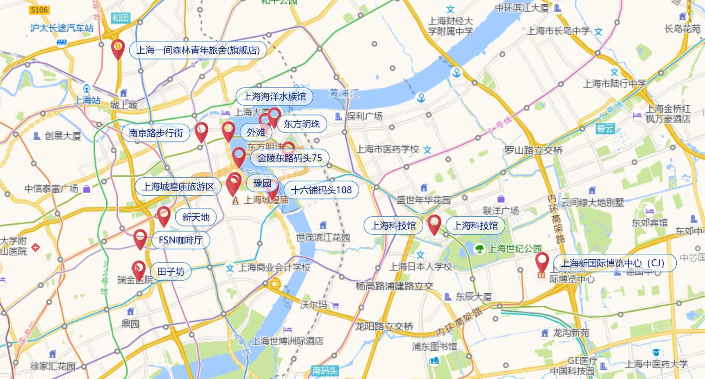 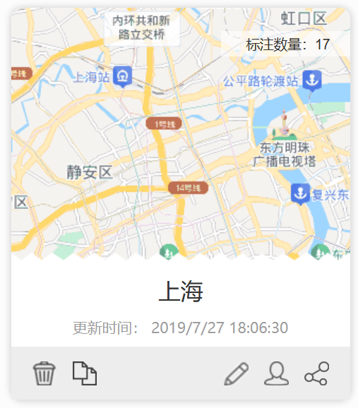

&emsp;时间久远加上照片丢失，很多细节我已无力追溯，我只能靠当时在社交媒体的推文和一些残存的记忆来尽可能地还原当时的经历和所思所想。既然流水账行不通的话，就先从我最先想到的地方开始讲吧，大可随便一些。

&emsp;当时在一番考虑之下，我们选择了上海一间青年旅舍（静安店寺地铁站店）。价格在旺季算是挺合适了，一个床位96元每天。去地铁站8号线中兴路站需要步行大约一公里，不算太远，但在上海的夏天已经足够折磨人了。房间的硬件设施比较简单，四张宿舍般的上下铺床位，一张桌子，一个晾衣杆和四个衣架，此外值得一提的是，四人间有独立卫浴。青旅正对高架桥，但是隔音还不错。只是以上这些，这间青旅不值得我惦记。青旅出门右手一两百米有一家铺子不大的牛肉面店，我在上海的每天早饭都是在那里解决的。四天三晚的行程（实际上只有三次早餐）中，我在那家小店里分别吃了牛肉面、牛杂面和牛杂拌面，价格大概是二十元左右，牛肉或是牛杂给的很多，对于上海的物价而言是非常实惠了。我不擅长评价食物，但是牛肉和牛杂味道很棒，肉汤鲜味十足，我能确信这是我这辈子吃过最好的牛肉面。这两年我去上海的次数不少，在某一次行程中我尝试回到那间青旅，目的是再尝一尝记忆中最完美的牛肉面。可惜或许是因为导航错了地方，我没找到那间青旅，也自然找不到那家牛肉面店。或许那碗牛肉面在我的回忆中被美化到了不应达到的高度，不过我也希望能在此生再吃上一碗。

### 外滩

&emsp;来上海不能不知道外滩。在抵达上海的第一天晚上，我们选择去乘一次外滩的游船，我们提前订好了船票（当时不知道有轮渡，虽然我现在也没坐过轮渡）。船票108元一张，从十六铺码头出发，在外滩和陆家嘴之间环游一圈回到码头，大约有一个小时。那时我还不太清楚外滩是怎样个范围，也不知道最受欢迎的观景位是南京东路的尽头，只知道似乎发生过外滩灯光秀的踩踏事故。

&emsp;坐上游船开始观景，这是繁丽魔幻的现代都市对二线城市小镇做题家灵魂冲击的开始。我无法想象晚上的河岸能够如此闪耀，（陆家嘴的）电视塔和各式高楼的灯光能够如此霓虹变幻。尽管时间久远，但我能够确信那时我肯定也陷入了一些恍惚，是一种超越我迄今为止对这个小小世界的认知的恍惚。或许是散光，亦或许是一些触动心神的震撼带来的泪水，尽管远处（外滩一侧）的建筑和灯光我看不太清楚，但是这也够了。这些模糊感足够让我感到外滩的神秘，和一种发自内心的游离感。

&emsp;由于是抵达上海的第一天，还没感受到上海轨道交通系统的强大，一群坐惯了15分钟一趟公交车的学生决定打的回青旅。滴滴打车排队100多人属实吓到了我们。最后我们选择在路边叫车，四个人分摊一百元车费倒是还可以接受。后来在跟别的出租车司机聊天中得知，那种颜色（具体忘了）的出租车经常宰客，确实，7公里一百块钱确实有些狠。

### ChinaJoy和Yuki Kajiura LIVE

&emsp;8月2日应该是我这趟行程最期待的一天。早上会去上海新国际博览中心参观期待已久的ChinaJoy Day2，晚上则是去国家会展中心的虹馆EH听梶浦的演唱会。

&emsp;从7号线花木路站下车步行至龙阳路，这段路程会很熟悉，因为第二天临时起意想去的海贼王巡展上海站也就在那附近（喜马拉雅艺术中心）。地铁上能看到很多coser印象比较深的有蝶祈（那年罪恶王冠还很火）、fgo里的小达芬奇、还有不少bilibili的2233娘。

&emsp;ChinaJoy的场馆真的很大，从早八点半左右开始排队，进场就走了将近半个钟头。一天下来在场馆绕了三圈左右，走了得有二十多公里。ChinaJoy有很多游戏硬件厂商和汽车厂商参展，可惜我对这些不是很感兴趣，其次就是游戏展和动漫展了。动漫展只占十个展馆中的一个，数量上少但也足矣，有木棉花等一些厂商，周边价格也不便宜，只简单地买了一些。游戏展有不少知名厂商如bilibili、腾讯、任天堂、索尼、育碧等，也算是大饱眼福了。当时听说索尼为了死亡搁浅的中国首发放映会准备了价值两亿的大屏幕，我也算是去凑了个热闹（虽然我到现在都没有玩）。以及由于当时风口浪尖的原神登录PS4而在索尼摊位前怒砸PS4的事件也发生在现场（虽然我并不在，是事后在贴吧看到的）。

&emsp;很多人逛CJ可以带一麻袋礼物出来，不过我比较社恐，没参与任何活动。记得买了张地平线零之曙光的光盘（后来因为晕3d也没玩儿下去），路人女主里英梨梨的色纸和刀剑的挂轴。就这么到处随便看看，逛了二十多公里。

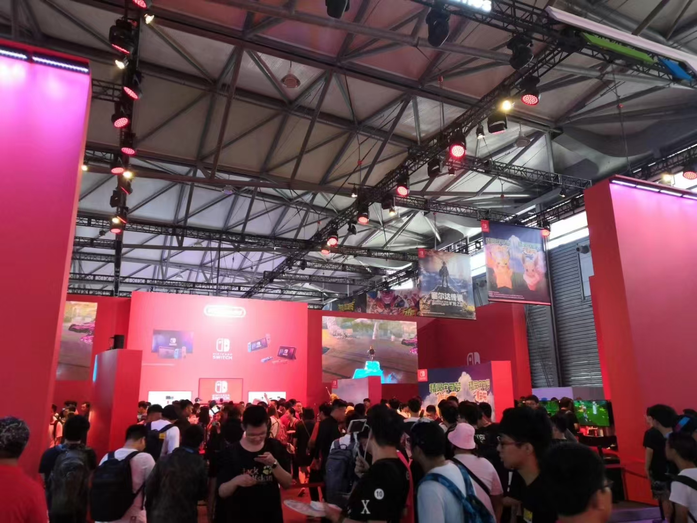 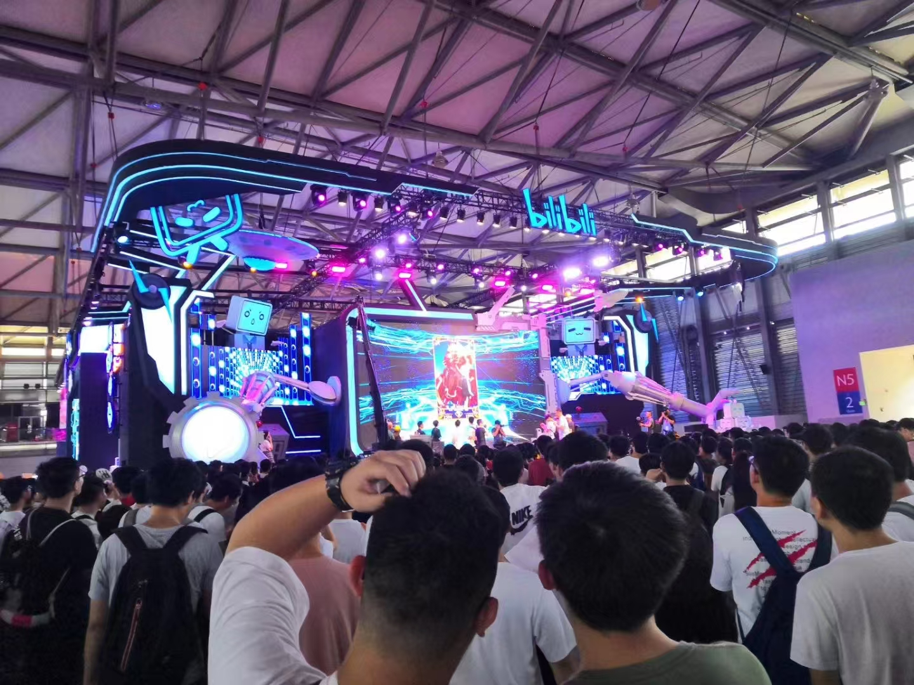

&emsp;中午在CJ现场啃了麦当劳，下午逛累了就从龙阳路转2号线去虹馆EH了。4点就到虹馆了（迷宫一般的虹馆，当时还有进博会，当同时有多个活动在会展中心举办的时候就非常难走），绕了好久的路，在上楼的路上收到了无料（同人卡套和小扇子），在场贩买了个80块钱的束口袋（后来用得破破烂烂的了），然后就去那家五六点就下班的KFC里坐着等了。那时不知道有梶浦由记音乐共享会（群聊），后来在23年11月去FJ18 Shanghai时跟群友闲聊才知道当时也有一些歌迷活动，不过我在KFC根本不知道。初三毕业就有幸听到一场Yuki桑的LIVE，我兴许也是那时最年轻的听众；Yuki的歌迷大多也是已经工作了的社畜。

&emsp;这是一次难忘的LIVE，也是我人生的第一场LIVE。虹馆的音响向来不好，但颤动心弦的震响足以在这一魔幻的旅途给我带来冲击灵魂的震撼。起先只听过light sword、满天的路人，即将成为Yuki桑的忠实歌迷。

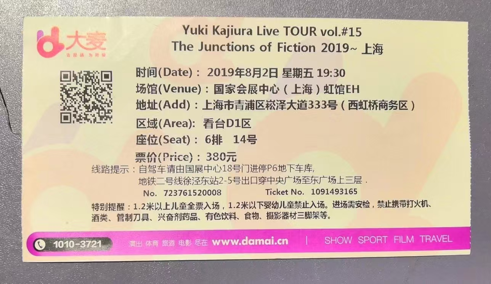 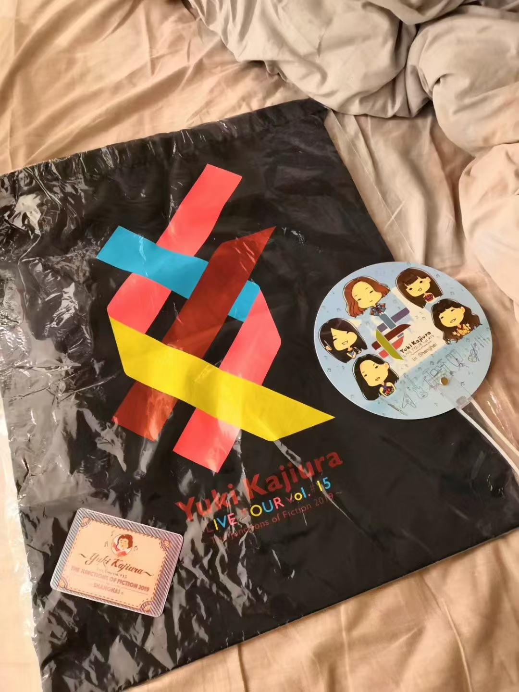 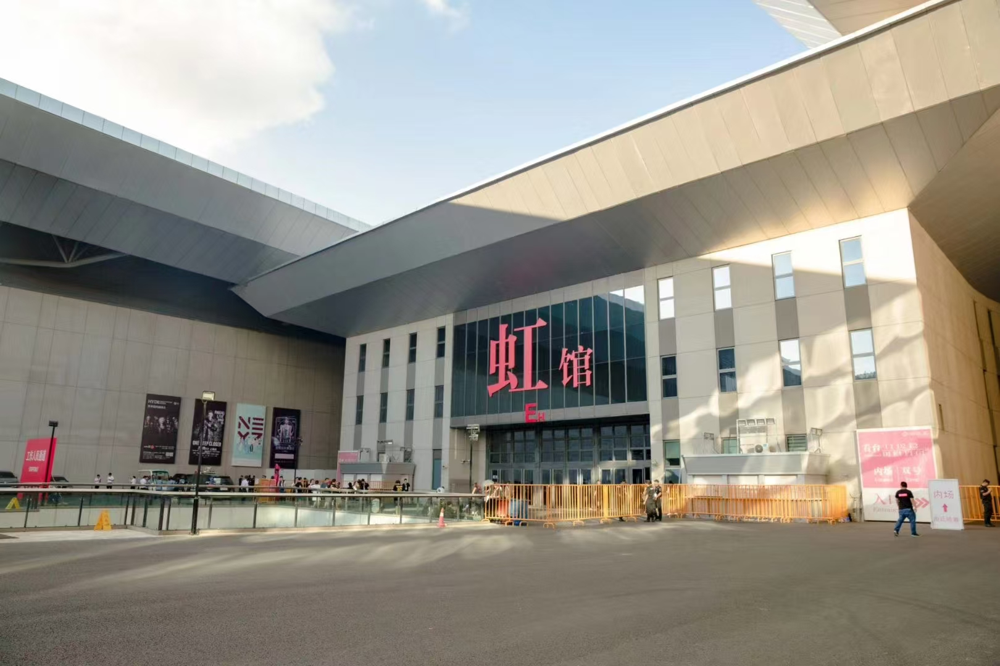

&emsp;一些更细节的回忆，我在参加FJ vol.18 Shanghai前在知乎留下了[这篇回答](https://www.zhihu.com/question/338414272/answer/3288369370)，感兴趣的话可以去看看。今后我也可能会写一篇LIVE回忆录，专门来记录LIVE的体验，这里就不多写了。

&emsp;演出结束已经是十点左右，很幸运地赶上了地铁末班车。相比于温州八点多公交就停运地差不多了，在十点钟能在半小时左右跨越二十多公里回府，这是我不敢想的。

&emsp;隔日，偶然在b站看见海贼王巡展上海站正好在举办，就打算去看看。里面有一个光影演出非常精彩，路飞在一面墙不断躲避障碍，穿梭到另一面墙，可惜这部分不允许拍摄。里面有许多复制原画，可惜当时只注意拍照留档（最后也没留住），没有慢慢欣赏。参展结束后体验了一下VR，那是我第一次看VR视频。临走前买了份明信片和海报，那个时候路飞的悬赏刚到15亿贝利。

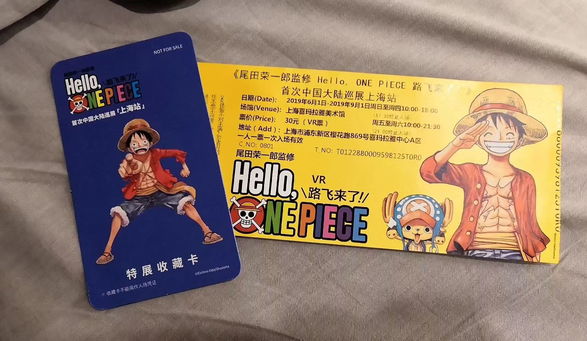 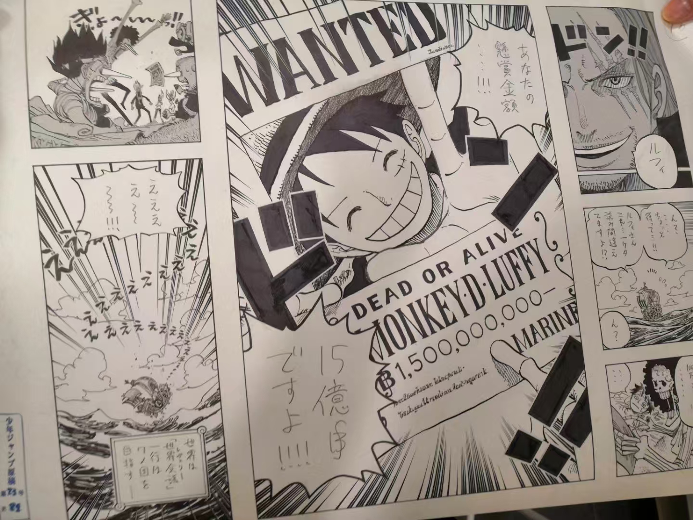 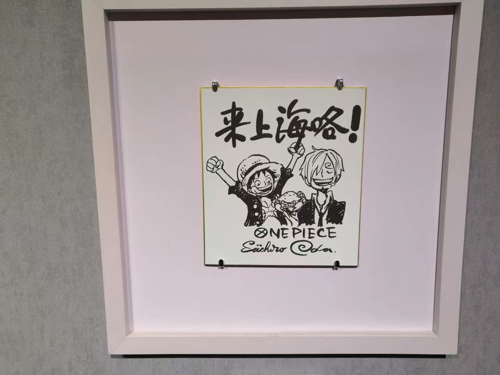

### 走马灯

&emsp;到此为止，本篇回忆最精彩的部分就结束了。接下来就是杂七杂八的随想。除了外滩、展馆和LIVE，也去了不少地方。海洋水族馆的内容一般，门票却要144元，毫无性价比，至少我是不会再去了；田子坊确实是个坑外地人的人造景点，没有什么意思；城隍庙的建筑是我喜欢的，那天的晴天和雨天切换地很快，从外滩走到城隍庙的这段路也是我非常喜欢的，后来我也走过不少次；每次路过豫园都没有开门，我也不大清楚这里的参观时间是怎样的，总之也没进去过；陆家嘴的中央绿地后来也没少去过，在那里仰望几座大楼，绝对可以感受到自我的渺小；最后一天来到静安大悦城想坐个摩天轮来着，可惜来的有些太早了，遗憾，该坐动车回温州了……

&emsp;这一次上海之旅，对我而言不仅仅是第一次人生的旅行，它还意味着很多。上海地铁在炎热的夏天提供了清凉的环境和舒适的交通体验，上海的交通系统也是这次旅行给我带来最大感触的要素之一。对于在温州只能乘坐公交或是出租车地我，第一次如此自由、高效、经济地在一座城市里穿梭，这得以让每一个突然的想法充实着我快节奏的旅行之中。我也开始理解为什么交通与城市发展为何息息相关了，最近几年第一次在温州乘坐轻轨时，我也有了当初乘坐上海地铁时的恍惚感了。我能确信有这么一个瞬间，在隧道中疾驰的列车中听着空气间的呼啸，我应该也应当感慨于上海轨道交通的便利，一些小镇（在上海面前没有几座城市能自称都市）人的向往和自卑，一些认知被打破的茫然。

&emsp;外滩是我每次来上海不会错过的地方，这点执念有些近似于朝圣了，因为这里对我而言不仅仅是外滩。也带着些南京东路的嘈杂与聒噪，外滩的人永远都不少，尤其是旺季，这几年更甚。或许某种程度上也能印证这一“朝圣之地”的想法。在外滩看的是陆家嘴，有哪些大楼自不必多说，霓虹变幻的灯光不免让人感到恍惚（这个词在这篇文章似乎提到很多次了）。恍惚于什么？我每次来看~~外滩~~陆家嘴，或者说每次处于不同的人生阶段、带着不同的心情来看的时候，都能给我不同的感受。这里魔幻般的繁华带给我最大的感受是——**我向往这里，但我不属于这里**。当然随着人生阅历的丰富，近几年我的想法也有所改变，对这里的思考不再是理想乡，多了些理性，削减了几分向往。我感受到了个体的、我的渺小，感受到了上海、世界的遥远。这里的生活（或许）很美好，这里的发展（确实）很宏伟，但这与我无关，它们不属于我，应该说是我不属于这里。踏上离开的地铁，你终于得在这恍惚间反应过来，你的生活还在继续，与这里无关。类似的想法也会产生在陆家嘴散步时，所以我也喜欢在陆家嘴散步，这里的参差感能让我反思人生，重新审视自己。

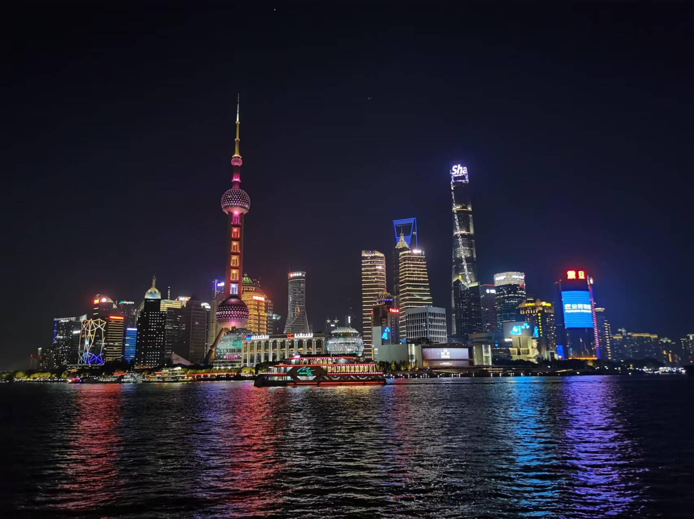

&emsp;这次旅行让我彻头彻尾地着迷于上海这一现代都市，我也开始向往大学能考到上海。虽然事与愿违，但我在高中一改以往玩物丧志的思想，开始认真规划以后的人生道路。不论是在精神上，在思想上，这次旅行一定程度上也改变了我的人生。也算是借这次回忆，再一次审视了自己和未来吧。应当还有很多能写的，但就到此为止吧。化用《东五往事》的话，窗外天色如墨，在这安静的氛围里，我写下最后一字，宣告追忆的结束并继续迈向未来。

&emsp;全文完。

### 五年半后的后记

&emsp;2025年1月15日，大三寒假回家，因为中转又一次造访上海。这两年来我也来过很多次了，按频率算的话，平均每两三个月都会因为或大或小的原因来上海（多数是因为中转或是看live）。因为来得多了，少了初识的新鲜感，也随着人生阅历的丰富，对现代化城市表面繁华的思考也趋于理性了，或者说是祛魅了。不论如何，总归还是来了。

&emsp;由于每次待的时间都不长，因此从南京东路（当然会看一看百联和SE cafe）走到外滩，在外滩休息一会已经是我“重温”上海的习惯流程了，这次也不例外。每回在外滩站立，我纵向重新审视一下自己、酝酿些能体感人生的感悟，似乎有些刻意为之了；每回在外滩观景，我总想把眼前的一切都刻印到脑海，无奈充斥回忆的外滩比平整的一张照片立体太多。Fine，人生的好风景远不止外滩，何必囿于此地，继续行走便是。

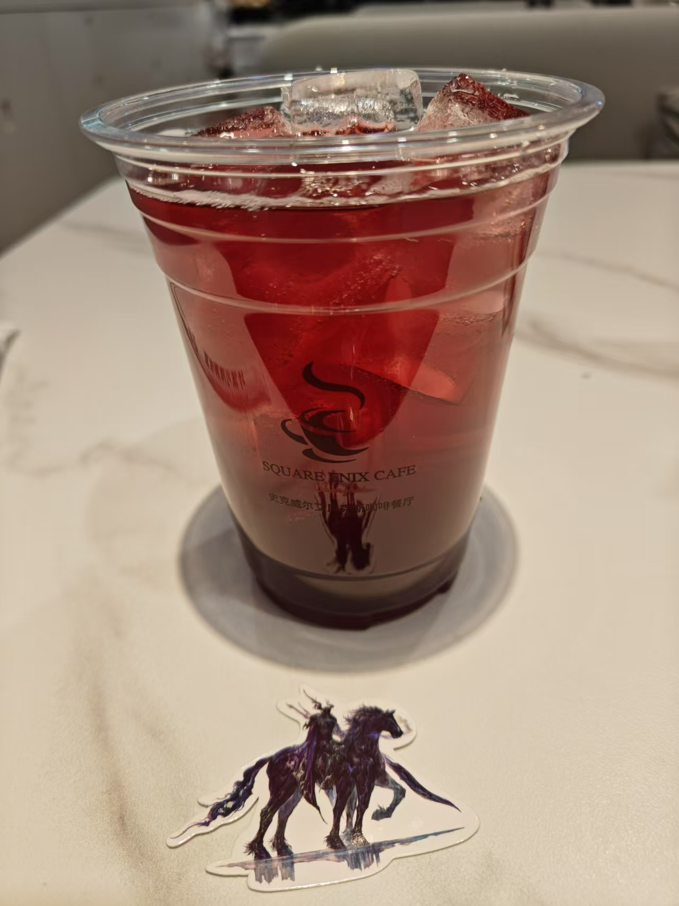 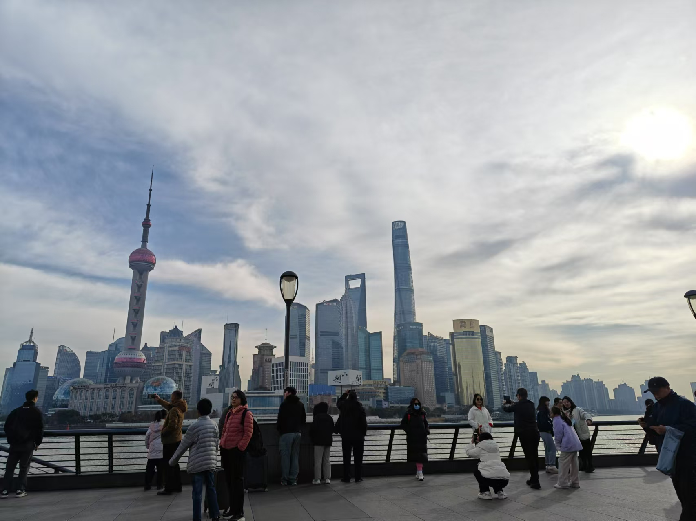

&emsp;不一样的是，正巧这次住的hotel和五年前的青年旅舍在同一个地铁站附近（8号线的中兴路），甚至只隔了两条街道！那就没有不去看看的理由了。

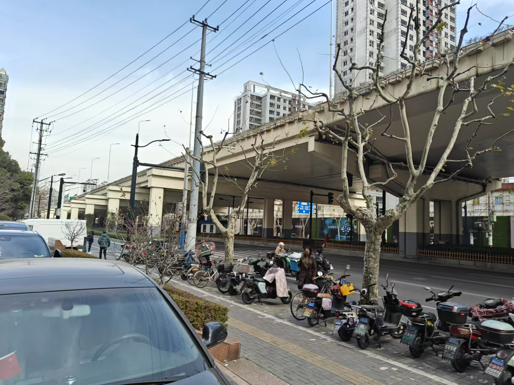 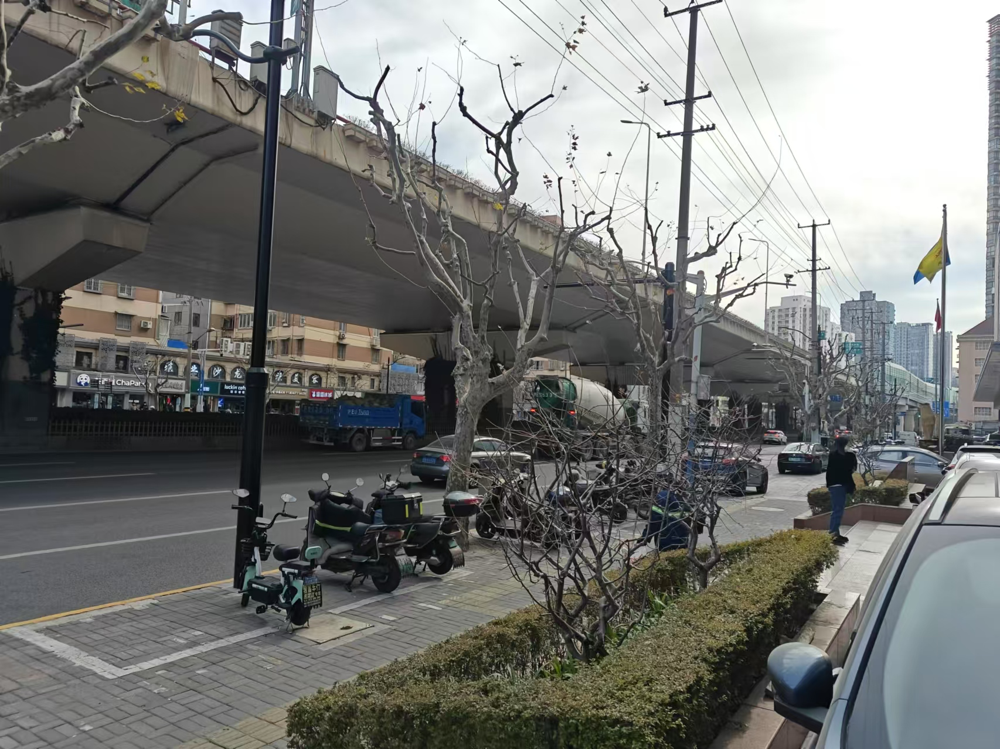

&emsp;从地铁站4口出来，沿着导航的路线，周围已经有了很大的变化，不愧是静安区的城建速度，好在我熟知的那一块变化无几。往南走100多米就能找到那家牛肉面店，店面装潢显然翻新过，以至于我最开始怀疑还是不是那家店。（后来问过老板娘，老板娘说她在这里已经开了六七年了）

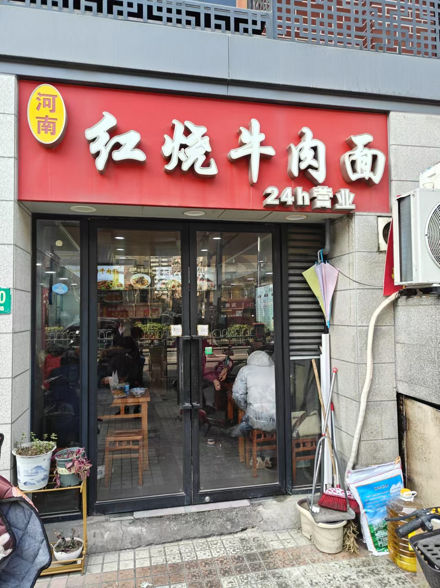 

&emsp;点了份之前常吃的牛杂拌面，虽然不及记忆中那么好吃，不过也是差强人意的。后来看大众点评在发现这家店只有3.5分，如果不是这家店在我的记忆中独树一帜，我了能永远也不会来这家店。总之，这家店的牛肉面是，也依旧是很好吃的。

&emsp;全文完，again。