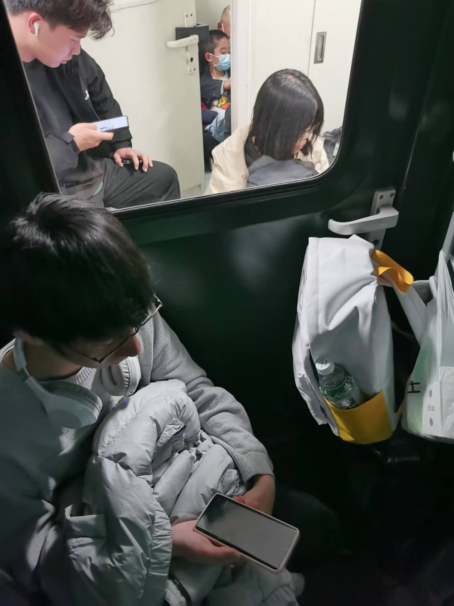
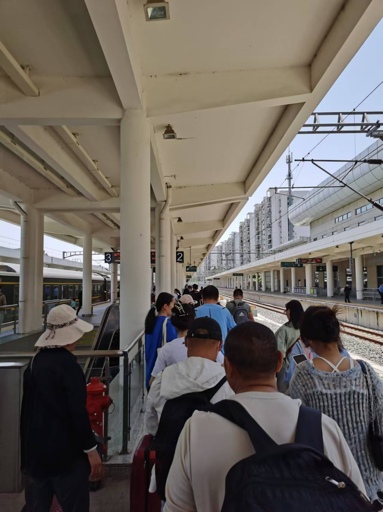
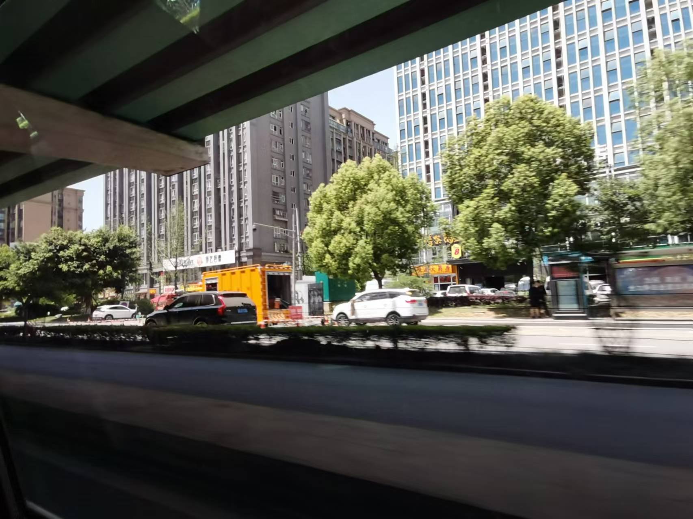
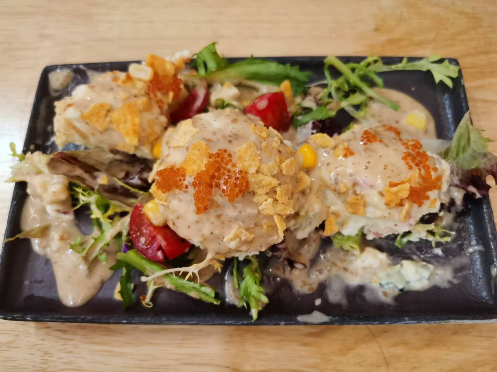
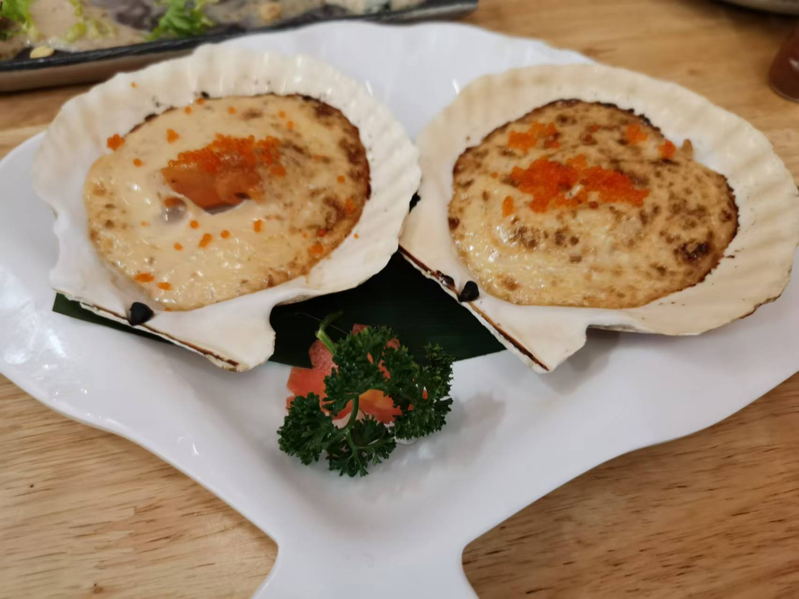
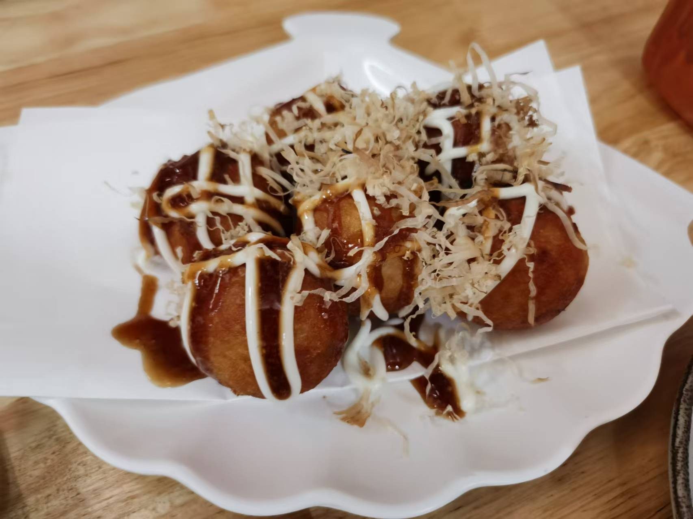
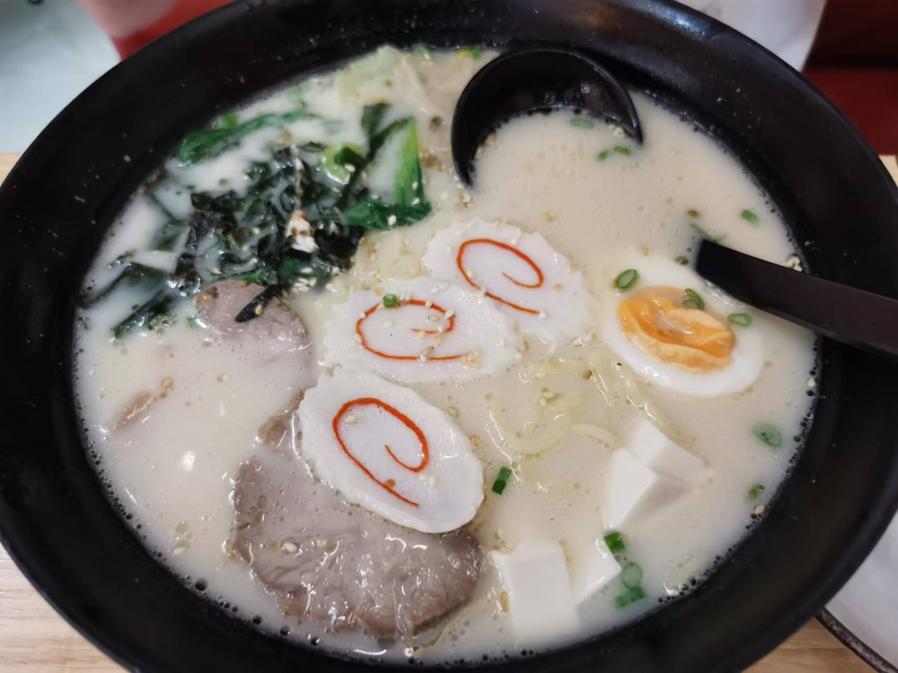
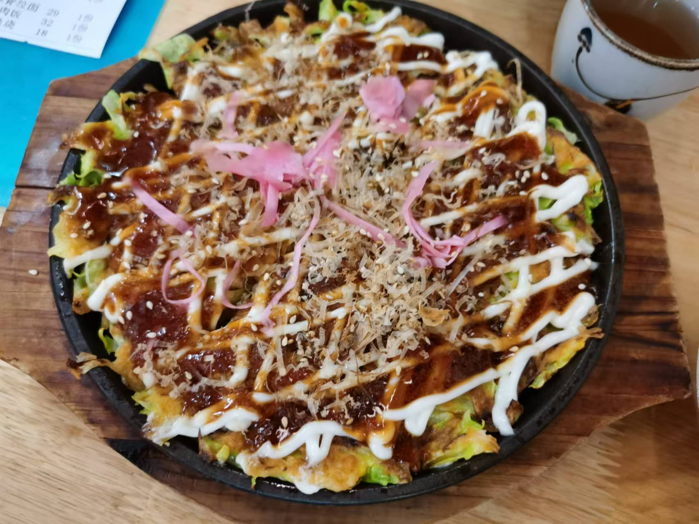
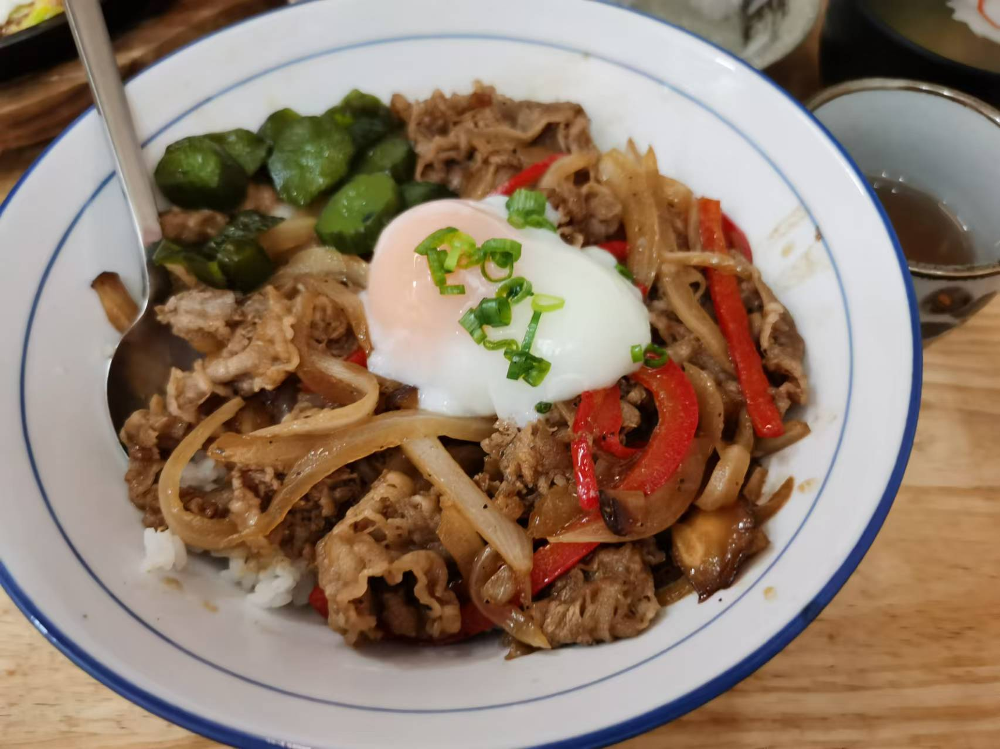
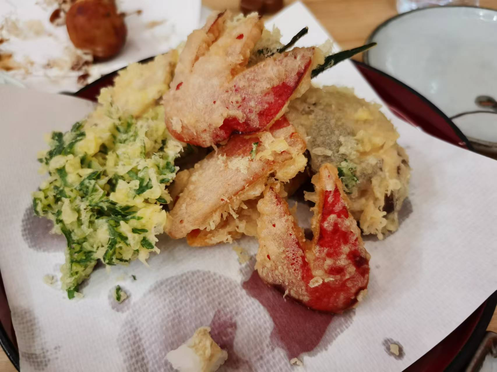

## 川渝之旅

### 前言

&emsp;时隔三年半没有出过省了，这期间经历了完整的高中三年和疫情三年。所幸浙南地区的疫情并不严重（相比于其他地方），加之高中把我保护得很好，所以疫情对我的影响并不很大。高中三年五味杂陈，很难用一句话总结，这个话题日后有机会再继续罢。也有疫情的口诛笔伐让我对上海祛了些魅，也有高考的惨烈失手，也有青春十字路口的迷惘与无所适从，总之我来到了离两千公里外的地方上学。

&emsp;大一下，正值疫情后的线下复学和封控解放，第一个五一黄金假期没理由不旅游一下。离家越远，我感觉我能去的地方也就越远，不再是我认知内的浙南一带了（或者说人之内只有温州）。本来和来自福建的伙伴打算去上海逛展，不过计划有变，总之大学生的第一次冒险就决定是川渝了。

### 出师未捷

&emsp;我们旅途的开头可谓用“灾难”二字形容，我现在也想不明白当初是怎样的意志让我坚持下去的。

&emsp;由于太久没通过铁路出行，加之黄金假期将至才临时更改的计划，我们没有买到也没有候补到去成都的硬座票。起初我们还是乐观的，看别人的经验帖说有餐车可以坐，也有机会坐空坐，后来才发现我们的想法还是太年轻了。我们选择的是假期前一晚的十点左右出发，第二天中午十二点左右抵达成都，约十五小时，为此我们还买了两张折叠椅（最后伙伴忘记带了，所以只有一张）。

&emsp;毫不意外地，不仅没找到餐车，甚至车厢首末为数不多的空地也被提前排队上车的人占领了，我们几乎只能站着。这样的状况就别妄想小憩了，但通宵的列车有些过于无聊，好在我提前准备了消磨时间的东西，在上车后的两三个小时内学了一轮Python，把带的漫画（藤本树的《再见绘梨》）看完了。如果仅是无聊和疲惫，那这一晚还算好过。

&emsp;灾难开始于列车经兰州东站，上车的人数激增，本就不富余的小空间变得更加狭窄了。有一段时间里，我们甚至没机会在折叠椅上坐一会，因为车厢里挤满了人，最后我们只能在车厢的橡胶连接处待了一晚上。

  

&emsp;很难想象那一晚我是如何熬过去的……总之，抵达成都！旅行的前两晚住在双流机场附近的普通hotel。

### 成都

&emsp;一路上没有什么闲暇心情想吃东西，所以抵达成都的时候已经饿昏了，在前往hotel的路上就已经选好了日料店打算解决午饭。这一顿日料非常好评，味道过得去，但是十分实惠，我们两人花了两百不到，最后甚至没吃完。

   

  

&emsp;

### 重庆