## 川渝之旅

### 前言

&emsp;时隔三年半没有出过省了，这期间经历了完整的高中三年和疫情三年。所幸浙南地区的疫情并不严重（相比于其他地方），加之高中把我保护得很好，所以疫情对我的影响并不很大。高中三年五味杂陈，很难用一句话总结，这个话题日后有机会再继续罢。也有疫情的口诛笔伐让我对上海祛了些魅，也有高考的惨烈失手，也有青春十字路口的迷惘与无所适从，总之我来到了离两千公里外的地方上学。

&emsp;大一下，正值疫情后的线下复学和封控解放，第一个五一黄金假期没理由不旅游一下。离家越远，我感觉我能去的地方也就越远，不再是我认知内的浙南一带了（或者说人之内只有温州）。本来和来自福建的伙伴打算去上海逛展，不过计划有变，总之大学生的第一次冒险就决定是川渝了。

### 出师未捷

&emsp;我们旅途的开头可谓用“灾难”二字形容，我现在也想不明白当初是怎样的意志让我坚持下去的。

&emsp;由于太久没通过铁路出行，加之黄金假期将至才临时更改的计划，我们没有买到也没有候补到去成都的硬座票。起初我们还是乐观的，看别人的经验帖说有餐车可以坐，也有机会坐空坐，后来才发现我们的想法还是太年轻了。我们选择的是假期前一晚的十点左右出发，第二天中午十二点左右抵达成都，约十五小时，为此我们还买了两张折叠椅（最后伙伴忘记带了，所以只有一张）。

&emsp;毫不意外地，不仅没找到餐车，甚至车厢首末为数不多的空地也被提前排队上车的人占领了，我们几乎只能站着。这样的状况就别妄想小憩了，但通宵的列车有些过于无聊，好在我提前准备了消磨时间的东西，在上车后的两三个小时内学了一轮Python，把带的漫画（藤本树的《再见绘梨》）看完了。如果仅是无聊和疲惫，那这一晚还算好过。

&emsp;灾难开始于列车经兰州东站，上车的人数激增，本就不富余的小空间变得更加狭窄了。有一段时间里，我们甚至没机会在折叠椅上坐一会，因为车厢里挤满了人，最后我们只能在车厢的橡胶连接处待了一晚上。

  

&emsp;很难想象那一晚我是如何熬过去的……总之，抵达成都！旅行的前两晚住在双流机场附近的普通hotel。

### 成都（`2024/04/30`-`2024/05/03`）

&emsp;一路上没有什么闲暇心情想吃东西，所以抵达成都的时候已经饿昏了，在前往hotel的路上就已经选好了日料店打算解决午饭。这一顿日料非常好评，味道过得去，但是十分实惠，我们两人花了两百不到，最后甚至没吃完。

   

  

&emsp;饱餐过后就该去奔赴景点了（没想到通宵站票后我还有精力玩乐），首先去了宽窄巷子，全都是人头（不愧是疫情后的第一个黄金假期，巷子已经被人堵得水泄不通了），巷子已经商业化非常严重了，里一圈外一圈不外乎各种小吃摊子、熊猫文创、剧院茶馆云云，该有的文化氛围虽仍能循迹，但也已被开发地不剩无几了，因此简单逛逛就好。再就是春熙路、IFS那一块。

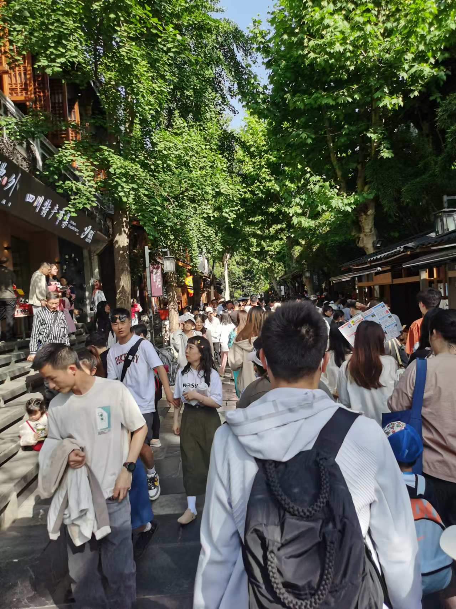  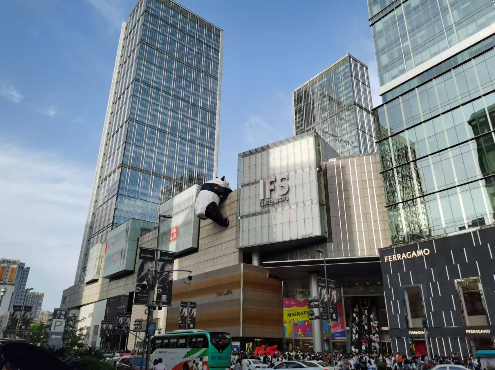

&emsp;晚上打算去锦里古街（我对古街一类的还是蛮有兴趣的），不过锦里距离最近的地铁站得有步行二十分钟的距离，还是建议乘坐公交车。但是还没走到门口就已经被人流推着走了，意识到不对劲，赶紧掉头去附近的九眼桥。九眼桥是成都的酒吧街，这里显然不太适合我，看了眼桥，吃了碗冰粉就急匆匆地去赶地铁末班车了。~~锦城虽云乐，不如早还家。~~

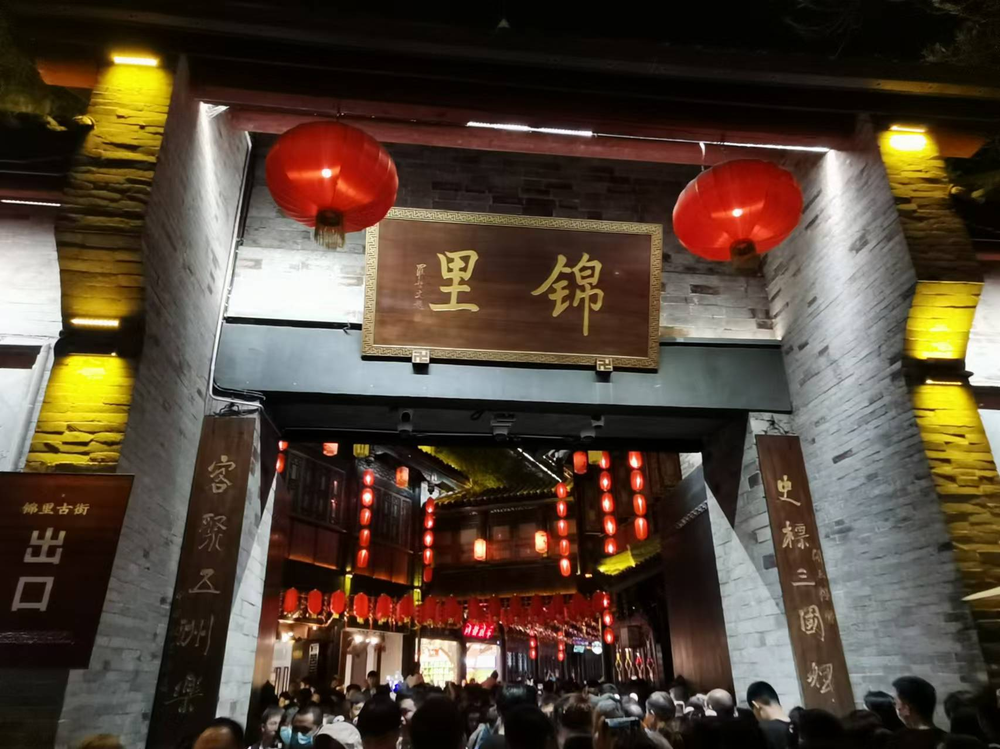  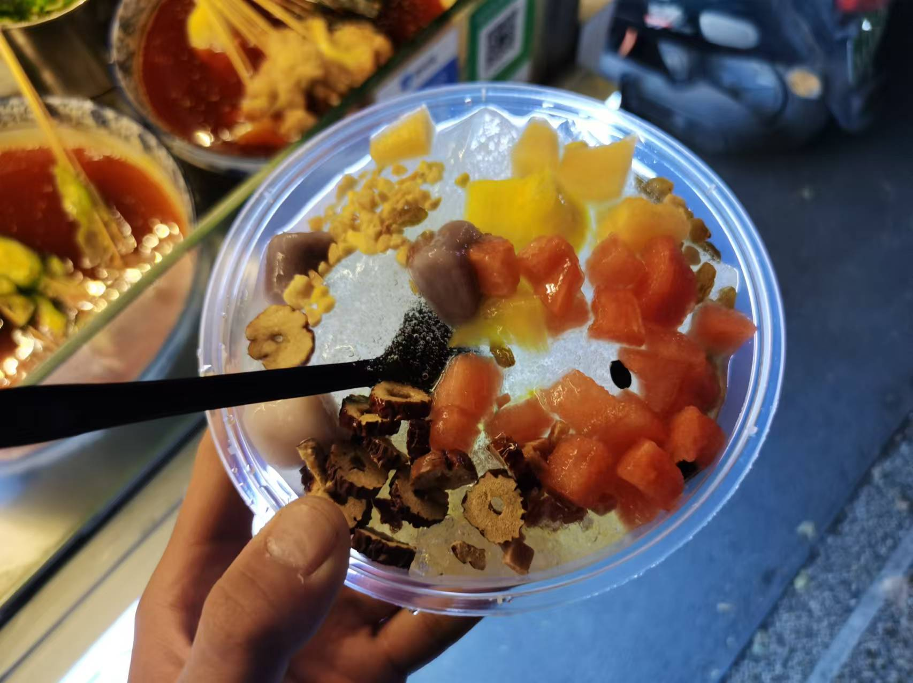

&emsp;第二天一早也是顺利参观了锦里古街，那次参观给我的印象很好，以至于我第二次去成都时又直奔锦里（和第一次去没参观上的武侯祠）。不过后来才发现锦里也是个商业化很高的古街了。由于当天晚上就得离开成都了，hotel又离车站太远，所以只能扛着行李箱溜达了。

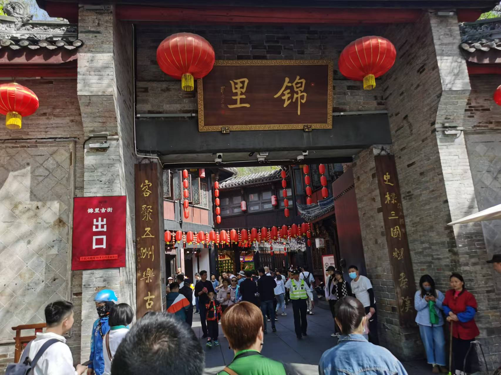 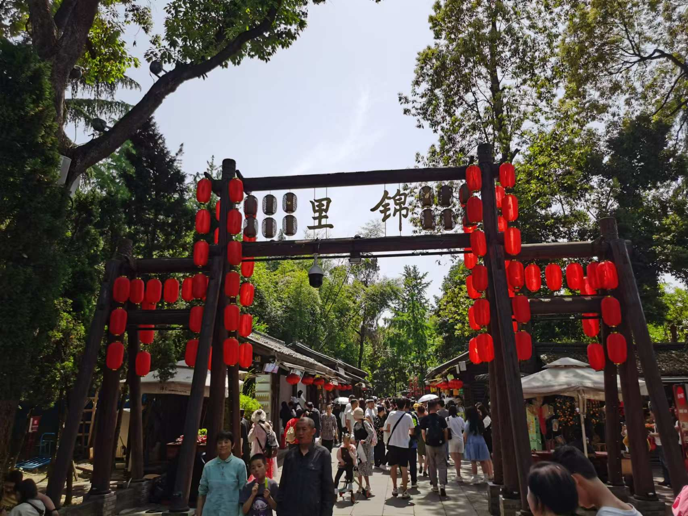

&emsp;彼时的我还很喜欢在景区里买吃的，进去狠狠地吃了拇指生煎、蒜蓉扇贝、烤鱿鱼、锅巴土豆——现在回想起确是一溜的景区小吃。蒜蓉扇贝实在是太辣了，我吃不得一点辣，只能丢了。还试了试糖油果子，一般般；浆果茶的味道不错，以至于被坑了一袋茶（等价的money），下次再也不会了。

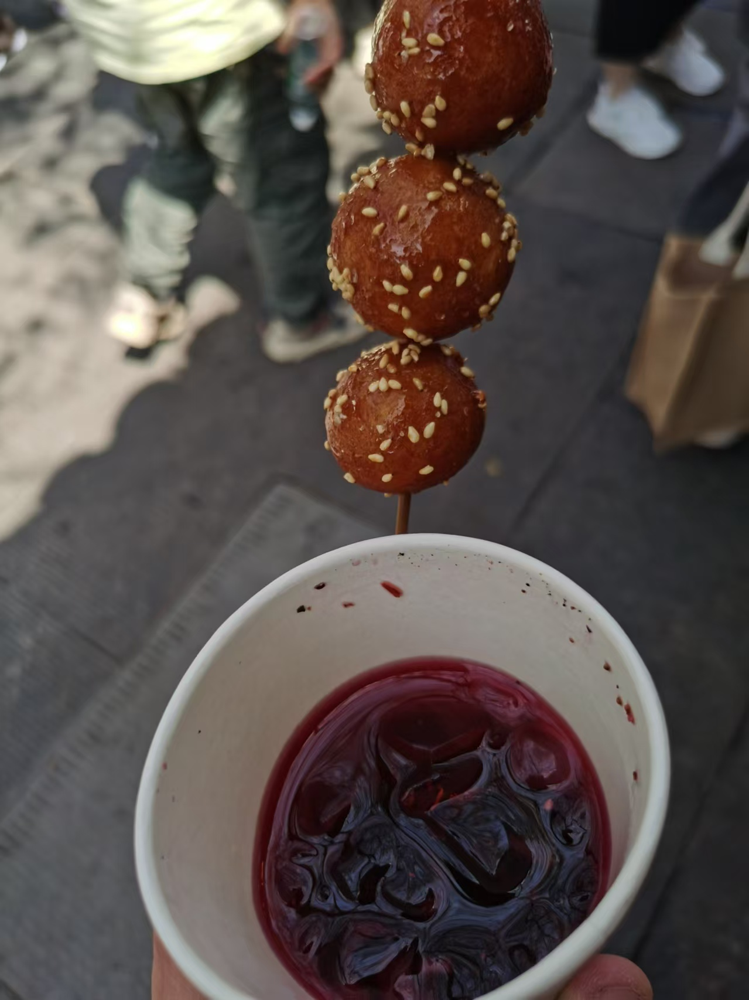 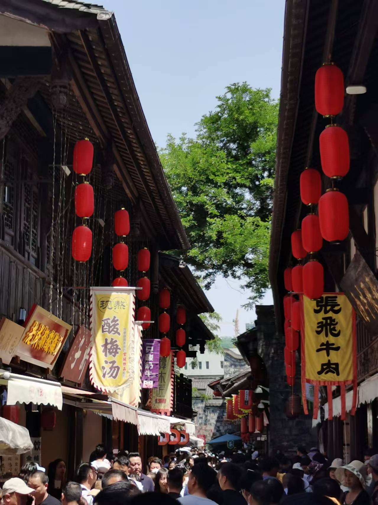

&emsp;印象中那时成都就同时在修好几条地铁线路（直到隔年第二次去时也还是在修），因此不少线路由于轨道交通不太方便，我大多选择步行。That's fine，我也很喜欢city walk。不知道从哪里知道了耍都，过去一看发现是个已经落没的商业中心，大白天的没几家店铺营业着，也自然看不见人。或许这里也有曾经光辉的一刻吧，不知未来会不会有，不过也与我无关了。

&emsp;路上正好遇到一处桃树下堆满垃圾，不知道怎得感觉有些奇怪的美感就拍了下来。刚拍完就被一旁店铺的人出来喝止要删除，但彼时正值我气血方刚不怕惹事的时候，自然也不会服软，当然也不必影响旅游的心情。

  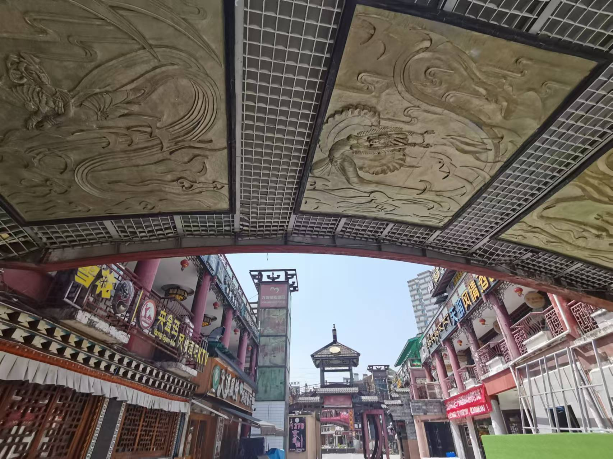

&emsp;中午约了高一的同学见面，他在成都大学念书，也是为数不多在毕业后还保持一定联系的同学。路过四川省图书馆和天府广场，很气派。不过行程紧张，就没去图书馆看一眼或是仔细逛逛天府广场了，下次有机会想去天府红看看。

 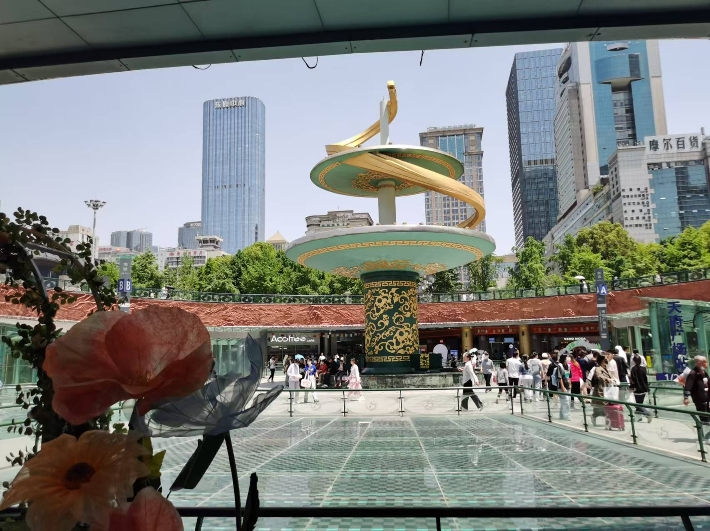

&emsp;下午和老同学一起去东郊记忆逛了逛，那是片有些保留工业文化，但很迎合年轻人潮流的创意园区吧。在那边散散步还算不错，不过不够消磨时间，于是敲定下午去成都大学参观参观。

&emsp;这也是我本科入学后第一次到别的大学，也是见见世面了。成都大学很大，差点把我走断腿；建筑很新，遗憾的是没有留更多照片。总之，剩下的时间就在和友人闲聊和瞎逛中慢慢结束了，也意味着我一天半的成都之旅该结束了。

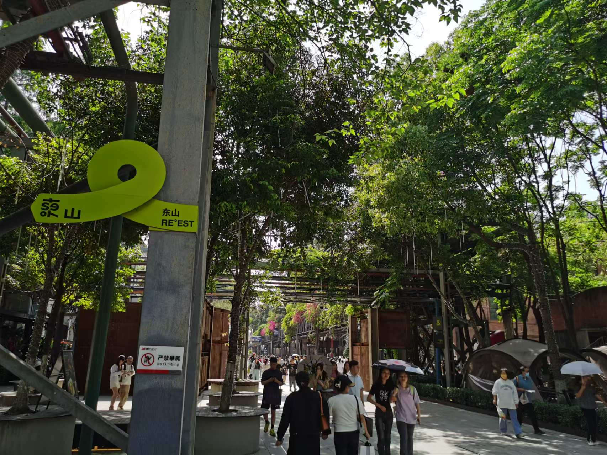 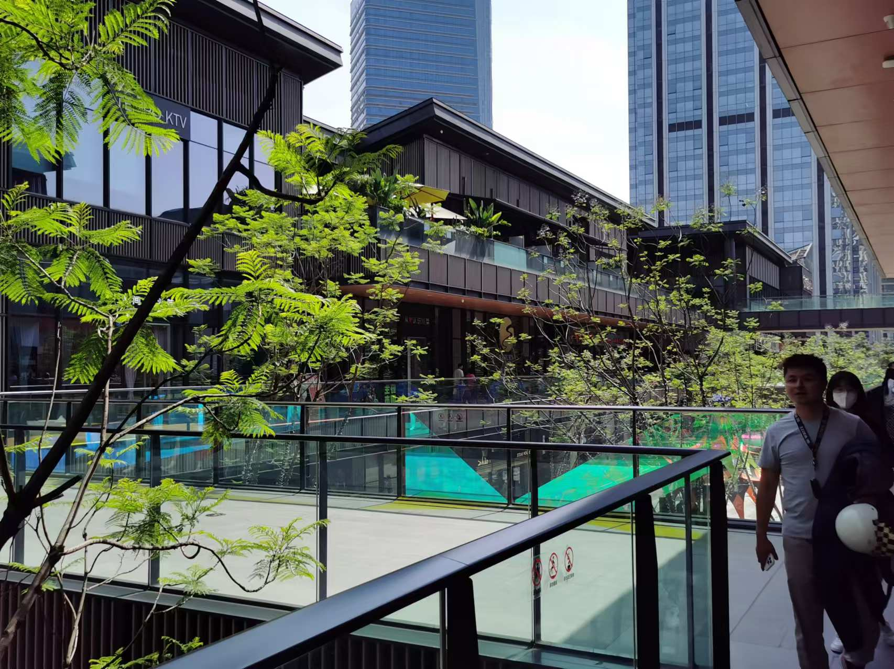 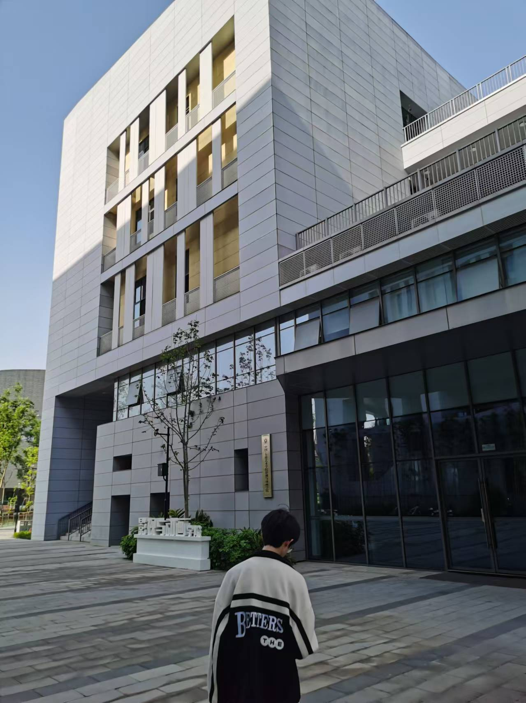

&emsp;简短的行程也确实不够我去青城山、大熊猫基地之类的地方，离市区太远了，不太现实，更何况是久违的黄金假期。不过就我两次在成都旅游的经历来看，仅仅市区内的一些景点实在有些无趣。不过这一天半的行程也足够充实，对于三年半没出行旅游过的我而言，这一特种兵行程也让我足够满足——接下来该去我更期待的重庆了。

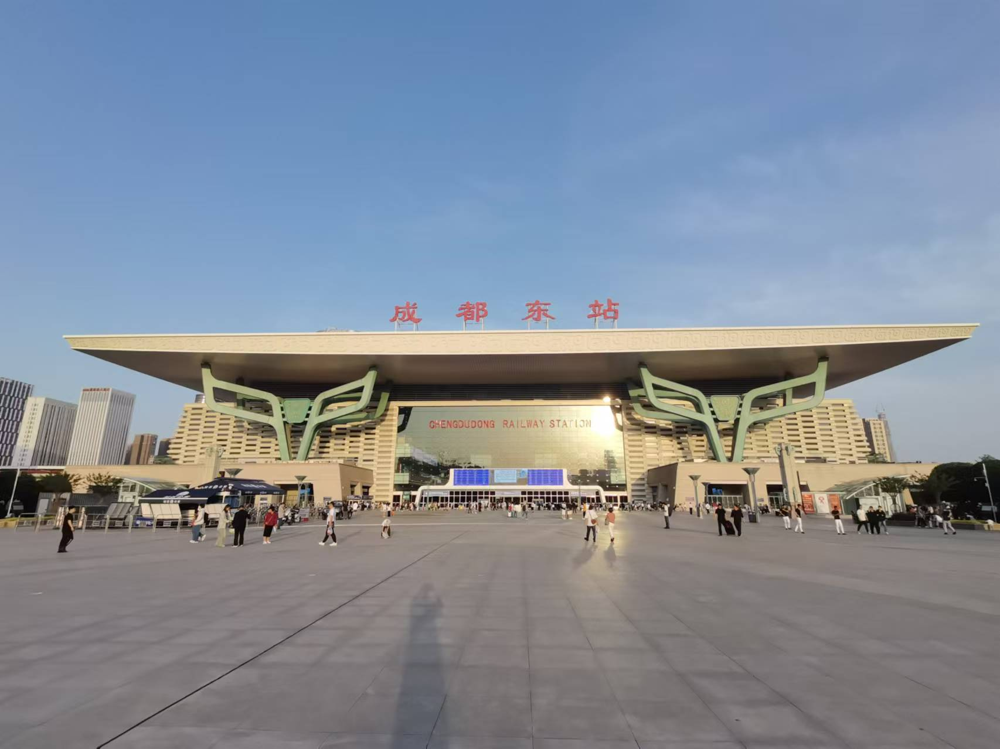

### 重庆

&emsp;