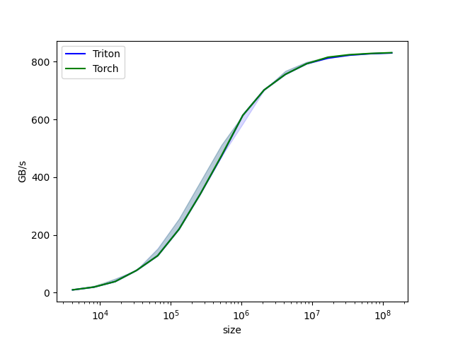
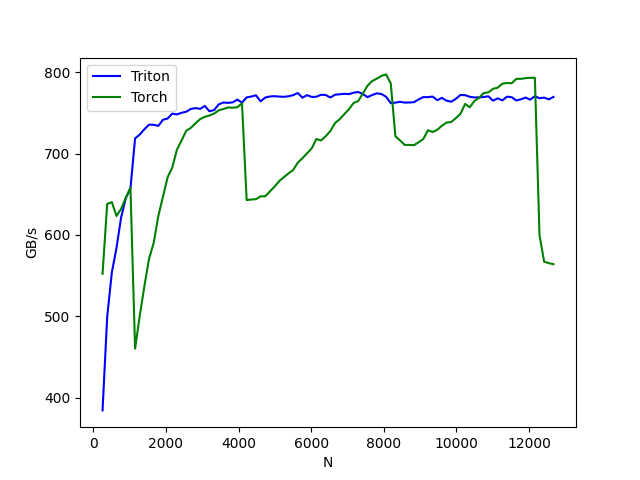

## Reference

[教程 | Triton 中文站](https://triton.hyper.ai/docs/getting-started/tutorials)

[Tutorials — Triton documentation](https://triton-lang.org/main/getting-started/tutorials/index.html)

[并行编程语言（Triton & 九齿） - 2024 冬季大模型与人工智能系统训练营](https://opencamp.cn/InfiniTensor/camp/2024winter/stage/7)

## Vector Addition

### Compute Kernel

```python
import torch

import triton
import triton.language as tl

DEVICE = torch.device("cuda:0")


@triton.jit
def add_kernel(x_ptr,  # *Pointer* to first input vector.
               y_ptr,  # *Pointer* to second input vector.
               output_ptr,  # *Pointer* to output vector.
               n_elements,  # Size of the vector.
               BLOCK_SIZE: tl.constexpr,  # Number of elements each program should process.
               # NOTE: `constexpr` so it can be used as a shape value.
               ):
    pid = tl.program_id(axis=0)  # We use a 1D launch grid so axis is 0.
    block_start = pid * BLOCK_SIZE # Offsets is a list of pointers  
    offsets = block_start + tl.arange(0, BLOCK_SIZE)
    
    mask = offsets < n_elements
    # Load x and y from DRAM
    x = tl.load(x_ptr + offsets, mask=mask)
    y = tl.load(y_ptr + offsets, mask=mask)
    output = x + y
    # Write x + y back to DRAM.
    tl.store(output_ptr + offsets, output, mask=mask)
```

> 编译遇到的第一个报错是`AttributeError: 'CudaDriver' object has no attribute 'get_active_torch_device'`，在[issue#5388](https://github.com/triton-lang/triton/issues/5388)下找到了原因和解决方案，`DEVICE = triton.runtime.driver.active.get_active_torch_device()`似乎对应了旧本版本，用`DEVICE = torch.device("cuda:0")`可以暂缓燃眉之急。

kernel的实现思路是简单的：

+ 对于输入`(input_x, input_y, output, n, BLOCK_SIZE)`，获取`programd_id`，通过`pid * BLOCK_SIZE`计算分块索引，通过`block_start + tl.arange(0, BLOCK_SIZE)`确定每个元素的索引

+ 确定`mask`，防止边界溢出

+ 加载输入元素，实现向量加法，最后写回DRAM

接下来需要一个合适的辅助函数，负责生成`output`张量和创建合适的layout

```python
def add(x: torch.Tensor, y: torch.Tensor):
    output = torch.empty_like(x) # preallocate the output
    assert x.device == DEVICE and y.device == DEVICE and output.device == DEVICE
    n_elements = output.numel()
    grid = lambda meta: (triton.cdiv(n_elements, meta['BLOCK_SIZE']), )
    add_kernel[grid](x, y, output, n_elements, BLOCK_SIZE=1024)
    # We return a handle to z but, since `torch.cuda.synchronize()` hasn't been called, the kernel is still
    # running asynchronously at this point.
    return output
```

核心只有两行代码，

+ `grid = lambda meta: (triton.cdiv(n_elements, meta['BLOCK_SIZE']), )`定义一个grid匿名函数，用`triton.cdiv`计算$\lceil\frac{n}{BLOCKSIZE}\rceil$

+ `add_kernel[grid](x, y, output, n_elements, BLOCK_SIZE=1024)`调用`grid(meta)`来确定网格大小并启动GPU线程块，并将`(x, y, output, n_elements, BLOCK_SIZE=1024)`传递给kernel

```python
torch.manual_seed(0)
size = 984320000
x = torch.rand(size, device=DEVICE)
y = torch.rand(size, device=DEVICE)
output_torch = x + y
output_triton = add(x, y)
print(output_torch)
print(output_triton)
print(f'The maximum difference between torch and triton is '
      f'{torch.max(torch.abs(output_torch - output_triton))}')
```

### Benchmark

这个设计真的非常喜欢，不用费事去写一些benchmark测试代码了！

```python
@triton.testing.perf_report(
    triton.testing.Benchmark(
        x_names=['size'],  # Argument names to use as an x-axis for the plot. 用作绘图 x 轴的参数名称。
        x_vals=[2**i for i in range(12, 28, 1)],  # Different possible values for `x_name`. `x_name` 的不同可能值。
        x_log=True,  # x axis is logarithmic. x 轴为对数。
        line_arg='provider',  # Argument name whose value corresponds to a different line in the plot. 参数名称，其值对应于绘图中的不同线条。
        line_vals=['triton', 'torch'],  # Possible values for `line_arg`. `line_arg` 的可能值。
        line_names=['Triton', 'Torch'],  # Label name for the lines. 线条的标签名称。
        styles=[('blue', '-'), ('green', '-')],  # Line styles. 线条样式。
        ylabel='GB/s',  # Label name for the y-axis. y 轴标签名称。
        plot_name='vector-add-performance',  # Name for the plot. Used also as a file name for saving the plot. 绘图名称。也用作保存绘图的文件名。
        args={},  # Values for function arguments not in `x_names` and `y_name`. 不在 `x_names` 和 `y_name` 中的函数参数值。
    ))

def benchmark(size, provider):
    x = torch.rand(size, device='cuda', dtype=torch.float32)
    y = torch.rand(size, device='cuda', dtype=torch.float32)
    quantiles = [0.5, 0.2, 0.8]
    if provider == 'torch':
        ms, min_ms, max_ms = triton.testing.do_bench(lambda: x + y, quantiles=quantiles)
    if provider == 'triton':
        ms, min_ms, max_ms = triton.testing.do_bench(lambda: add(x, y), quantiles=quantiles)
    gbps = lambda ms: 3 * x.numel() * x.element_size() / ms * 1e-6
    return gbps(ms), gbps(max_ms), gbps(min_ms)

benchmark.run(print_data=True, show_plots=True, save_path='./')
```

以下是单卡Tesla V100-PCIE-32GB的benchmark结果，可以看出和Torch还是有一些差距的

```text
vector-add-performance:
           size      Triton       Torch
0        4096.0    9.600000    9.600000
1        8192.0   19.200000   19.200000
2       16384.0   38.400001   38.400001
3       32768.0   76.800002   76.800002
4       65536.0  127.999995  127.999995
5      131072.0  219.428568  219.428568
6      262144.0  341.333321  341.333321
7      524288.0  472.615390  474.898540
8     1048576.0  614.400016  614.400016
9     2097152.0  702.171410  702.171410
10    4194304.0  756.184613  756.184613
11    8388608.0  792.974002  793.173993
12   16777216.0  812.429770  815.800825
13   33554432.0  822.627612  824.352211
14   67108864.0  827.823144  828.695462
15  134217728.0  830.445624  831.344043
```



## Fused Softmax

### Naive Softmax

$$softmax(z_{i})=\frac{e^{z_{i}}}{\Sigma_{j=1}^{n}e^{z_{j}}}=\frac{exp(z_{i})}{\Sigma_{j=1}^{n}exp(z_{j})}$$

```python
def naive_softmax(x):
    """Compute row-wise softmax of X using native pytorch
    """
    # read  MN elements ; write M  elements
    x_max = x.max(dim=1)[0]
    # read MN + M elements ; write MN elements
    z = x - x_max[:, None]
    # read  MN elements ; write MN elements
    numerator = torch.exp(z)
    # read  MN elements ; write M  elements
    denominator = numerator.sum(dim=1)
    # read MN + M elements ; write MN elements
    ret = numerator / denominator[:, None]
    # in total: read 5MN + 2M elements ; wrote 3MN + 2M elements
    return ret
```

> 由于softmax具有平移不变性，而exp(x)容易上溢，因此需要减去最大元素：
> $$softmax(x)=softmax(x+c)$$

对于naive的softmax实现，需要从DRAM中读取$5MN+2M$个元素，并写回$3MN+2M$个元素，IO共需要$8MN+4M$个单位，显然是不理想的。理想情况下，只读写一次并完成所有计算，因此可以得到理想加速约为4倍（$\frac{8MN+4M}{2MN}$）。

### Compute Kernel

softmax kernel需要补充的内容都写在注释里了：

```python
@triton.jit
def softmax_kernel(output_ptr, input_ptr, input_row_stride, output_row_stride, n_rows, n_cols, BLOCK_SIZE: tl.constexpr,
                   num_stages: tl.constexpr):
    # kernel思路 : 让多个program并行处理不同的行
    row_start = tl.program_id(0)    # program ID
    row_step = tl.num_programs(0)   # program 数量
    # 遍历每一行, tl.range(..)行索引list
    ## 线程0处理:[0, row_step, 2 * row_step, ...]
    ## 线程1处理:[1, 1 + row_step, 1 + 2 * row_step, ...]
    ## 线程2处理:[2, 2 + row_step, 2 + 2 * row_step, ...]
    ## ... **实现了不同program处理不同row**
    for row_idx in tl.range(row_start, n_rows, row_step, num_stages=num_stages):
        # row_start_ptr指向当前行的首个元素
        row_start_ptr = input_ptr + row_idx * input_row_stride
        # 计算列索引
        col_offsets = tl.arange(0, BLOCK_SIZE)      # 列偏移, 生成[0, BLOCK_SIZE - 1]
        input_ptrs = row_start_ptr + col_offsets    # 当前行首 + 列偏移
        # 计算mask
        mask = col_offsets < n_cols # 注意是用列偏移和列数生成的mask
        row = tl.load(input_ptrs, mask=mask, other=-float('inf'))   # 根据mask读取内存, 超出n_cols的部分填充为-∞
        row_minus_max = row - tl.max(row, axis=0)
        # softmax
        numerator = tl.exp(row_minus_max)
        denominator = tl.sum(numerator, axis=0)
        softmax_output = numerator / denominator
        # Write back output to DRAM
        output_row_start_ptr = output_ptr + row_idx * output_row_stride # 计算输出索引
        output_ptrs = output_row_start_ptr + col_offsets                # 计算输出内存地址
        tl.store(output_ptrs, softmax_output, mask=mask)
```

认真看完源码后，会发现softmax kernel的实现思路并不难，每个program处理输入矩阵的一**组**行（按program数量跨步处理），执行完softmax操作后写回DRAM。

> Note: Triton的一个重要限制是**BLOCK_SIZE**必须是$2^n$的元素

同样，我们需要一个辅助函数。在此之前，`triton.runtime.driver.active.utils.get_device_properties(torch.cuda.current_device())`非常有用，能够帮助我们收集必要的计算卡硬件信息。

```python
device = torch.cuda.current_device()
properties = driver.active.utils.get_device_properties(device)
NUM_SM = properties["multiprocessor_count"]
NUM_REGS = properties["max_num_regs"]
SIZE_SMEM = properties["max_shared_mem"]
WARP_SIZE = properties["warpSize"]
target = triton.runtime.driver.active.get_current_target()
kernels = {}
```

Tesla V100-PCIE-32GB的输出如下：

```text
{
    'max_shared_mem': 98304,          # 共享内存
    'max_num_regs': 65536,            # 最大寄存器数
    'multiprocessor_count': 80,       # SM 数量
    'warpSize': 32,                   # WARP 大小
    'sm_clock_rate': 1380000,         # SM 频率 (Hz)
    'mem_clock_rate': 877000,         # 内存频率 (Hz)
    'mem_bus_width': 4096             # 内存总线宽度 (bit)
}
```

辅助函数如下：

```python
def softmax(x):
    n_rows, n_cols = x.shape
    # BLOCK_SIZE是大于矩阵列数的最小二次幂
    BLOCK_SIZE = triton.next_power_of_2(n_cols)
    num_warps = 8
    # 如果 GPU 共享内存（SMEM）足够大（>200KB），就用 4 个流水线阶段，否则用 2 个
    num_stages = 4 if SIZE_SMEM > 200000 else 2
    # Allocate output
    y = torch.empty_like(x)

    # pre-compile kernel to get register usage and compute thread occupancy.
    # 预编译内核以获取寄存器使用情况并计算线程占用情况。
    kernel, num_programs = kernels.get(BLOCK_SIZE, (None, 0))
    if kernel is None:
        kernel = softmax_kernel.warmup(y, x, x.stride(0), y.stride(0), n_rows, n_cols, BLOCK_SIZE=BLOCK_SIZE,
                                       num_stages=num_stages, num_warps=num_warps, grid=(1, ))
        kernel._init_handles()
        n_regs = kernel.n_regs
        size_smem = kernel.metadata.shared
        occupancy = NUM_REGS // (n_regs * WARP_SIZE * num_warps)
        occupancy = min(occupancy, SIZE_SMEM // size_smem)
        num_programs = NUM_SM * occupancy
        kernels[BLOCK_SIZE] = (kernel, num_programs)


    num_programs = min(num_programs, n_rows)


    # Create a number of persistent programs.
    # 创建一些持久化程序。
    kernel[(num_programs, 1, 1)](
        y,
        x,
        x.stride(0),
        y.stride(0),
        n_rows,
        n_cols,
    )
    return y
```

在预编译kernel前需要确定`BLOCK_SIZE`大小、warp数量、流水线阶段并分配输出tensor空间。更多的流水线阶段可以提高并行效率，但会消耗更多的shared memory。

在预编译阶段，`softmax_kernel.warmup(...)`预编译softmax kernel，用于获取寄存器使用情况、shared memory使用量、线程占用率，并通过`kernel._init_handles()`初始化kernel的CUDA句柄。最终计算`num_programs`（SM数量×线程占用率）并保证安全运行kernel。



### Why Fused Softmax?

读完[Fused Softmax Tutorial](https://triton-lang.org/main/getting-started/tutorials/02-fused-softmax.html)的代码后，我不太理解为什么这个kernel被成为融合Softmax（Fused Softmax），为什么将原本$\Theta(8MN+4M)$的IO开销缩减到了一次读写，为什么能够比PyTorch的实现更快（明明softmax的步骤是一样的）。

除了用到了pipelining优化了计算流程，主要是在PyTorch传统softmax实现中，涉及多个kernel启动并在全局现存（global memory）之间频繁读写数据，导致了额外的内存访问开销和kernel启动开销（计算最大值，计算指数函数，行归一化，输出）。而用Triton写的Fused Softmax kernel编写了一个自定义CUDA kernel，在单个kernel内部完成了所有计算的步骤，也可以更好地利用shared memory和registers。